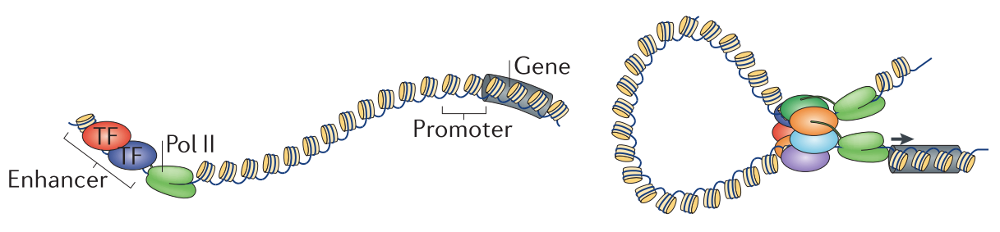
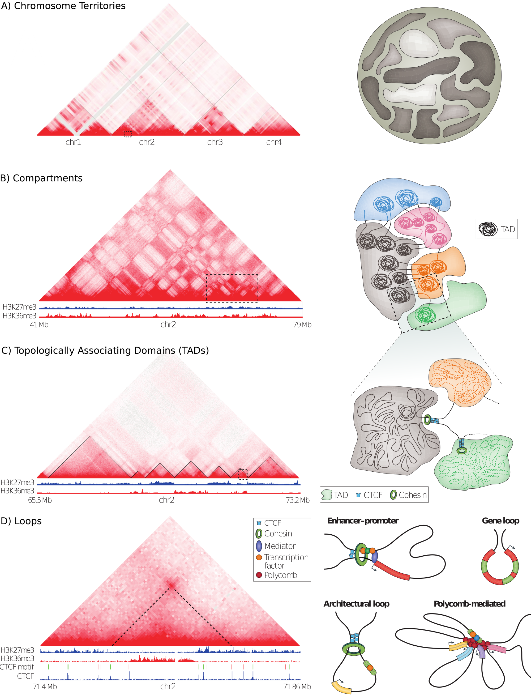
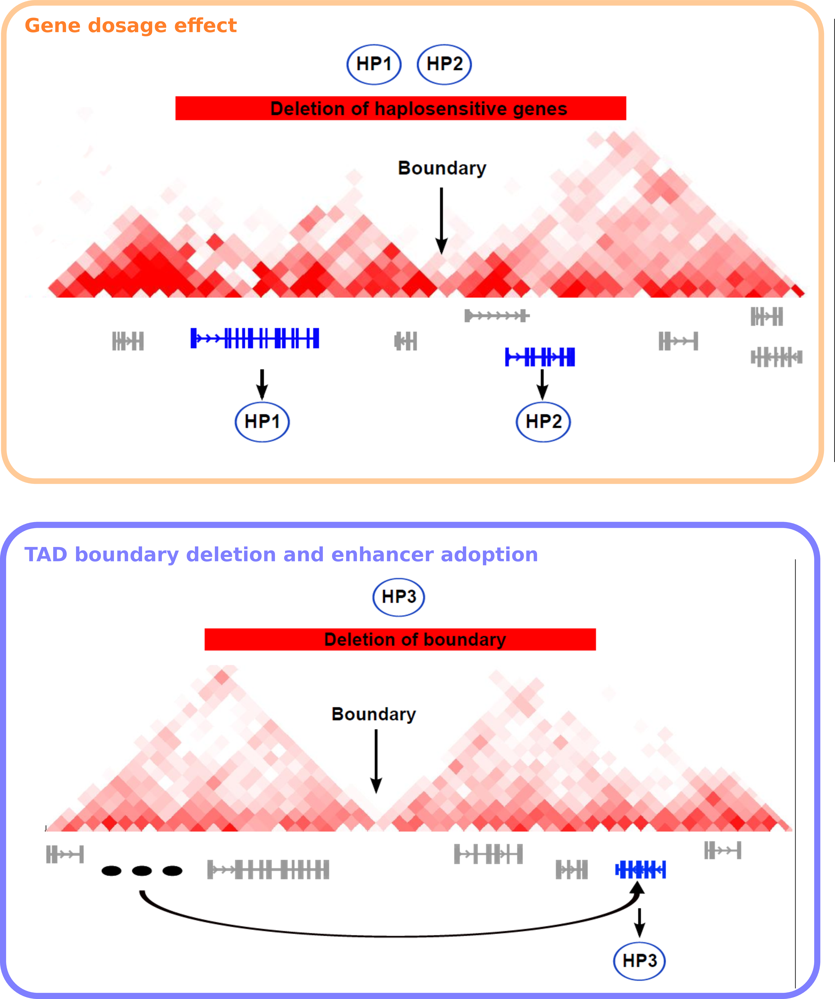

# Introduction {#intro}

<!-- Ugly hack to put content before sub-section ------------------- -->
`r if (knitr:::is_html_output()) ' '`
<!-- ---------------------------------------------------------------- -->

## Regulation of gene expression {#regulation-of-expression}

Each cell in our body originate from the same fertilized stem cell and has therefore virtually the same genome. However, different cell types have distinct morphologies and fulfill diverse functions. This diversity is achieved by expressing only a subset of genes to a specific extent for any cell type, developmental state, and environmental condition. Gene expression is therefore complex and controlled on many molecular levels [@Lelli2012]. 

The initial sequencing of the human genome reviled a tremendous resource of information encoded in the DNA sequence [@Lander2001]. However, we are still far from completely understanding the sequence information itself [@Lander2011]. While functional knowledge of individual genes and its activity, evolution, and associations to diseases accumulates over the last decades, the non-coding parts of the genome are only recently annotated in massive collaborative efforts [@Dunham2012; @Kundaje2015; @Andersson2014]. These projects provide various functional data along the genome and together with many independent studies lead to an increased understanding of the regulatory potential of non-coding regions and its dynamic activity across conditions. 

It becomes clear that gene regulation occurs on many levels. The genomic sequence itself encodes cis-regulatory modules (CRMs) to which transcription factors (TFs) bind by recognizing specific DNA sequence motifs. TFs often form complexes with other proteins and DNA. However, TF binding and CRM assembly at promoter regions of genes or distal enhancer elements require often specific epigenetic states of chromatin. Epigenetic modifications of DNA, such as methylation, influence the ability of TF to bind DNA. 
Also, the chromatin structure and accessibility itself determines if a gene can be transcribed. 
So-called pioneering factors can bind closed chromatin that is wrapped around nucleosomes and remodel it to make it accessible for other TFs that require open chromatin and specific environments of post-translational histone modifications to bind cis-regulatory regions and activate target gene expression. Another layer in gene regulation is the three-dimensional folding structure of chromatin in the nucleus, as explained in more detail below.

However, most of the cell-type specific gene regulation that accounts for cell differentiation in development and morphological diversification in evolution are driven by activation changes of non-coding regulatory regions, described as enhancers [@Long2016].


## Distal regulation by enhancers

Transcription factors regulate transcription of genes by binding to genomic DNA. However, these regulatory binding events do not occur only at proximal promoters of genes. In contrast, many transcription factors regulate genes by binding to distal regulatory elements, such as enhancers [@Spitz2012].
Physical interactions between enhancers their target gene promoter is facilitated by chromatin looping and propagated by proteins such as the mediator complex [@Andrey2017].


<!-- ---------------------------------------------------------------- -->
```{r EnhancerLooping, fig.cap='(ref:EnhancerLooping)', out.width='80%', fig.align='center'}

```

(ref:EnhancerLooping) **Enhancer-promoter interactions by chromatin looping.** Eukaryotic genes are regulated by binding of transcription factors (TF) to DNA. Transcription factor binding events occur at proximal promoters of genes and distal regulatory elements, such as enhancers (left). Chromatin looping facilitates physical interactions of enhancers with promoters to enable distal-regulation of transcription. Figure adapted from [@Pombo2015].

Enhancers were originally defined as genomic regions that enhance the expression of a reporter gene when placed experimentally in front of a minimal promoter. 
[@Banerji1981; @Shlyueva2014]. Enhancer activity can also be detected genome-wide by specific genomic experimental approaches. 
Thereby, patterns of open chromatin are identified using DNase-seq [@Song2010] or ATAC-seq [@Buenrostro2013]. Active enhancers show short bidirectional transcription, which can be identified using CAGE [@Andersson2014]. Enhancer associate with specific patterns of posttranslational histone modifications, such as H3K27ac and H3K4me1. These epigenetic marks, as well as TF binding events, can be detected genome-wide by chromatin immunoprecipitation coupled with sequencing (ChIP-seq) experiments [@Creyghton2010].

Single enhancers often regulate multiple genes. Similarly, individual genes can be regulated by multiple enhancers.
Thereby, additive effects of multiple enhancers often archive complex regulation of developmental genes. 
For example, the $\alpha$-globin gene locus is controlled by multiple enhancers, whereby each act independently and in an additive fashion without evidence of synergistic effects [@Hay2016]. Also, the Indian hedgehog (Ihh) locus is regulated by multiple enhancers with individual combinations of tissue specificities that function in an additive manner [@Will2017].
Variation of the copy number of enhancers by experimental perturbations correlates with expression strength. For example, a significant reduction of the expression of the oncogene *PIMI* could not be achieved by perturbing a single enhancer, but only by combinatorial repression of several weak enhancers [@Xie2017].

<!-- Enhancers are reviewed in more detail in @Spitz2012, @Andrey2017, and @Long2016. -->
While large-scale efforts provide genome-wide maps of enhancers and their activity in different human tissues [@Andersson2014], it is challenging to interpret the outcome of enhancer activity to gene expression.
Enhancers can be located several hundred kb apart from the promoter of regulated genes. Genome-wide studies suggest that the majority of enhancers do not regulate the next gene [@Sanyal2012].
Therefore, it is critical to understand long-range genome folding to illuminate the re-wiring between enhancers and regulated genes.

## Methods to probe the 3D chromatin architecture

### Microscopy-based techniques to visualize the genome in 3D

Historically, the organization of chromosomes and specific loci within the nucleus have mostly been studied using fluorescent *in situ* hybridization (FISH) experiments.
FISH is limited to visualize a few pre-defined loci in a few hundred cells at once and is limited in spatial resolution. 
Novel super-resolution microscopy approaches such as STORM and PALM have enabled direct visualization of the fine-scale structures of the genome at an unprecedented resolution [@Bonev2016].
Labeling of specific chromatin proteins, histone marks, or genomic loci allow to 
analyze the dynamics of chromosomes at high resolution in living cells.
However, despite spectacular technical progress, microscopy-based approaches are limited to a small number of genetic loci and do not allow a comprehensive analysis of the nuclear architecture of the complete genome. 
Furthermore, the specific folding patterns observed in microscopy cannot be mapped to genomic coordinates. This substantially limits the computational integration with other genomic data. 
However, a combination of imaging-based techniques with proximity-ligation experiments together with integrative computational models might enable to study the real-time dynamics of chromatin organization with high resolution on the single cell level [@Stevens2017; @Flyamer2017]. 

### Proximity-ligation based method to quantify chromatin interactions {#proximity-ligation}

The frequency of interactions between different loci in the genome can be
measured experimentally by proximity ligation techniques [@Sati2017; @Schmitt2016]. These protocols are variations of the chromosome conformation capture (3C) experiment [@Dekker2002]. 
3C works by the ability to cross-link two genomic loci that are in close physical proximity in the nuclear
space (Fig. \@ref(fig:ProximityLigation)A). This is achieved by treating cells with formaldehyde leading to covalent bonds between individual proteins and DNA with proteins [@Hoffman2015].
The cross-linked chromatin is then digested by restriction enzymes to fragment the genomic DNA. 
Then, re-ligation of fragmented DNA result in hybrid DNA molecules of restriction fragments that were in close physical proximity during cross-linking but originate from different regions in the linear genome sequence [@Dekker2013; @Andrey2017]. 

<!-- ---------------------------------------------------------------- -->
```{r ProximityLigation, fig.cap='(ref:ProximityLigationCap)', out.width='80%', fig.align='center'}
knitr::include_graphics("figures/Dekker2013_3C.png")
```

(ref:ProximityLigationCap) **Proximity ligation technologies to measure chromatin interactions.** **(A)**  By treating cells with formaldehyde chromatin is crosslinked. After fragmentation with restriction enzymes, DNA from two loci in close physical proximity in the nucleus is ligated to a hybrid DNA molecule that is then made from DNA that originated from two regions distal in the linear genome (indicated in red and blue). **(B)** Different variants of the 3C experiments differ in their approaches to measure the ligation products or subsets of it, in order to quantify chromatin interactions. Figure adapted from [@Dekker2013].

<!-- ---------------------------------------------------------------- -->

There exist several 3C-based methods which differ by the way the ligation product, which represents and chromatin interaction, is measured and quantified (Fig. \@ref(fig:ProximityLigation)B). 
The standard 3C protocol allows quantifying hybrid DNA-product by quantitative PCR using specific primers to amplify the product junction [@Dekker2002].
In Circular chromosome conformation capture (4C) experiments, a circular PCR is used to amplify all hybrid DNA products that are ligated with the desired restriction fragment, e.g., a specific viewpoint of interest. These products are then sequenced to generate an interaction profile measuring all
interacting regions with this viewpoint [@Simonis2006; @Noordermeer2011].
Another variant of 3C, Carbon copy chromosome conformation capture (5C), combines
3C with hybrid capture approaches to identify up to millions of interactions in parallel between two large sets of predefined loci, for example between a set of promoters and a set of distal regulatory elements [@Dostie2006; @Sanyal2012].
Other methods combine chromatin immunoprecipitation to enrich for chromatin interactions between loci bound by specific proteins of interest or marked by post-translational histone modifications. 
One of these methods is chromatin interaction analysis by paired-end tag sequencing (ChIA-PET), which allows for genome-wide analysis of long-range interactions between sites bound by a protein of interest [@Fullwood2009]. Therefore, ChIA-PET data represent a selected subset of all interactions but is an efficient alternative to measure interactions at high resolution [@Tang2015]. 
The most unbiased method to quantify all pair-wise interactions genome-wide is Hi-C [@Lieberman-Aiden2009]. After the initial restriction enzyme step of 3C, in Hi-C, the ends are filled with a biotin-marked nucleotide and subsequently re-ligated. A streptavidin pull-down step enriches the chimeric products, which are then sequenced using paired-end sequencing technology. Each read from the resulting read-pairs is then aligned independently to the reference genome to identify the originating position of the sequenced restriction fragment. 
Each read pair represents a pairwise physical interaction of the corresponding regions. 
Interaction frequencies are usually analyzed by binning the genome into equal-sized regions of several kb depending on sequencing depth.
While the first Hi-C study produced genome-wide interactions at a 1Mb resolution [@Lieberman-Aiden2009], more recent studies could analyze folding patterns at 40kb [@Dixon2012] and later up to 1kb resolution [@Rao2014].
These methods provided fascinating insights into higher-order genome organization.

## Hierarchy of chromatin 3D structure

The three-dimensional organization of genome folding was studied extensively in recent years and is reviewed comprehensively [@Pombo2015; @Sexton2015; @Bouwman2015; @Dekker2016; @Dixon2016; @Schmitt2016; @Bonev2016; @Hnisz2016a; @Merkenschlager2016; @Long2016; @Rowley2016; @Ruiz-Velasco2017; @Andrey2017].

The genome is thought to be hierarchically organized on different genomic-length scales (Fig. \@ref(fig:GenomeHierarchy)). 
Whole chromosomes occupy distinct territories in the nucleus. Thereby,
chromatin clusters in two types of compartments on the Mb scale.
On the sub-Mb scale, pair-wise interactions are enriched in discrete domains and sub-domains. 
These domains are made up of individual looping interactions and restrict regulatory contacts between enhancers and gene promoters.
These hierarchical levels are described below in more detail.

<!-- ---------------------------------------------------------------- -->
```{r GenomeHierarchy, fig.cap='(ref:GenomeHierarchy)', out.width='100%', fig.align='center'}

```

(ref:GenomeHierarchy) **Hierarchical organization of three-dimensional chromatin architecture.** The left side shows a high-resolution Hi-C interaction map as a heat-map. The color intensity represents the interaction frequencies of orthogonally associated loci. The right side shows models of the individual genome structures. **(A)** Interactions occur mostly between loci on the same chromosome, indicating chromosome territories. **(B)** Alternating patterns of interaction clusters show the association of chromatin into A/B compartments. **(C)** TADs appear as triangles with enrichment for intra-TAD interactions. Borders of TADs insulate interactions between neighboring domains. **(D)** Peaks in the Hi-C heat-map indicate pair-wise chromatin looping interactions of the associated loci. Several types of loops are shown on the right side. Figure adapted from [@Bonev2016]. 

<!-- ---------------------------------------------------------------- -->

### Chromosomal territories and inter-chromosomal contacts

The eukaryotic genome is highly organized in the interphase nucleus. 
Chromosomes occupy distinct spatial regions, called chromosome territories, and intermingle less than one would expect by chance (Fig. \@ref(fig:GenomeHierarchy)A) [@Cremer2001]. This was first observed using imaging-based approaches and is also reflected in Hi-C interaction maps, where inter-chromosomal contacts occur an order of magnitudes less frequent than intra-chromosomal contacts [@Lieberman-Aiden2009].
However, despite this spatial segregation of chromosomes, an intermingling of chromosome occurs and is associated with chromosomal translocations [@Branco2006; @Roukos2013; @Roukos2014].
There are also specific gene regulatory interactions between different chromosomes [@DeLaat2007], for example, olfactory receptor genes cluster densely in the nucleus of olfactory neurons to facilitate mono-allelic expression of a single receptor gene per cell [@Monahan2015].
Together, there exists only a few, but specific inter-chromosomal contacts and the genome is non-randomly organized in the interphase nucleus by chromosomes occupying distinct spatial territories.

### A/B compartments

The ability to measure genome-wide chromatin contacts using Hi-C revealed that individual regions on chromosomes segregate by preferential interactions into two major clusters, referred to as A/B-compartments (Fig. \@ref(fig:GenomeHierarchy)B) [@Lieberman-Aiden2009].
Interestingly, regions in A-compartments are associated with active histone modifications and
active transcription, whereas B-compartment is associated with heterochromatin, lamina association, and repressed genes [@Bonev2016]. 
More recently, higher resolution Hi-C maps further subdivided A/B compartments into six sub-compartments with preferential interactions and associations with distinct chromatin features [@Rao2014].

<!-- further organized in mega-base scale -->
<!-- A/B-compartments that show specific preferential interaction patterns -->
<!-- and transcriptional activity [@Lieberman-Aiden2009; @Rao2014]. -->

### Topologically associating domains (TADs)

Compartments could be identified by clustering of long-range interactions in Hi-C maps with bin resolution of 1 Mb. In 2012, higher resolution Hi-C maps of up to 40 kb lead to the identification of genomic regions with preferential interactions within them (Fig. \@ref(fig:GenomeHierarchy)C). 
These genomic regions were termed topologically associating domains (TADs) [@Dixon2012; @Nora2012; @Sexton2012]. 
Other authors describe similar structures as physical domains, chromatin domains, or contact domains. TADs are operationally defined as genomic regions with frequent interactions of loci within the domain and decreased interactions across domain boundaries. Quantitatively, Hi-C contact frequencies between loci in the same TAD are approximately two to three times those of genomic regions outside of the TAD [@Merkenschlager2016]. 

TADs can be identified from Hi-C interaction maps computationally by different algorithms [@Ay2015]. The directionality index (DI) is a score for each bin in the Hi-C matrix that quantifies the number of upstream versus downstream interactions of this bin. Using hidden Markov models, TAD boundaries where then identified in regions where DI changes drastically [@Dixon2012]. 
Other algorithms compute an insulation score as the extent to which interactions cross potential TAD boundaries [@Crane2015].
Later, the Arrowhead algorithm was introduced to find "contact domains" as smaller nested structures along the diagonal of high-resolution Hi-C matrices [@Rao2014].
Furthermore, when analyzing Hi-C interactions at different length scales, hierarchies of TADs and sub-TADs could be identified that overlap each other [@Filippova2014; @Fraser2015]. 
The different algorithms and parameters used in each study is only one source of variation in reliably identifying TADs. Othe sources of variations are (i) the resolution of Hi-C maps, which is mainly defined by sequencing depths, (ii) the individual steps in Hi-C protocols, such as the restriction enzyme used, [@Rao2014], and (iii) different normalization strategies for raw Hi-C contact frequencies [@Dali2017; @Forcato2017]. 
Therefore, the number and size of TADs vary between different studies, making it difficult to compare TADs in different conditions and species across studies. 

The first studies on TADs identified around 3,000 TADs with a median size of ~800 kb in human and mouse genomes [@Dixon2012] and around 1,200 physical domains of about 100 kb in *Drosophila* genomes [@Sexton2012].
Analysis of 1kb or 5kb resolution Hi-C matrices resulted in nested contact domains with a median size of 185 kb (range 40 kb - 3 Mb) in human and mouse cells [@Rao2014].
Interestingly, TADs might be equivalent to chromatin domains of 10 kb - 1 Mb in size detected by microscopy approaches [@Cremer2010; @Gibcus2013]. Another connection of Hi-C derived interaction maps with previous microscopy observations, is that TADs in *Drosophila* correspond to bands of polytene chromosomes [@Eagen2015].
Importantly, domain structures, like TADs, were also identified using methods that do not use chromatin cross-linking and proximity-ligation. 
Labeling approaches using oligoprobes enabled to trace the position of TADs along individual chromosomes [@Wang2016d].
Furthermore, domain organization in TADs was confirmed by a recently developed genome architecture mapping (GAM) approach, which relies on DNA sequencing from a collection of thin nuclear sections [@Beagrie2017].

The spatial positioning of TADs correlates with many genomic features measured along the
linear genome [@Merkenschlager2016]. 
TAD boundaries are enriched for binding of insulator proteins, such as CTCF in mammals and CP190 in Drosophila [@Dixon2012; @Sexton2012]. Furthermore, TAD boundaries are associated  with active chromatin, such as H3K4me3 and H3K27me3, DNase I hypersensitivity, active transcription, short interspersed nuclear elements (SINEs),
and house-keeping genes [@Dixon2012].
Furthermore, TADs correspond to regions of early and late replication timing [@Pope2014; @Dileep2015] and lamina-associated domains (LADs) [@Dixon2012].
Importantly, enhancer-promoter interactions seem to be mostly constrained within TADs [@Shen2012; @Ghavi-helm2014; @Symmons2014], and initial studies report slightly increased co-expression of genes within the same TAD [@Nora2012].

Altogether, there is accumulating evidence that TADs are fundamental units of chromosome organization [@Dixon2016]

### Hierarchy of domain-like structures across genomic-length scales

Globally, higher-order interactions between different TADs leads to a tree-like hierarchy of TADs and meta-TADs across genomic scales up to the range of entire chromosomes [@Fraser2015].
Similar to A/B-compartments, these tree structures correlate with epigenetic marks and expression changes during cell differentiation [@Fraser2015].

However, TADs can also be divided further into smaller regions with stronger preferential interactions within them. 
These are often referred to as sub-TADs [@Phillips-Cremins2013] and might correspond to contact domains which were later identified using high-resolution Hi-C [@Rao2014].
While sub-TADs display the same self-association features as TADs with decreased contact frequencies across sub-TAD boundaries, sub-TADs seems to be less stable across different cell types and tissues and are stronger related to tissue-specific gene expression [@Berlivet2013; @Phillips-Cremins2013]. 
Studies of CTCF and cohesin mediated interactions using ChIA-PET identified smaller structural units within TADs [@Dowen2014]. 
Chromatin loops anchored at CTCF and cohesin binding sites span genomic regions described as insulated neighborhoods that restrict enhancer-promoter interactions [@Hnisz2016a]. 
Furthermore, perturbations of anchor regions by naturally occurring or experimentally induced mutations lead to dysregulation of enclosed genes [@Dowen2014; @Hnisz2016; @Ji2016].
In summary, segregation of chromosomes into domain-like structures seems to follow a hierarchical organization across genomic-length scales. Accordingly, interaction clustering appears at scales of A/-B compartments or meta-TADs over TADs, contact domains, sub-TADs to individual chromatin loops. 

### Chromatin looping interactions

High-resolution proximity ligation techniques enabled to measure genome-wide pairwise interactions that interact significantly more frequently than background interactions (Fig. \@ref(fig:GenomeHierarchy)D). 
Chromatin loops can be broadly divided into two types [@Yu2017; @Andrey2017]
The first type is constitutive or architectural loops.
Constitutive loops are mostly invariant across cell types and demarcate TAD or sub-TAD boundaries [@Dowen2014; @Ji2016; @Phillips-Cremins2013]. Often, they are formed by CTCF and cohesin complexes [@Rao2014]. 

High-resolution Hi-C data showed that around 80% of borders of contact domains interact each other as loop anchors [@Rao2014]. 
This indicating that TADs form through loops between their borders and eventually several further nested loops within them.

An intrinsic feature of vertebrate genomes is a comparatively long distance between regulatory regions, such as enhancers, and their regulated genes.
For their ability to function as transcriptional regulators, enhancers need to come into close spatial proximity with their target promoter. 
These regulatory interactions are facilitated by the second type of chromatin loops, facultative loops. 
These loops are more cell type-specific and represent enhancer-promoter interactions. 
For example, the enhancers of the $\beta$-globin gene interact strongly with its target gene via long-range chromatin contacts in erythroid cells where the $\beta$-globin gene is active but shows little or no interactions in cells from different lineages [@Palstra2003].
Notably, such regulatory interactions of facultative loops appear mostly within regions spanned by consecutive loops or TADs [@Hnisz2016a]. 

### TAD and loop formation by architectural proteins {#loop-mechanism}

An important question in current research efforts is to understand how TADs and chromatin loops are established on a molecular level. 
These mechanisms might differ between species. 
Several, so-called, architectural proteins are enriched at TAD boundaries in flies and allow dynamic regulation of these boundaries [@Bortle2014; @Gomez-Diaz2014]. In vertebrates, only some of these proteins are conserved, indicating a partially different set of factors with such functions [@Phillips-Cremins2013; @Bonev2016]. Profiling 76 TFs for binding signals at strong chromatin loop anchors identified CTCF, subunits of the cohesin complex, ying yang 1 (YY1) and zinc finger protein 143 (ZNF143) as highly enriched [@Rao2014]. Furthermore, the mediator complex has a well-characterized role in bridging enhancer and promoters of long-range distances and assemble the pre-initiation complex for transcriptional elongation [@Allen2015]. Mediator depletion resulted in diminished looping interaction strength [@Bonev2016].

Cohesin is a ring-shaped protein and has several functions including sister chromatid cohesion and DNA repair and interacts with mediator complex and CTCF in the context of chromatin architecture [@Bonev2016; @Merkenschlager2016].
Initial studies analzed chromatin organization in cohesin deficient cells.
In two studies depletion of cohesin reduced interactions within TADs but did not alter TAD structures completely [@Seitan2013; @Zuin2014]. 
One study report a significant increase in interactions between different TADs after cohesin depletion [@Sofueva2013]. 
Conditional deletion of cohesin in non-cycling thymocytes suggested a role of cohesin in mediating regulatory interactions between enhancers within TADs [@Ing-simmons2015].

The best studied architectural protein is probably CTCF [@Ong2014].
CTCF is conserved in most bilaterians, expressed in all tissues, and essential for embryonic development. 
By its ability to restrict promoter-enhancer interaction in reporter plasmids, CTCF was characterized as insulator protein. 
CTCF has 11 zinc finger binding domains which recognize a specific DNA sequence motif, to which CTCF binds with high affinity [@Kim2007; @Nagy2016]. 
CTCF binding sites are enriched at TAD boundaries in *Drosophila* and mammals.
However, only around 15% of CTCF binding sites are located at TAD boundaries, suggesting that CTCF binding not be sufficient for TAD formation [@Bonev2016]. 
About 30% to 60% of CTCF binding sites are cell-type specific, and many variable sites show an association of DNA methylation with CTCF binding. 
CTCF binding sites that depend on methylation are located mostly within TADs.
Interestingly, CTCF ChIP-seq data across individuals show a higher variability of CTCF binding within TADs and lower variation at TAD boundaries [@Ruiz-Velasco2017]. 
Also, evolutionary conservation of CTCF binding across species is stronger at TAD boundaries [@VietriRudan2015].
Depletion of CTCF had a similar effect than cohesin degradation, resulting in increased inter-domains interactions [@Seitan2013; @Zuin2014].
These data suggest a crucial role of cohesin and CTCF in promoter-enhancer interactions and TAD formation [@Pombo2015; @Merkenschlager2016].

Interestingly, CTCF motifs appear mostly in convergent orientation at chromatin loop anchors
[@Rao2014; @Tang2015; @VietriRudan2015]. 
Furthermore, experimental inversion of the motif results in changes of loop formation and, at least in some cases, altered gene expression [@Guo2015; @deWit2015; @Sanborn2015].
Polymer simulation studies together with perturbation experiments led to a model of
TAD and loop formation by loop extrusion.
According to this model, loop-extruding factors, such as cohesin, form
progressively larger loops but stall at CTCF binding sites in convergent
orientation [@Sanborn2015; @Fudenberg2016]. 
Interestingly, this model explains many features of chromatin interaction data, such as the directionality of CTCF motif and nested hierarchy of TADs and TAD-like structures. 

In summary, genome-wide interaction data suggest a hierarchical organization of chromosome architecture. 
First, dynamic nucleosome contacts form clutches and fibers. 
These engage in long-range chromatin loops, some of which are stabilized by architectural proteins, such as CTCF and cohesin at convergently oriented motif sites, and lead to the formation of TADs.
TADs form clusters by their epigenomic type into A/B compartments, and coalescence of compartments in the same chromosome forms chromosome territories [@Bonev2016].

## Dynamics of chromatin structure

Proximity ligation experiments, like Hi-C, measure contact frequencies as average over millions of cells in the sample. Therefore, identified contacts might be present only in a subset of cells. Furthermore, specific contacts could be very dynamic over short time-scales in individual cells.
While recent methodological advances allow studying of variation across individual cells (discussed in section \@ref(single-cell)), initial studies focused on the differences of genome folding across cell cycle and cell differentiation. 

### Dynamics across cell cycle

It is important to keep in mind how chromosome folding changes during cell division. Spatial organization is generally studied in non-synchronous cells, of which interphase cells make up the biggest proportion [@Bouwman2015].
In interphase, chromosomes are decondensed and hierarchically organized into territories, compartments, and TADs as described above. 
To prepare for cell division chromosomes untangle and condense, while transcription ceases almost entirely. Mitotic chromosomes do not show preferential organization, such as compartments or TADs [@Naumova2013]. Enhancer-promoter looping might be absent as well [@Dekker2014].
After cell division, chromosomes decondense and fold into the interphase hierarchy. While individual genes are relatively mobile during the early G1 phase, they become quickly constrained to a small nuclear sub-volume, after which genome folding is relatively stable for the rest of the interphase [@Chubb2002; @Walter2003].
These dynamics during cell-cycle raise the question of how the pattern of 3D organization is re-established with each cell division.

### Dynamics across cell types and differntiation
<!-- - Variablity between cell types and conditions -->
<!-- - Cell-type invariant TADs   -->
  
The primary domain architecture of chromatin is mostly preserved in different cell types and even across species [@Dixon2012; @Rao2014].
However, chromatin dynamics specify distinct gene expression programs and biological functions [@Bonev2016].
One example of dynamic chromatin organization is dosage compensation, in which the X chromosome is transcriptionally inactivated in human female cells. 
Whereas typical TAD structures were observed on the active X chromosome, only two huge domains were identified on the inactive X chromosome in *Drosophila* and human [@Deng2015; @Rao2014].
Other examples include differences in terminally differentiated post-mitotic cells. For example, rod photoreceptor cells in nocturnal mammals have an unusual, inverted nuclear architecture, in which heterochromatin is enriched in the center of the nucleus and is absent from the periphery [@Solovei2013; @Falk2018]. 
Further biological processes related to cell cycle exit strongly affect three-dimensional chromatin organization. These are quiescence in yeast, where intrachromosomal contacts increase [@Rutledge2015], and senescence, where heterochromatin relocalizes from the nuclear periphery to the interior [@Chandra2015].
However, A/B compartments and TADs seems to be mostly unaffected in these processes [@Criscione2016]. 

Subtler effects of changes in chromatin reorganization are observed during biological processes such as cell differentiation and signaling [@Bonev2016].
During the transition of embryonal stem cells (ESC) from ground-state of pluripotency to a primed state for differentiation, a gradual and reversible establishment of long-range contacts was observed between bivalent gene promoters [@Joshi2015]. These changes depended on Polycomb repressive complex 2, underscoring its role in establishing 3D genome organization in early development, as was previously shown for *Drosophila* [@Bantignies2011]. To address the question of how nuclear architecture change during lineage specification, a recent Hi-C study produced Hi-C interaction
maps in ESCs and four ESC-derived lineages representing early developmental stages [@Dixon2015]. Interestingly, TADs are mostly unchanged during lineage specification, but intra-TAD interactions in some domains were strongly altered, and these changes correlate with active chromatin state [@Dixon2015].
Furthermore, often entire TADs relocate from one compartment to another, which was also associated with transcriptional changes of genes in these TADs. 
Also in B cell differentiation, several regions change compartment identity and relocate from the nuclear periphery to the interior [@Lin2012].

The dynamics of chromatin architecture were also studied in response to stimuli, such as hormone signaling by progestin or estradiol. Despite substantial changes in the transcriptional activity, only small differences were observed in the domain organization of chromatin [@LeDily2014]. 
However, often the entire TAD responded as a unit by changing histone modifications and switching between A and B compartment. This suggests that transcription status is coordinated within TADs.
Overall, TADs seems to be mostly cell-type invariant, whereby local regulatory interactions within TADs and global differences in compartment type change between cell types and correlate with differential gene expression. 

## Evolution of chromatin organization

While TADs were initially described for mammalian genomes, 
a similar domain organization was found in the genomes of non-mammalian species such as *Drosophila* [@Sexton2012],
zebrafish [@Gomez-Marin2015] *Caenorhabditis elegans* [@Crane2015] and yeast [@Hsieh2015; @Mizuguchi2014].
However, in *C. elegans*, TADs were only observed on the X chromosome of XX hermaphrodites and not on autosomes [@Crane2015]. 
The small and compact genome with most of the cis-regulatory information within 10kb from the TSS might not need long-range domains for gene regulation [@Long2016].
In contrast, plants have long-range cell-type specific enhancers [@Zhu2015], but TAD like structures could not be
observed in Hi-C experiments in *A. thaliana*. 
Interestingly, both *C.elegans* and *A.thaliana* do not encode a CTCF homolog [@Heger2012], 
suggesting alternative mechanisms of genome organization and segmentation in these species [@Long2016]. 
TAD-like structures are therefore not required for eukaryotic interphase chromosome folding. 
Nevertheless, Hi-C experiments in bacteria and yeast suggest that self-interacting domains may be an ancient feature of chromosome organization. 
Hi-C data in *Caulobacter* cells revealed so-called chromosomally interacting domains (CIDs) of 30 to 420 kb in size [@Le2013].
In fission yeast *S. pombe*, globule structures at the 40-100 kb scale were identified and depend on cohesin complex [@Mizuguchi2014]. Furthermore, in very short CIDs of around 2-10 kb were detected in *S.cerevisiae* and bounded by highly transcribed genes [@Hsieh2015].

In summary, TAD like structures have been detected in many organisms, including files, worms, fungi, and bacteria, but variations in size and internal structure indicate differences in their formation and biological functions [@Dekker2015].
Further high-resolution experiments in more diverse species are needed to understand the evolutionary origin of genome segregation into TAD-like structures. 

The presence of domain-like structures in diverse species across the tree of life leads to the question if not only the genomic sequence but also its folding structure is conserved between species. 
Interestingly, TADs are not only mostly stable across different cell-types [@Dixon2012; @Rao2014] and during differentiation [@Dixon2015], but also remarkably similar between homologous regions in mouse and human [@Dixon2012]. 
About half of the TAD boundaries identified in human hESC cells occur at homologous genomic positions in mouse ESCs [@Dixon2012]. A similar fraction of contact domains was detected at homologous genomic locations in mouse and human lymphoblastoid cells [@Rao2014]. 
Another study could trace back a single TAD boundary at the Six gene loci to the origin of deuterostomes [@Gomez-Marin2015]. However, these analyses focused only on the subset of syntenic regions between genomes and therefore, do not allow conclusions about disruptions or the conservation of TADs by chromosomal rearrangements between species. 

During evolution, the genome sequence underwent several types of mutations. While single nucleotide mutations only alter a single DNA base at a time, structural variants modify larger chromosomal regions by deletions, duplications, inversions, or translocations. Thereby deletions and duplications can alter the copy number of genes. The breakpoint of such rearrangements can also lead to disruption of genes or gene fusion. 
However, rearrangement breakpoints can also alter the regulatory environment of genes by disrupting regulatory regions, such as enhancers, or their interactions. 
Comparative genomic analysis of two species can identify evolutionary rearrangements by altered adjacencies of orthologous genes. 

Initial comparative Hi-C studies identified several evolutionary breakpoints at TAD boundaries and highlighted an important role of conserved CTCF binding sites in facilitating conservation of TADs [@VietriRudan2015]. 
However, it remains to be investigated systematically if TAD regions as a whole might be stable or disrupted by rearrangements during evolution and how this is associated with conserved or divergent transcriptional regulation between species. 

## Disruption of chromatin architecture in disease

The insulating function of TADs, which restrict promoter-enhancer interactions [@Symmons2014], suggests that alterations of TAD structures may
induce ectopic interactions between regulatory elements and genes in neighboring TADs, leading to gene dysregulation (Fig. \@ref(fig:EnhancerAdoption)). 
Consistently, genetic manipulation of specific TAD boundaries can change the surrounding interaction patterns and thus affect the expression of nearby genes. After experimental deletion of a 58-kb region encompassing a TAD boundary in mouse ESC, interactions between adjacent TADs increased significantly and genes in neighboring TADs were upregulated [@Nora2012].
More precise deletion or inversion of CTCF binding site at loop anchors in TAD boundaries altered local chromatin architecture and nearby gene expression [@Dowen2014; @Guo2015; @Narendra2015].

The alteration of chromatin contacts upon experimental disruptions of TAD boundaries leads to the question whether disruption of TADs could also be and mechanism of disease pathology. This hypothesis was initially discussed by studying the etiology of the Liebenberg syndrome, in which an upper-limb malformation phenotype is caused by a deletion in the vicinity of the *PITX1* gene [@Spielmann2013a]. *PITX1* becomes thereby accessible to an enhancer with specific activity in lower-limb and was miss-expressed in a corresponding mouse model [@Spielmann2012]. 
Overlap of this deletion with later identified TAD boundaries leads to the hypothesis of a regulatory effect mechanism of boundary deletions referred to as enhancer adoption.

An association of TAD disruptions with diseases was first shown by computational analysis integrating TAD structures, with tissue-specific enhancers, and large chromosomal deletions, which were associated with clinical phenotypes [@Ibn-Salem2014].
In this study, the Human Phenotype Ontology database [@Kohler2014] was used to relate the phenotypes of 922 deletion cases from the DECIPHER database [@Firth2009] to monogenic diseases associated with genes in or adjacent to the deletions. This was used to differentiate for each deletion case between two possible pathogenic effect mechanism that best explains the phenotypes observed in the patients (Fig. \@ref(fig:EnhancerAdoption)). Many deletions were best explained by a gene dosage mechanism and haploinsufficiency of genes located within the deletion. 
However, about 12 percent of cases were best explained by a TAD boundary disruption and specific combinations of tissue-specific enhancers and genes in adjacent TADs. 
Importantly, randomization of phenotype data showed that this enhancer adaption mechanism was significantly more frequent than expected by chance [@Ibn-Salem2014].
Therefore, this study shows for the first time an association of TAD disruption with genetic diseases and describes a regulatory effect mechanism of TAD disruptions that need to be further investigated and has to be considered when interpreting genetic variations in patient genomes.

<!-- ---------------------------------------------------------------- -->
```{r EnhancerAdoption, fig.cap='(ref:EnhancerAdoptionCap)', out.width='60%', fig.align='center'}

```

(ref:EnhancerAdoptionCap) **Models of pathomechanisms by chromosomal deletions involving TAD disruption** In each panel, an exemplary deletion is shown as a red bar, a TDB is indicated with a black arrow, and genes associated with the phenotypes of the CNV patient are shown in blue, other genes in gray. Phenotypic abnormalities are represented as exemplary HPO terms (HP1, HP2, and HP3). Three tissue-specific enhancers are shown in (B) as black ovals. **(A)** Gene-dosage effect. A deletion leads to a reduction in the dosage of haplosensitive genes located within the CNV. The individual with the deletion has two phenotypic abnormalities (HP1, HP2) resulting from deletion of two haplosensitive genes. A Mendelian disease related to mutations in the first gene is associated with HP1, and a Mendelian disease related to mutations in the second gene is associated with HP2. **(B)** TAD boundary deletion and enhancer adoption. Removal of the topological domain boundary allows the tissue-specific enhancer inappropriately to activate a phenotypically relevant gene located adjacent to the deletion, a phenomenon that we refer to as enhancer adoption. In this case, the individual with the deletion has a phenotypic abnormality (HP3) that is also seen in individuals with a Mendelian disease related to a mutation in the gene adjacent to the deletion. Figure adapted from [@Ibn-Salem2014].

Interestingly, these initial results are largely confirmed by more recent studies investigating structural variants that disrupt TADs and lead to ectopic gene expression in genetic diseases [@Lupianez2015; @Franke2016; @Redin2017] and cancers [@Northcott2014; @Hnisz2016; @Weischenfeldt2016]. This is discussed in more detail below (Chapter \@ref(thesis-discussion)).

Together, these observations lead to the questions whether other types of structural variants, like translocations and inversions, could also disrupt TADs and regulatory interactions of genes.
To analyze such a position effect, we need careful integration of diverse genomic and phenotypic data. Computational tools could predict the impact of rearrangement breakpoints on TAD disruption and potential regulatory effects on phenotypically relevant genes. Such a method would improve molecular diagnoses of many patients with variants of unknown significance.

## Aims of this thesis

The recent advances in genome-wide ligation proximity mapping revealed that 
interphase chromosomes are highly organized and structurally segregate into TADs.
TADs were already shown to associate with diverse genomic functions such as histone modifications [@Dixon2012; @Sexton2012], replication timing [@Pope2014], and gene expression correlation [@Nora2012; @LeDily2014]. 
We previously showed a significant association of TAD disruptions by large chromosomal deletions with clinical phenotypes, likely caused by an enhancer adaption mechanism [@Ibn-Salem2014].
However, it is still unclear how exactly the genome folds into TADs and what consequence this has for gene regulation during evolution and in genetic diseases. For example, it is not clear to which extends genes within the same TAD are expressed and regulated in a coordinated manner. Despite initial evidence of evolutionary conservation of TADs in homologous regions between human and mouse [@Dixon2012; @VietriRudan2015], there was no systematic analysis of the stability of TADs during evolution.
Furthermore, it is unclear if TAD disruptions during evolution correlate with gene expression divergence between species. 
The accumulating evidence of the critical gene regulatory function of TADs leads to the question if TADs play an essential role in genetic diseases [@Spielmann2016]. More specifically, TADs might be used together with other genomic annotations, such as enhancers and their interactions with regulated genes, to interpret structural variations in patient genomes. 
Furthermore, increasing molecular and mechanistic understanding of chromatin looping and TAD formation could be used to improve genome-wide contact maps and predict computationally long-range interactions in diverse tissues and conditions.

Therefore, this thesis addresses the question, whether TADs represent only structural units of genomes or also essential functional building block, in which genes can be regulated in a coordinated manner.
By computationally integrating genome-wide chromatin interaction maps with diverse genomic datasets, including sequence conservation, enhancer activity, protein binding, gene expression and clinical phenotypes, this work addresses the following questions.

**Is the three-dimensional folding structure of genomes associated with co-regulation of functionally related genes?**


- How are paralog genes distributed in the linear genome and the three-dimensional genome architecture? 
- Are paralogs co-regulated with shared enhancers and located in the same TAD in genomes of human and other species?
- Can we learn about the evolutionary history of genes and how they are created within regulatory environments of TADs?

**Are TADs functional building blocks of genomes and subjected to selective pressure during evolution?**

- Are human TAD regions conserved during evolution or disrupted by rearrangements when compared to other vertebrate genomes?
- Have genes within TADs a more conserved expression profile across different tissues?
- Are disruptions of TADs during evolution associated with changes in gene expression profiles?


**Can clinical phenotypes be explained by rearrangements affecting TADs and the regulation of relevant genes?**

- Can TADs be used to interpret gene regulatory effects of balanced chromosomal rearrangements in whole-genome sequenced patients?
- How can we quantify the similarity of phenotypes observed in patients and phenotypes associated with genes to prioritize candidate genes?
- Can we provide a computational tool to integrate functional genomic elements, chromatin interaction data, and TADs with phenotype data of patients to predict pathomechanism of structural variations?

**Can protein binding profiles and genomic sequence features predict chromatin looping interactions?**

- Does the cross-linking effect in ChIP-seq experiments provide characteristic signals at interacting chromatin loop anchors? 
- Does the genomic sequence encode features that are predictive for long-range chromatin interactions?
- Can we provide a computational method to predict chromatin looping interactions in specific cell-types and conditions of interest?
- Which transcription factors are most predictive and eventually functionally involved in chromatin looping?

## Structure of this thesis

The following four chapters address and discuss the questions raised above. 
First, the focus is on duplicated genes in the human genome. Because of
their related sequences and functions, a shared evolutionary history, and
close colocalization in the genome they represent an interesting model
to study how genome folding is related to regulation of gene expression
during evolution (Chapter \@ref(paralog-regulation)). 
Next, whole-genome alignment between human and other vertebrate genomes are used to systematically investigate whether TADs represent conserved building blocks of genomes and whether rearrangements of TADs lead to altered gene expression programs (Chapter \@ref(TAD-evolution)). 
Then, we address disruptions of
chromatin organization by analyzing disease associated rearrangement
breakpoints from whole-genome sequenced patients of various genetic
disorders to explain their phenotypes by miss-regulation of genes in disrupted TADs (Chapter \@ref(position-effect)). 
Finally, we make use of recent insights in chromatin loop formation to provide a computational tool for predicting long-range chromatin contacts from broadly available ChIP-seq data, with the aim to facilitate three-dimensional folding analysis in diverse tissues and conditions for which Hi-C like data is not available (Chapter \@ref(loop)).
The overall findings are then discussed in the context of most recent literature and future research perspectives (Chapter \@ref(thesis-discussion)).

