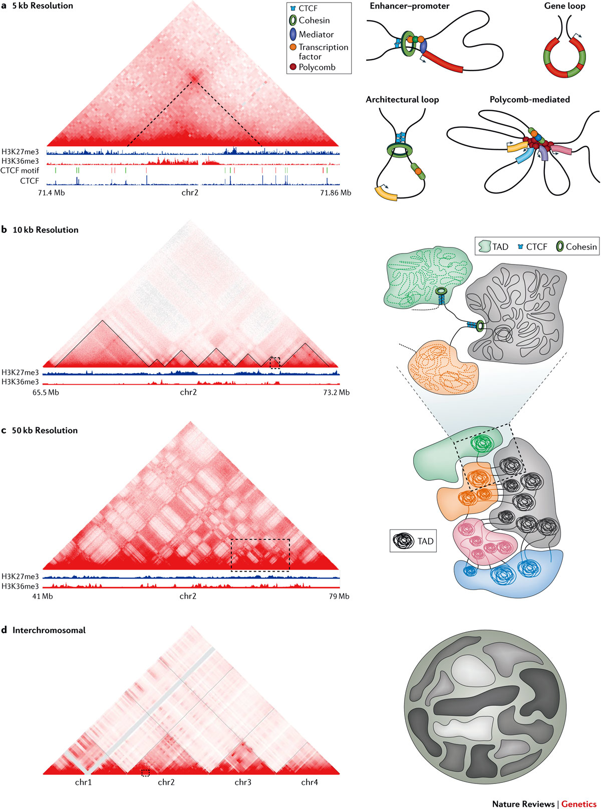

# Introduction {#thesis-intro}

## Regulation of gene expression

Each cell in our body originate from the same fertilized stem cell and has therefore virtually the same genome. However, different cell types have distinct morphologies and fulfill diverse functions. This diversity is archived by expressing only a subset of genes to a specific extent for any cell type, developmental state, and environmental condition. Gene expression is therefore complex and controlled on many molecular levels [@Lelli2012]. 

The initial sequencing of the human genome reviled a large resource of information on the genetic sequence, however, we are still far from complete understanding of the sequence itself. While functional knowledge of individual genes and its activity, evolution and associations to diseases accumulates over the last years, the non-coding parts of the genome is only very recently annotated in large collaborative efforts [@Dunham2012; @Kundaje2015; @Andersson2014]. These efforts lead to an increased understanding of the regulatory potential of non-coding regions and its dynamics across conditions. 

The genomic DNA sequence itself encodes cis-regulatory modules (CRMs) to which transcription factors (TFs) bind by recognizing specific DNA sequence motifs. TFs often form complexes with other proteins and DNA. However, TF binding and CRM assembly require often specific epigenetic states of chromatin. Epigenetic modifications of DNA, such as methylation, influence the ability of TF to bind DNA. 
The chromatin structure and accessibility itself also determines if a gene can be transcribed. While so-called pioneering factors can bind closed chromatin that is wrapped around nucleosomes and remodel it to make it accessible for other TFs that require open chromatin and specific post-translational histone modifications to bind cis-regulatory regions and activate target gene expression. 

Another layer in gene regulation is the three-dimensional folding structure of chromatin in the nucleus. 
However, most of the cell-type specific gene regulation that accounts for cell differentiation in development and morphological diversification in evolution, are driven by activation changes of enhancers [@Long2016].

However, the genome is still largely considered as 
- From 1D to 3D


## Enhancers

Enhancers were originally defined as genomic regions that enhance the expression of a reporter gene, when placed experimentally in front of a minimal promoter. 
[@Banerji1981; @Shlyueva2014]. Enhancer activity can also be detected 
genome-wide by specific patterns of open chromatin using DNase-seq [@Song2010], 
ATAC-seq [@Buenrostro2013] or posttranslational modification of histones, such as
H3K27ac by ChIP-seq [@Creyghton2010].
Complex regulation of developmental genes is often archived by additive effects of multiple enhancers. 
For example, the $\alpha$-globin gene locus is controlled by multiple enhancers, whereby each 
enhancer elements act independently and in an additive fashion without evidence 
of synergistic or higher-order effects [@Hay2016]. Also, the Indian hedgehog (Ihh) locus is regulated by multiple enhancers with individual combinations of tissue specificities that function in an additive manner [@Will2017].
Experimental variation for of the copy number of enhancers is associated with expression strength.
Significantly reduction of the expression of the oncogene *PIMI* could not be archived by perturbing a single enhancer, but only by combinatorial repression of several weak enhancers [@Xie2017].
Enhancers are reviewed in more detail in @Spitz2012, @Andrey2017, and @Long2016.

## Methods to probe the 3D chromatin archtiecture

### Microscopy-based techniques to visuallize the genome in 3D
Historically, the organization of chromosomes and specific loci within the nucleus have mostly been studied using fluorescent *in situ* hybridization (FISH) experiments.
FISH is limited to examine a few pre-defined loci a few hundred cells at once and is limited in spatial resolution. 
Novel super-resolution microscopy approaches such as STORM and PALM have enabled direct visualization of the fine-scale structures of the genome at an unprecedented resolution [@Bonev2016].
Labeling of specific chromatin proteins, histone marks, or genomic loci allow to 
analyze the dynamics of chromosomes at high resolution in living cells.
However, despite spectacular technical progress, microscopy-based approaches are limited to a small number of genetic loci and do not allow a comprehensive analysis of the nuclear architecture of the complete genome. 
Furthermore, the specific folding patterns observed in microscopy cannot be mapped to genomic coordinates, substantially limiting the integration with other genomic data. 
However, a future combination of imaging-based techniques with proximity-ligation experiments together with integrative computational models might enable to study the real-time dynamics of chromatin organization with high resolution on the single cell level [@Stevens2017, @Flyamer2017]. 

### Proximity-ligation based method to quantify chromatin interactions

The frequency of interactions between different loci in the genome can be
measured experimentally by proximity ligation techniques [@Sati2017; @Schmitt2016]. These protocols are variations of the chromosome conformation capture (3C) experiment [@Dekker2002]. 
3C works by the ability to cross-link two genomic loci that are in close physical proximity in the nuclear
space by treating cells with formaldehyde leading to covalent bonds between proteins and DNA with proteins [@Hoffman2015].
The cross-linked chromatin is than digested by enzymes to fragment the genomic DNA. 
Than, re-ligation of fragmented DNA result in 
hybrid DNA molecules of restriction fragments that where in close
physical proximity during cross-linking but originate from different regions in the linear genome sequence [@Dekker2013; @Andrey2017] (Fig. \@ref(fig:ProximityLigation)A). 

<!-- ---------------------------------------------------------------- -->
```{r ProximityLigation, fig.cap='(ref:ProximityLigation)', out.width='80%', fig.align='center'}
knitr::include_graphics("figures/Dekker2013_3C.png")
```

(ref:ProximityLigation) **Proximity ligation technologies to measure chromatin interactions** **(A)**  By treating cells with formaldehyde chromatin is crosslinked. After fragmentation with restriction enzymes, DNA from two loci in close physical proximity in the nucleus is ligated to a hybrid DNA molecules that is than made from DNA that originated from two regions distal in the linear genome (indicated in red and blue). **(B)** Different variants of the 3C experiments differ in their approaches to measure the ligation products or subsets of it in order to quantify chromatin interactions. Figure adapted from [@Dekker2013].

<!-- ---------------------------------------------------------------- -->

There exist several 3C-based methods which differ by the way the ligation product, which represents and chromatin interaction, is measured and quantified (Fig. \@ref(fig:ProximityLigation)B). 
The classic 3C protocol allows to quantify hybrid DNA-product by quantitative PCR using specific primers to amplify the product junction [@Dekker2002].
In Circular chromosome conformation capture (4C) experiments, a circular PCR is used to amplify 
all hybrid DNA products that are ligated with a desired restriction fragment, e.g. a specific viewpoint of interest. These products are then sequences to generate an interaction profile measuring all
interacting regions with this viewpoint [@Simonis2006; @Noordermeer2011].
Another variant of 3C, Carbon copy chromosome conformation capture (5C), combines
3C with hybrid capture approaches to identify up to millions of interactions in parallel between two large sets of loci, for example between a set of promoters and a set of distal regulatory elements [@Dostie2006; @Sanyal2012].
Other methods combine chromatin immunoprecipitation to enrich for chromatin interactions between loci bound by specific proteins of interest or marked by post-translational histone modifications. 
One of these methods is chromatin interaction analysis by paired-end tag sequencing (ChIA-PET), which allows for genome-wide analysis of long-range interactions between sites bound by a protein of interest [@Fullwood2009]. Therefore, ChIA-PET data represent a selected subset of all interactions, but is an efficient alternative to measure interactions at high resolution [@Tang2015]. 
The most unbiased method to quantify all pair-wise interactions genome-wide is Hi-C [@Lieberman-Aiden2009]. After the initial restriction enzyme step of 3C, in Hi-C, the ends are filled with a biotin-marked nucleotide and subsequently re-ligated. A streptavidin pull-down step is used to enrich for the chimeric products, which are then sequenced using paired-end sequencing technology. Each read from the resulting read-pairs is then aligned independently to the reference genome to identify the originating position of the sequenced restriction fragment. 
Each read pair represent a pairwise physical interaction of the corresponding 
regions. 
Interaction frequencies are usually analyzed by binning the genome into equal sized regions of several kb depending on sequencing depth.
While the first Hi-C study produced genome-wide interactions at 1Mb resolution [@Lieberman-Aiden2009], more recent studies could analyse folding patterns at 40kb [@Dixon2012], and later up to 1kb resolution [@Rao2014].

<!-- libraries fo hypbrid DNA products are further digested with a second restiction enzyme and further re-ligated to g -->

## Hierarchy of chromatin 3D structure

The three-dimensonal organization of genome folding was studied extensively in recent years 
and is reviewd comprehensively by leading expertes in the field [@Pombo2015; @Sexton2015; @Dekker2016; @Dixon2016; @Schmitt2016; @Bonev2016; @Hnisz2016; @Merkenschlager2016; @Long2016; @Ruiz-Velasco2017; @Andrey2017].

<!-- ---------------------------------------------------------------- -->
```{r GenomeHierarchy, fig.cap='(ref:GenomeHierarchy)', out.width='100%', fig.align='center'}

```

(ref:GenomeHierarchy) **Hierarchical organization of chromatin three-dimensional chromatin architecture** **(A)**  Figure source [@Bonev2016] [https://www.nature.com/articles/nrg.2016.112/figures/2](https://www.nature.com/articles/nrg.2016.112/figures/2).

<!-- ---------------------------------------------------------------- -->

### Chromosomal territories and inter-chromosomal contacts
The eukaryotic genome is highly organized in the interphase nucleus. 
Chromosomes occupy distinct spatial regions, called chromosome territories, and 
intermingle less than one would expect by chance [@Cremer2001]. This was first observed 
using imaging based approaches, and is reflected in Hi-C interaction maps, where inter-chromosomal contacts occur an order of magnitudes less frequent than intra-chromosomal contacts [@Lieberman-Aiden2009].
However, despite this spatial segregation of chromosome, intermingling of chromosome occurs and is associated with chromosomal translocations [@Branco2006; @Roukos2013; @Roukos2014].
There are also specific gene regulatory interactions between different chromosomes [@DeLaat2007], for example olfactory receptor genes cluster densely in the nucleus of olfactory neurons to facilitate mono-allelic expression of a single receptor gene per cell [@Monahan2015].
Togther, there exists only a few but specific inter-chromosomal contacts and the genome is non-randomly organized in the nucleus by chromosomes occupying distinct spatial territories.

### A/B compartments
The ability to measure genome-wide chromatin contacts using Hi-C, 
revealed that individual regions on chromosomes segregate by preferential interactions 
into two mayor clusters, referred to as A/B-compartments [@Lieberman-Aiden2009].
Interestingly, regions in A-compartments are associated with active histone-modifications and
active transcription, whereas B-compartment is associated with heterochromatin, lamina association, and repressed genes [@Bonev2016]. 
More recnetly, higher resolution Hi-C maps further subdevided A/B compartments into
six sub-compartments with prefferntial interacitons and associations to distinct chromatin features [@Rao2014].

<!--  further organized in mega-base scale -->
<!-- A/B-compartments that show specific preferential interaction patterns -->
<!-- and transcriptional activity [@Lieberman-Aiden2009; @Rao2014]. -->

### Topologically associating domains (TADs)

Compartments could be identified by clustering of long-range interactions in Hi-C maps
with bin resolution of 1 Mb. In 2012 higher resolution Hi-C maps of up to 40 kb lead to the identification of genomic regions with preferential interactions within them. 
These genomic regions were termed topologically associating domains (TADs) [@Dixon2012; @Nora2012; @Sexton2012]. They are operationally defined as genomic regions with frequent interactions of loci within the domain and decreased interactions across domain boundaries. Quantitatively, Hi-C contact frequencies between loci in the same TAD are approximately two to three times those of genomic regions outside of the TAD [@Merkenschlager2016]. 

TADs can be identified from Hi-C interaction maps computationally by different algorithms [@Ay2015]. The directionality index is a score for each bin in the Hi-C matrix that quantifies the
number of upstream versus downstream interactions of this bin. Using hidden Markov models TAD boundaries where then identified in regions where DI is changing drastically [@Dixon2012]. 
Other algorithms compute an insulation score as the extent to which interactions cross potential TAD boundaries [@Crane2015].
Later the Arrowhead algorithm was introduced to find "contact domains" as smaller nested structures along the diagonal of high resolution Hi-C matrices [@Rao2014].
Furthermore, when analyzing Hi-C interactions at different length scales, hierarchies of TADs and sub-TADs could be identified that overlap each other [@Filippova2014; @Fraser2015]. 
The different algorithms and parameters used in each study is only one source of variation 
in reliably identifying TADs. Also, the resolution of Hi-C maps, which is mainly defined by
sequencing depths but also the Hi-C protocol itself [@Rao2014], as well as different 
normalization strategies for Hi-C contacts introduce variability [@Forcato2017]. 
Therefore, the number and size of TADs varies between different studies, making it 
difficult to compare TADs in different conditions and species across studies. 

The first studies on TADs identified around 3,000 TADs with a median size of ~800 kb in human and mouse genomes [@Dixon2012] and arround 1,200 physical domains of arround 100 kb in *Drosophila* genomes [@Sexton2012].
Analysis of 1kb or 5kb resolution Hi-C matrices resulted in nested "contact domains" 
with a median size of 185 kb (range 40 kb - 3 Mb) in human and mouse cells [@Rao2014].

Interestingly, TADs might be equivalent to "chromatin domains" of 10 kb - 1 Mb in size detected by microscopy approaches [@Cremer2010; @Gibcus2013]. Another connection of Hi-C derived interaction maps with previous microscopy observations, is that TADs in *Drosophila* correspond to bands of polytene chromosomes [@Eagen2015].

The spatial positioning of TADs correlate with many genomic features measured along the
linear genome [@Merkenschlager2016]. 
TAD boundaries are enriched for binding of "insulator proteins", such as CTCF in mammals and CP190 in Drosophila [@Dixon2012; @Sexton2012]. Furthermore, TAD boundaries are associated 
with active chromatin, such as H3K4me3 and H3K27me3, DNase I hypersensitivity, active transcription, 
and house-keeping genes [@Dixon2012].
TADs correspond to regions of early and late replication timing [@Pope2014; @Dileep2015] and lamina associated domains (LADs) [@Dixon2012].
Importantly, enhancer-promoter interactions seems to be mostly constrained within TADs [@Shen2012]

Altogether, there is accumulating evidence that TADs are fundamental units of chromosome organization [@Dixon2016]


### Chromatin loops

In summary, these findings suggest a hierarchical organization of chromosome architecture. First, dynamic nucleosome contacts from clutches and fibers. 
These engage in long-range chromatin loops, some of which are stabilized by architectural proteins, such as CTCF and cohesin, and lead to the formation of TADs.
TADs form cluster by their epigenomic type into A/B compartments and coalescence of compartments in the same chromosome forms chromosome territories [@Bonev2016].

## Dynamics of chromatin structure
Proximity ligation experiments like Hi-C measure contact frequencies as average over millions of cells used in the experiments. Therefore, identified contacts might not be present in each individual cells and can be can be dynamic over short time-scales in each individual cell.
It is important to keep in mind how chromosome folding change during cell division. Spatial organization is generally studied in non-synchronous cells, of which interphase cells make up the biggest proportion [@Bouwman2015].
In interphase, chromosomes are decondenced and hierarchically organized into the territories, compartments, and TADs as described above. 
To prepare for cell division chromosomes untangle and condense, while transcription ceases almost entirely. Mitotic chromosomes do not show preferential organization, such as compartments or TADs [@Naumova2013]. Enhancer-promoter looping might be absent as well [@Dekker2014].
After cell division, chromosomes decondense and fold into the interphase hierarchy. While individual genes are relatively mobile during early G1 phase, they become quickly constrained to a small nuclear sub-volume, after which genome folding is relatively stable for the rest of the interphase [@Chubb2002; @Walter2003].
These dynamics during cell-cycle raise the question of how the pattern of 3D organization is re-established with each cell division.

### Variation of chromatin structure across cell types
<!-- - Variablity between cell types and conditions -->
<!-- - Cell-type invariant TADs   -->
  
The primary domain architecture of chromatin is largely preserved in different cell types and even across species [@Dixon2012; @Rao2014].
However, chromatin dynamics specify distinct gene expression programs and biological functions [@Bonev2016].
One example of dynamic chromatin organization is dosage compensation, in which the X chromosome is transcriptionally inactivated in human female cells. 
Whereas normal TAD structures were observed on the active X chromosome, only two very large domains were identified on the inactive X chromosome in *Drosophila* and human [@Deng2015; @Rao2014].
Other examples include differences in terminally differentiated post-mitotic cells. For example, rod photo-receptor cells in nocturnal mammals have an unusual, inverted nuclear architecture, in which heterochromatin is enriched in the center of the nucleus and is absent from the periphery [@Solovei2013]. 
Further biological processes related to cell cycle exit strongly affect chromatin three-dimensional organization. These are quiescence in yeast, where intrachromosomal contacts increase [@Rutledge2015], and senescence, where heterochromatin relocalizes from the nuclear periphery to the interior [@Chandra2015].
However, A/B compartments and TADs seems to be largley unaffected in these processes [@Criscione2016]. 

Subtler effects of changes in chromatin reorganization are observed during biological processes such as cell differentiation and signaling [@Bonev2016].
During the transition of embryonal stem cells (ESC) from ground-state of pluripotency to a primed state for differentiation, a gradual and reversible establishment of long-range contacts was observed between bivalent gene promoters [@Joshi2015]. These changes depended on Polycomb repressive complex 2, underscoring its role in establishing 3D genome organization in early development, as was previously shown for *Drosophila* [@Bantignies2011]. To address the question, how nuclear architecture change during lineage specification, a recent Hi-C study produced Hi-C interaction
maps in ESCs and four ESC-derived lineages representing early developmental stages [@Dixon2015]. Interestingly, TADs are mostly unchanged during lineage specification, but intra-TAD interactions in some domains were strongly altered and these changes correlate with active chromatin state [@Dixon2015].
Furthermore, often entire TADs relocate from one compartment to another, which was also associated with transcriptional changes of genes in these TADs. 
Also in B cell differentiation, several regions change compartment identity and relocate from the nuclear periphery to the interior [@Lin2012].

The dynamics of chromatin architecture were also studied in response to stimuli, such as hormone signaling by progestin or estradiol. Despite large changes in the transcriptional activity, only small changes were observed in the domain organization of chromatin [@LeDily2014]. 
However, often the entire TAD responded as a unit by changing histone modifications and switching between A and B compartment. This suggests, that transcription status is coordinated within TADs.

- Add percentage of shared boundaries between cell types [@Dixon2012; @Rao2014].
- Summary of dynamics

## Evolution of chromatin organization

While TADs were initially described for mammalian genomes, 
a similar domain organization was found in the genomes of non-mammalian species such as *Drosophila* [@Sexton2012],
zebrafish [@Gomez-Marin2015] *Caenorhabditis elegans* [@Crane2015] and yeast [@Hsieh2015; @Mizuguchi2014].

However, in *C. elegans* TADs were only observed on the X chromosome of XX hermaphrodites and not on autosomes [@Crane2015]. 
The small and compact genome with most of the cis-regulatory information within 10kb from the TSS might not need long-range domains for gene regulation [@Long2016].
In contrast, plants have long-range cell-type specific enhancers [@Zhu2015], but TAD like structures could not be
observed in Hi-C experiments in *A. thaliana*. 
Interestingly, both *C.elegans* and *A.thaliana* do not encode a CTCF homolog [@Heger2012], 
suggesting alternative mechanisms of genome organization and segmentation in these species [@Long2016]. 
TAD-like structures are therefore not required for eukaryotic interphase chromosome folding. 
Nevertheless, Hi-C experiments in bacteria and yeast suggest that self-interacting domains may be an ancient feature of chromosome organization. 
Hi-C data in *Caulobacter* cells revealed so-called chromosomally interacting domains (CIDs) of 30 to 420 kb in size [@Le2013].
In fission yeast *S. pombe*, globule structures at the 40-100 kb scale were identified and depend on cohesin complex [@Mizuguchi2014]. Furthermore, in very short CIDs of around 2-10 kb were detected in *S.cerevisiae* and bounded by highly transcribed genes [@Hsieh2015].
Further high-resolution experiments in more diverse species are needed to understand the evolutionary origin of genome segregation into TAD-like structures. 

The presence of domain-like structures in diverse species across the tree of life leads
to the question if not only the genomic sequence but also its folding structure is conserved between species. 
Interestingly, TADs are not only largely stable across different cell-types [@Dixon2012; @Rao2014] and during differentiation [@Dixon2015], but also remarkably similar between homologous regions in mouse and human [@Dixon2012]. 
More than 54% of TAD boundaries in human hESC cells occur at homologous genomic positions in mouse ESCs [@Dixon2012]. Similarly, 45% of contact domains called in mouse B-lymphoblasts were
also identified at homologous regions in human lymphoblastoid cells
[@Rao2014]. A single TAD boundary at the Six gene loci could be traced back
in evolution to the origin of deuterostomes [@Gomez-Marin2015]. However, these
analyses focused only on the subset of syntenic regions that can be
mapped uniquely between genomes. 
Initial comparative Hi-C studies identified several evolutionary breakpoints at
TAD boundaries and hihglights a major role of conserved CTCF binding sites in facilitating conservation of TADs [@VietriRudan2015]. 
However, it remains to be investigated systematically if TAD regions as a whole might be stable or disrupted by rearrangements during evolution and how this is associated to conserved or divergent transcriptional regulation between species. 

## Disruption of chromatin architecture in disease

The insulating function of TADs to restrict promoter-enhancer interactions within them [@Symmons2014] and evolutionary conservation of TADs suggests that alternations of TAD structures may
induce ectopic interactions between regulatory elements, leading to gene dysregulation. 
Several experiments of genetic manipulation of specific TAD boundaries can change the surrounding interaction
patterns and thus affect the expression of nearby genes. 
After experimental deletion of a 58-kb region encompassing a TAD boundary in mouse ESC, interactions between adjacent TADs significantly increase and genes in neighboring TADs were upregulated [@Nora2012].
More precise deletion or inversion of CTCF binding site at loop anchors in TAD boundaries altered local chromatin architecture and nearby gene expression [@Dowen2014; @Guo2015; @Narendra2015].

## Aims of this thesis
The recent advances of genome-wide ligation proximity mapping revealed that 
interphase chromosomes are highly organized and structurally segregate into TADs.
TADs were already shown to associate with diverse genomic functions such as histone modifications [@Dixon2012; @Sexton2012], replication timing [@Pope2014], and gene expression correlation [@Nora2012; @LeDilay2014]. 
We previously showed a significant association of TAD disruptions by large chromosomal deletions with clinical phenotypes, likely caused by an enhancer adaption mechanism [@Ibn-Salem2014; @Lupianez2015].
However, it is still unclear how exactley the genome folds into TADs and what consequence this has for gene regulation during evolution and in genetic diseases. For example, it is not clear to which extends genes within the same TAD are expressed and regulated in a coordinated manner. Despite initial evidence of evolutionary conservation of TADs in homologous regions between human and mouse [@Dixon2012; @VietriRudan2015], there was no systematic analysis of the stability of TADs during evolution and the consequences of TAD disruptions on gene expression divergence between species. The accumulating evidence of the important gene regulatory function of TADs leads to the question if TADs play an important role in genetic diseases [@Spielmann2016]. More specifically, TADs might be used together with other genomic annotations, such as enhancers and their interactions with regulated genes to interpret structural variations in patient genomes. 
Furthermore, increasing mechanistic understanding of chromatin looping interactions and TAD formation could be used to improve genome-wide contact maps and predict long-range interactions in diverse tissues and conditions.
Therefore, this thesis addresses the question whether TADs represent only structural units of the genome or also important functional building blocks in which gene regulation is coordinated.
By computationally integrating genome-wide chromatin interaction maps with diverse genomic datasets, including sequence conservation, regulatory activity, protein binding, gene expression and clinical phenotypes, I address the following questions.


**Is the three-dimensional folding structure of genomes associated with co-regulation of functionally related genes?**


- How are paralog genes distributed in the linear genome and in the three-dimensional genome architecture? 
- Are paralogs co-regulated with shared enhancers and located in the same TAD in genomes of human and other species?
- Can we learn about the evolutionary history of genes and how they are created within regulatory environments of TADs?

**Are TADs functional building blocks of genomes and subjected to selective pressure during evolution?**

- Are human TAD regions conserved during evolution or disrupted by rearrangements when compared to other vertebrate genomes?
- Have genes within TADs a more conserved expression profile across different tissues?
- Are disruptions of TADs during evolution associated with changes in gene expression profiles?


**Can clinical phenotypes be explained by rearrangements affecting TADs and the regulation of relevant genes?**

- Can TADs be used to interpret gene regulatory effects of balanced chromosomal rearrangements in whole-genome sequenced patients?
- How can we quantify the similarity of phenotypes observed in patients and phenotypes associated with genes in order to prioritize candidate genes?
- Can we provide a computational tool to integrate functional genomic elements, chromatin interaction data, and TADs with phenotype data of patients to predict pathomechanism of structural variations?

**Can ChIP-seq signals and sequence features predict chromatin looping interactions?**

- Does the cross-linking effect in ChIP-seq provide specific signals at interacting chromatin loop anchors? 
- Does the genomic sequence encode features that are predictive for long-range chromatin interactions?
- Can we provide a computational method to predict chromatin looping interactions in specific cell-types and conditions of interest?
- Which transcription factors are most predictive and eventually functionally involved in chromatin looping?


## Structure of this thesis

The following four chapters address and discuss the questions raised above. 
First, the focus is on duplicated genes in the human genome. Because of
their related sequence and function, shared evolutionary history, and
close colocalization in the genome they represent an interesting model
to study how genome folding is related to regulation of gene expression
during evolution (Chapter \@ref(paralog-regulation)). 
Next, whole-genome alignment between human and other vertebrate genomes are used to systematically investigate whether TADs represent conserved building blocks of genomes and whether rearrangements of TADs lead to altered gene expression programs (Chapter \@ref(TAD-evolution)). 
The next chapter address disruptions of
chromatin organization by analyzing disease associated rearrangement
breakpoints from whole-genome sequenced patients of various genetic
diseases to explain their phenotypes by miss-regulation of genes in disrupted TADs (Chapter \@ref(position-effect)). 
Finally, I make use of recent insights in chromatin loop formation to provide a
computational tool for predicting long-range chromatin contacts from largely available ChIP-seq data, with the aim to facilitate three-dimensonal folding analyisis in diverse tissues and conditions for
which Hi-C like data is not available (Chapter \@ref(loop)).
The overall findings are then discussed together with further research perspectives (Chapter \@ref(thesis-discussion)).
