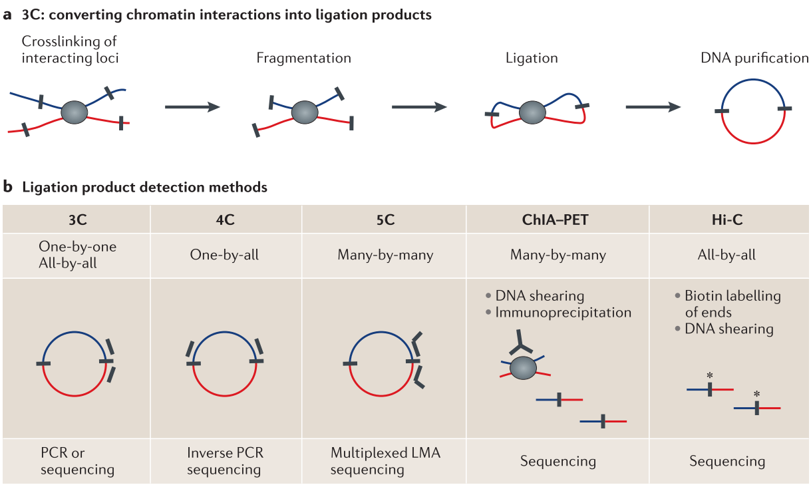

# Introduction {#introduction} 


## Structure of the Intorduction
- Cell diversity
- Gene Regulation
- Enhancers
    - Enhancer–promoter interaction
- Techniques to probe the 3D chromatin architecture
    - Imaging based techniques
    - 3C based methods
    - Hi-C 
    - ChIA-PET
- Chromatin 3D Structure
    - Hierarchy of chromatin 3D structure
        - Chromosomal Territories
        - A/B-Compartments
        - TADs
        - Chromatin Loops
              - Enhancer-Promoter loops
              - Gene Loops
              - Architectural loops
    - Architectural Proteins
    - Loop extrusion model
- Evolution of chromatin architecture
- Disruption of chromatin architecture

## Cell diversity and regulation of gene expression

- Cell diversity
- Gene Regulation


An important mechanism in eukaryotic gene regulation is the binding of
transcription factors (TFs) to distal regulatory regions such as
enhancers which perform looping interactions to the transcription
machinery at gene promoters. Chromatin interactions can be measured by
chromatin conformation capture (3C) and its high-throughput variations
such as 4C, 5C, 6C, ChIA-PET and Hi-C [@Dekker2013; @Lieberman-Aiden2009].

While genome-wide Hi-C data is still only available for a limited number
of cell-types and has limited resolution, it is successfully used to
re-discover important features of the three-dimensional chromatin
architecture in the nucleus that is organized on different levels. In
interphase, chromosomes occupy distinct territories in the
nucleus [@Cremer2001] and are further organized in mega-base scale
A/B-compartments that show specific preferential interaction patterns
and transcriptional activity [@Lieberman-Aiden2009; @Rao2014]. On smaller
scales topologically associating domains (TADs) were identified using
Hi-C [@Dixon2012; @Nora2012; @Sexton2012]. These are regions of several
hundred kb, that have more interactions within themselves than with
other regions and are separated by boundaries that insulate interactions
between loci in different TADs. Interestingly, TADs are largely stable
across cell-types and conserved between mammals [@Dixon2012; @Rao2014; @Dixon2015; @VietriRudan2015]. However, many cell-type
specific chromatin interaction loops occur within TADs [@Rao2014; @Dixon2015]. 
This indicates a stable and cell-type invariant chromatin
architecture on larger scales, such as TADs, and a more dynamic and
cell-type specific organization of interactions within TADs that connect
enhancers and TF binding sites to regulated genes.


## Enhancers

- Enhancers
    - Enhancer–promoter interaction

Enhancers where originally defined as genomic regions that enhance the 
expression of a reporter gene, when placed experimentally in front of a minimal promoter. 
[@Banerji1981; @Shlyueva2014]. Enhancer activity can also be detected 
genome-wide by specific patterns of open chromatin using DNase-seq [@Song2010] 
or ATAC-seq [@Buenrostro2013] or posttranslational modification of histones, such as
H3K27ac by ChIP-seq [@Creyghton2010].
Complex regulation of developmental genes is often archived by additive affects of multiple enhancers. 
For example the $\alpha$-globin gene locus is controlled by multiple enhancers, whereby each 
enhancer elements act independently and in an additive fashion without evidence 
of synergistic or higher-order effects [@Hay2016]. Also the Indian hedgehog (Ihh) locus is regulated by multiple enhancers with individual combinations of tissue specificities that function in an additive manner [@Will2017].
Experimental variation for of the copy number of enhancers is associated with expression strength.
Significantly reduction of the expression of the oncogene *PIMI* could not be archived by perturbing a single enhancers, but only by combinatorial repression of several weak enhancers [@Xie2017].
(Enhancers are reviewed in [@Spitz2012] and [@Andrey2017])

## Methods to probe the 3D chromatin archtiecture
- Imaging based techniques
- 3C based methods
- Hi-C 
- ChIA-PET

The frequency of interactions between different loci in the genome can be experimentally
measured by proximity ligation techniques [@Sati2017]. These protocols are variations of the chromosome conformation capture (3C) experiment [@Dekker2002]. 3C works by the ability to 
crosslink two genomic loci that are in close physical proximity in the nuclear
space by treating cells with formaldehyde. 
The crosslinked chromatin is than digested by enzymes to fragment the 
genomic DNA. Than the fragmented DNA is re-ligated which results in 
hybrid DNA molecules of restriction fragments that where in close
physical proximity during crosslinking but normally originate from different regions in the linear genome sequence [@Dekker2013; @Andrey2017] (Fig. \@ref(fig:ProximityLigation)A). 

<!-- ---------------------------------------------------------------- -->
```{r ProximityLigation, fig.cap='(ref:ProximityLigation)', out.width='80%', fig.align='center'}

```
(ref:ProximityLigation) **Proximity ligation technologies to measure chromatin interactions** 
**(A)**  By treating cells with formaldehyde chromatin is crosslinked. After fragmentation 
with restriction enzymes, DNA from two loci in close physical proximity in the nucleus is 
ligated to a hybrid DNA molecules that is than made from DNA that originated from 
two regions distal in the linear genome (indicated in red and blue).
**(B)** Different variants of the 3C experiments differ in their approaches to 
measure the ligation products or subsets of it in order to quantify chromatin interactions. 
Figure modified from [@Dekker2013].
<!-- ---------------------------------------------------------------- -->

There exist several 3C-based methods which differ by the way the ligation product, which represents and chromatin interaction, is measured and quantified (Fig. \@ref(fig:ProximityLigation)B). 
The classic 3C protocol allows to quantify hybrid DNA-product by quantitative PCR using specific primers to amplify the product junction [@Dekker2002].
In Circular chromosome conformation capture (4C) experiments, a circular PCR is used to amplify 
all hybrid DNA products ligated with a desired restriction fragment, e.g. a specific viewpoint of interest. These products are than sequences to generate an interaction profile measuring all
interacting regions with this viewpoint [@Noordermeer2011].
Another variant of 3C, Carbon copy chromosome conformation capture (5C), combines
3C with hybrid capture approaches to identify up to millions of interactions in parallel between two large sets of loci, for example between a set of promoters and a set of distal regulatory elements [@Dostie2006; @Sanyal2012].
Some methods combine chromatin immunoprecipitation to enrich for chromatin interactions between loci bound by specific proteins of interest or marked by post-translational histone modifications. 
One of these methods is chromatin interaction analysis by paired-end tag sequencing (ChIA-PET), which allows for genome-wide analysis of long-range interactions between sites bound by a protein of interest [@Fullwood2009]. Therefore, ChIA-PET data represent a selected subset of all interactions, but is an efficient alternative to measure interactions at very high resolution [@Tang2015]. 
The most unbiased method to quantify all pair-wise interactions genome-wide is Hi-C [@Lieberman-Aiden2009]. After the initial restriction enzyme step of 3C, in Hi-C, the ends are filled with a biotin-marked nucleotide and subsequently re-ligated. A streptavidin pull-down step is used to enrich for the chimeric products, which are than sequenced using paired-end sequencing technology. Each read from the resulting read-pairs is than aligned independently to the reference genome to identify the originating position of the sequenced restriction fragment. 
Thereby each read pair represent a pairwise physical interaction of the corresponding 
regions. Interaction frequencies are usually analyzed by binning the genome into 
equal sized regions several kb depending on sequencing depth.
While the first Hi-C study produced genome-wide interactions at 1Mb resolution [@Lieberman-Aiden2009], more recent studies could analyse folding patterns at 40kb [@Dixon2012], and later up to 1kb resolution [@Rao2014].


<!-- libraries fo hypbrid DNA products are further digested with a second restiction enzyme and further re-ligated to g -->


## Hierarchy of chromatin 3D structure
- Chromosomal Territories
- A/B-Compartments
- TADs
- Chromatin Loops
    - Enhancer-Promoter loops
    - Gene Loops
    - Architectural loops
- Architectural Proteins
- (Loop extrusion model)
- Nucleosomes / 10nm / 30nm fibers

## Changes of genome folding in evoltuion and disease genomes
- Evolution of chromatin architecture
- Disruption of chromatin architecture


## Aims of this thesis
In this PhD thesis, I analyze TADs and chromatin interactions with
respect to gene expression regulation. More specifically, we find out
weather TADs represent only structural units of the genome or also
functional building blocks, in which genes regulation is coordinated.

First, we focus on duplicated genes in the human genome. Because of
their related sequence and function, shared evolutionary history, and
close co-localization in the genome they represent an interesting model
to study how genome folding is related to regulation of gene expression
during evolution (Chapter [Paralog genes](#ch:paralog)). Furthermore, we make use of
deeply sequenced genomes of other vertebrates to systematically
investigate whether TADs represent conserved building blocks of genomes
and whether rearrangements are associated with altered gene expression
programs (Chapter \[ch:TadEvo\]). Next, we will address disruption of
chromatin organization by analyzing disease associated rearrangement
breakpoints from whole-genome sequenced patients of various genetic
diseases to explain miss-regulation by disruption of TADs and chromatin
contacts in diseases (Chapter \[ch:disruption\]). Finally, we will make
use of recent insights in chromatin loop formation to provide a
computational tool to predict chromatin loops from largely available
genomic data, with the aim to facilitate association of TF binding sites
in enhancers to regulated genes in many cell-types and condition, for
which Hi-C like data is not available.

**Are TADs functional genomic units in which genes are co-regulated?**

- **Are paralog genes co-regulated in the 3D chromatin architecture of genomes?**

**Are TADs buidling blocks of genomes and subjected to selective preasure during evolution?**
- **Are TADs stable units that are often transmitted as a whole than disrupted by rearrangements?**
- **Are changes of TADs during evolution associated with changes in gene expression profiles?**

**Are rearrangements of TADs associated to genetic diseases?**
- **Can TADs be used to interpred position effects of rearrangments in genetic diseases?**

**Can chromatin looping interactions be predicted by ChIP-seq and sequence features?**


