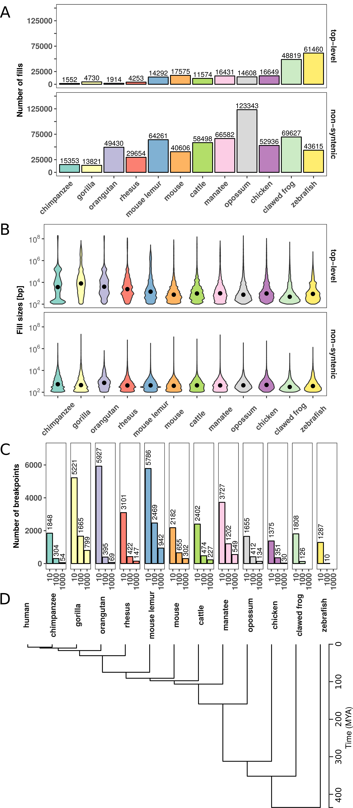
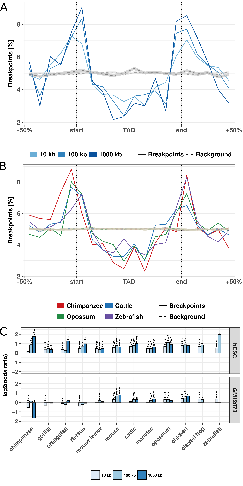
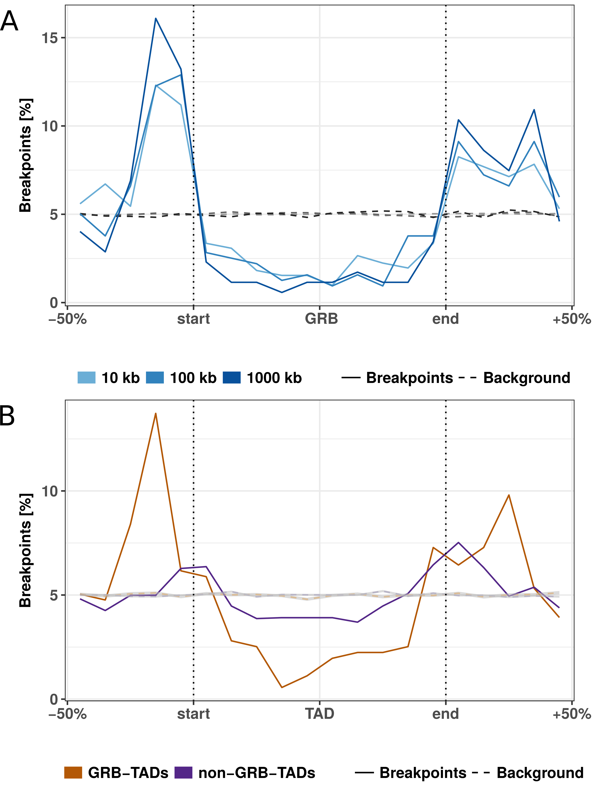
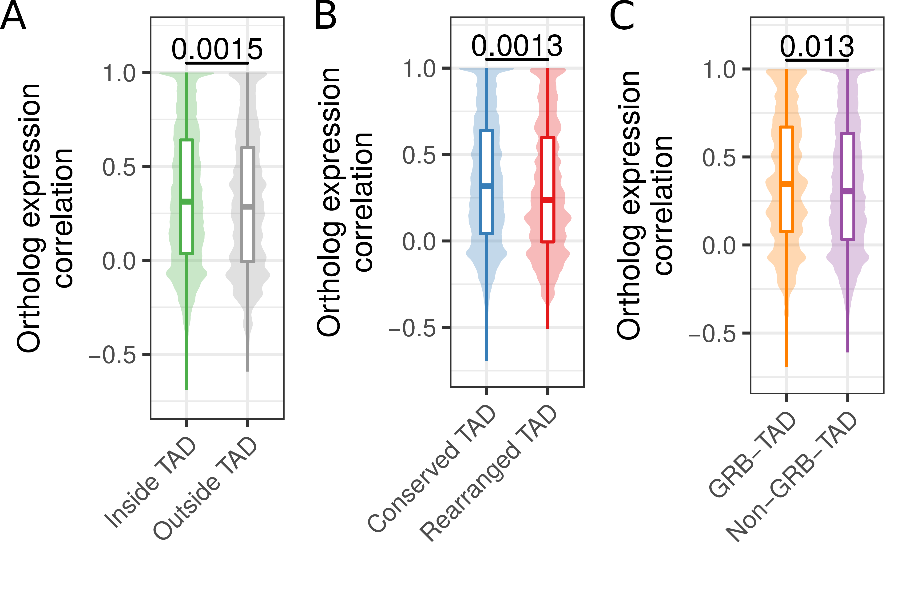

# Stability of TADs in evolution {#TAD-evolution}

###  Preamble {-}
> 
> This chapter is submitted as a corresponding-author paper to BMC Biology and is currently under review. A preprint is published at bioRxiv:
>
> Krefting J, Andrade-Navarro MA, **Ibn-Salem J**. **_Evolutionary stability of topologically associating domains is associated with conserved gene regulation_**. bioRxiv. 2017. [doi:doi.org/10.1101/231431](https://doi.org/10.1101/231431).
> 
> The preprint is availible online: https://doi.org/10.1101/231431.
> My contributions to this publication is indicated in Table \@ref(tab:contribution). 
> The source code of the complete analysis is available at GitHub: https://github.com/Juppen/TAD-Evolution.
> Supplementary figures and links to supplementary tables are shown in Appendix \@ref(sup-tad-evolution).
> 


###  Abstract {-}

**Background:** The human genome is highly organized in the
three-dimensional nucleus. Chromosomes fold locally into topologically
associating domains (TADs) defined by increased intra-domain chromatin
contacts. TADs contribute to gene regulation by restricting chromatin
interactions of regulatory sequences, such as enhancers, with their
target genes. Disruption of TADs can result in altered gene expression
and is associated to genetic diseases and cancers. However, it is not
clear to which extent TAD regions are conserved in evolution and whether
disruption of TADs by evolutionary rearrangements can alter gene
expression.

**Results:** Here, we hypothesize that TADs represent essential
functional units of genomes, which are selected against rearrangements
during evolution. We investigate this using whole-genome alignments to
identify evolutionary rearrangement breakpoints of different vertebrate
species. Rearrangement breakpoints are strongly enriched at TAD
boundaries and depleted within TADs across species. Furthermore, using
gene expression data across many tissues in mouse and human, we show
that genes within TADs have more conserved expression patterns.
Disruption of TADs by evolutionary rearrangements is associated with
changes in gene expression profiles, consistent with a functional role
of TADs in gene expression regulation.

**Conclusions:** Together, these results indicate that TADs are
conserved building blocks of genomes with regulatory functions that are
often reshuffled as a whole instead of being disrupted by
rearrangements.

###  Keywords {-}

Genome rearrangements; Topologically associating domains; TAD; Chromatin
interactions; 3D genome architecture; Hi-C; Evolution; Selection; Gene
regulation; Structural variants

## Introduction

The three-dimensional structure of eukaryotic genomes is organized in
many hierarchical levels [@Bonev2016]. The development of high-throughput
experiments to measure pairwise chromatin-chromatin interactions, such
as Hi-C [@Lieberman-Aiden2009] enabled the identification of genomic domains of several
hundred kilo-bases with increased self-interaction frequencies,
described as topologically associating domains (TADs) [@Dixon2012; @Nora2012]. Loci
within TADs contact each other more frequently and TAD boundaries
insulate interactions of loci in different TADs. TADs have also been
shown to be important for gene regulation by restricting the interaction
of cell-type specific enhancers with their target genes [@Nora2012; @Symmons2014; @Zhan2017].
Several studies associated disruption of TADs to ectopic regulation of
important developmental genes leading to genetic diseases [@Ibn-Salem2014; @Lupianez2015].
These properties of TADs suggested that they are functional genomic
units of gene regulation.

Interestingly, TADs are largely stable across cell-types [@Dixon2012; @Rao2014] and
during differentiation [@Dixon2015]. Moreover, while TADs were initially
described for mammalian genomes, a similar domain organization was found
in the genomes of non-mammalian species such as *Drosophila* [@Sexton2012],
zebrafish [@Gomez-Marin2015] *Caenorhabditis elegans* [@Crane2015] and yeast [@Hsieh2015; @Mizuguchi2014].
Evolutionary conservation of TADs together with their spatio-temporal
stability within organisms, would collectively imply that TADs are
robust structures.

This motivated the first studies comparing TAD structures across
different species, which indeed suggested that individual TAD boundaries
are largely conserved along evolution. More than 54% of TAD boundaries
in human cells occur at homologous positions in mouse genomes [@Dixon2012].
Similarly, 45% of contact domains called in mouse B-lymphoblasts were
also identified at homologous regions in human lymphoblastoid cells
[@Rao2014]. A single TAD boundary at the Six gene loci could be traced back
in evolution to the origin of deuterostomes [@Gomez-Marin2015]. However, these
analyses focused only on the subset of syntenic regions that can be
mapped uniquely between genomes and do not investigate systematically if
TAD regions as a whole might be stable or disrupted by rearrangements
during evolution.

A more recent study provided Hi-C interaction maps of liver cells for
four mammalian genomes [@VietriRudan2015]. Interestingly, they described three
examples of rearrangements between mouse and dog, which all occurred at
TAD boundaries. However, the rearrangements were identified by ortholog
gene adjacencies, which might be biased by gene density. Furthermore,
they did not report the total number of rearrangements identified,
leaving the question open of how many TADs are actually conserved
between organisms. It remains unclear to which extent TADs are selected
against disruptions during evolution [@Nora2013]. All these studies underline
the need to make a systematic study to verify if and how TAD regions as
a whole might be stable or disrupted by rearrangements during evolution.

To address this issue we used whole-genome alignment data to analyze
systematically whether TADs represent conserved genomic structures that
are rather reshuffled as a whole than disrupted by rearrangements during
evolution. Furthermore, we used gene expression data from many tissues
in human and mouse to associate disruptions of TADs by evolutionary
rearrangements to changes in gene expression.

##  Results

### Identification of evolutionary rearrangement breakpoints from whole-genome alignments

To analyze the stability of TADs in evolution, we first identified
evolutionary rearrangements by using whole-genome alignment data from
the UCSC Genome Browser [@Kent2003; @Kent2002] to compare the human genome to 12
other species. These species where selected to have genome assemblies of
good quality and to span several hundred million years of evolution.
They range from chimpanzee to zebrafish (Fig \@ref(fig:TadEvo1)). The whole-genome
data consists of consecutive alignment blocks that are chained and
hierarchically ordered into so-called net files as fills [@Kent2003]. To
overcome alignment artifacts and smaller local variations between
genomes we only considered top-level fills or non-syntenic fills and
additionally applied a size threshold to use only fills that are larger
than 10 kb, 100 kb, or 1000 kb, respectively. Start and end coordinates
of such fills represent borders of syntenic regions and were extracted
as rearrangement breakpoints for further analysis (see Methods for
details).

<!-- ---------------------------------------------------------------- -->
```{r TadEvo1, fig.cap='(ref:TadEvo1)', out.width='50%', fig.align='center'}

```

(ref:TadEvo1) **Number and size distributions of fill sizes of whole-genome alignments between human and 12 other species. **  **(A)** Number of syntenic alignment blocks (fills) between human (hg38) and 12 other species. Top-level fills are the largest and highest scoring chains and occur at the top level in the hierarchy in net files (top panel). Non-syn fills map to different chromosomes as their parent fills in the net files (bottom panel).  **(B)** Size distribution of top-level (top panel) and non-syntenic (bottom panel) fills as violin plot.  **(C)** Number of identified rearrangement breakpoints between human and 12 other species. Breakpoints are borders of top-level or non-syn fills that are larger or equal than a given size threshold (x-axis).  **(D)** Phylogenetic tree with estimated divergence times according to [*http://timetree.org/*](http://timetree.org/).

<!-- ---------------------------------------------------------------- -->

First, we analyzed the number and size distributions of top-level and
non-syntenic fills between human and other species (Fig \@ref(fig:TadEvo1)). As
expected, closely related species such as chimpanzee and gorilla have in
general fewer fills but larger fill sizes (mean length ≥1 kb), whereas
species which are more distant to human, such as chicken and zebrafish,
tend to have more but smaller fills (mean length ≤ 1 kb, Fig \@ref(fig:TadEvo1)A,B).
However, we also observe many small non-syntenic fills in closely
related species, likely arising from transposon insertions [@Mills2006]. As a
consequence of the number of fills and size distributions, we identify
different breakpoint numbers depending on species and size threshold
applied. For example, the whole-genome alignment between human and mouse
results in 2182, 655, and 302 rearrangement breakpoints for size
thresholds, 10 kb, 100 kb, and 1000 kb, respectively (Fig \@ref(fig:TadEvo1)C).
Together, the number and size distributions of syntenic regions reflect
the evolutionary divergence time from human and allow us to identify
thousands of evolutionary rearrangement breakpoints for enrichment
analysis at TADs.

### Rearrangement breakpoints are enriched at TAD boundaries

Next, we analyzed how the identified rearrangement breakpoints are
distributed in the human genome with respect to TADs. We obtained 3,062
TADs identified in human embryonic stem cells (hESC) [@Dixon2012] and 9,274
contact domains from high-resolution *in situ* Hi-C in human
B-lymphoblastoid cells (GM12878) [@Rao2014]. To calculate the number of
breakpoints around TADs, we enlarged each TAD region by +/-50% of its
size and divided the region in 20 equal sized bins. For each bin we
computed the number of overlapping rearrangement breakpoints. This
results in a size-normalized distribution of rearrangement breakpoints
along TAD regions. 

<!-- ---------------------------------------------------------------- -->
```{r TadEvo2, fig.cap='(ref:TadEvo2)', out.width='50%', fig.align='center'}

```

(ref:TadEvo2) **Evolutionary rearrangements are enriched at TAD boundaries.** **(A)** Distribution of evolutionary rearrangement breakpoints between human and mouse around hESC TADs. Each TAD and 50% of its adjacent sequence was subdivided into 20 bins of equal size, the breakpoints were assigned to the bins and their number summed up over the corresponding bins in all TADs. Blue color scale represents breakpoints from different fill-size thresholds. Dotted lines in gray show simulated background controls of randomly placed breakpoints. **(B)** Distribution of rearrangement breakpoints between human and: chimpanzee, cattle, opossum, and zebrafish, at 10 kb size threshold around hESC TADs. Dotted lines in gray show simulated background controls of randomly placed breakpoints. **(C)** Enrichment of breakpoints at TAD boundaries as log-odds-ratio between actual breakpoints at TAD boundaries and randomly placed breakpoints. Enrichment is shown for three different fill size thresholds (blue color scale) and TADs in hESC from [@Dixon2012] (top) and contact domains in human GM12878 cells from [@Rao2014] (bottom), respectively. Asterisks indicate significance of the enrichment using Fisher’s exact test (\*p &lt;= 0.05; \*\*p &lt;= 0.01; \*\*\*p &lt;= 0.001).

<!-- ---------------------------------------------------------------- -->

First, we analyzed the distribution of breakpoints at
different size thresholds between human and mouse at hESC TADs (Fig. \@ref(fig:TadEvo2)A). Rearrangement breakpoints are clearly enriched at TAD boundaries
and depleted within TAD regions. Notably, this enrichment is observed
for all size thresholds applied in the identification of rearrangement
breakpoints. Next, we also analyzed the breakpoints from chimpanzee,
cattle, opossum, and zebrafish (Fig \@ref(fig:TadEvo2)B) at the 10 kb size threshold.
Interestingly, we observed for all species a clear enrichment of
breakpoints at TAD boundaries and depletion within TAD regions. To
quantify this enrichment, we simulated an expected background
distribution of breakpoints by placing each breakpoint 100 times at a
random position of the respective chromosome. We than calculated the
fraction of observed and expected breakpoints that are closer than 40 kb
to a TAD boundary. For all size thresholds and analyzed species, we
computed the log-fold-ratio of actual breakpoints over random
breakpoints at domain boundaries (Fig \@ref(fig:TadEvo2)C). For virtually all species
and size thresholds analyzed, we found breakpoints significantly
enriched at boundaries of TADs and contact domains (Fig \@ref(fig:TadEvo2)C, \@ref(fig:TadEvoS1)).
Depletion was only observed for some combinations of species and size
thresholds which have only very few breakpoints (see Fig \@ref(fig:TadEvo1)C).
Furthermore, we compared the distance of each breakpoint to the closest
TAD boundary and observed nearly always significantly shorter distances
for actual breakpoints compared to random controls (Fig \@ref(fig:TadEvoS2)). Overall,
the enrichment was stronger for TADs in hESC compared to the contact
domains in GM12878. However, these differences were likely due to
different sizes of TADs and contact domains and the nested structure of
contact domains, which overlap each other [@Rao2014]. Rearrangements between
human and both closely and distantly related species are highly enriched
at TAD boundaries and depleted within TADs. These results show (i) that
rearrangements are not randomly distributed in the genome, in agreement
with [@Farre2015], and (ii) strong conservation of TAD regions over large
evolutionary time scales, indicating selective pressure against
disruption of TADs, presumably because of their functional role in gene
expression regulation.

### Clusters of conserved non-coding elements are depleted for rearrangement breakpoints

Another interesting feature that can be extracted from whole-genome
alignments are highly conserved non-coding elements (CNEs) [@Polychronopoulos2017]. CNEs
are defined as non-protein-coding sequences of at least 50 bp with over
70% sequence identity between distantly related species such as human
and chicken [@Polychronopoulos2017]. In the human genome, CNEs cluster around
developmental genes in so-called genomic regulatory blocks (GRBs)
[@Kikuta2007]. It has been shown recently that many GRBs coincide with TADs in
human and *Drosophila* genomes [@Harmston2017]. Therefore, we asked whether
evolutionary breakpoints are also enriched at boundaries of GRBs. This
would support the idea of a conserved regulatory environment around
important developmental genes. Indeed we saw a strong enrichment around
GRBs (Fig \@ref(fig:TadEvo3)A). This is consistent with previous studies in *Drosophila*
and Fish where CNE arrays often correspond to syntenic blocks [@Engstrom2007; @Dimitrieva2013].

<!-- ---------------------------------------------------------------- -->
```{r TadEvo3, fig.cap='(ref:TadEvo3)', out.width='50%', fig.align='center'}

```

(ref:TadEvo3) **Rearrangement breakpoint distribution around GRBs and GRB-TADs. ** **(A)** Rearrangement breakpoints between mouse and human around 816 GRBs. **(B)** Breakpoint distribution around GRB-TADs and non-GRB-TADs. GRB-TADs are defined as TADs overlapping more than 80% with GRBs and non-GRB-TADs have less than 20% overlap with GRBs. Breakpoints using a 10 kb fill size threshold are shown.

<!-- ---------------------------------------------------------------- -->

Next, we subdivided TADs according to their overlap with GRBs in
GRB-TADs (&gt; 80% overlap) and non-GRB-TADs (&lt; 20% overlap) as in
the original study [@Harmston2017]. As expected, we observed a higher
accumulation of breakpoints at boundaries and stronger depletion within
TADs for GRB-TADs compared to non-GRB-TADs (Fig \@ref(fig:TadEvo3)B). However, also the
non-GRB-TADs, that have less than 20% overlap with GRBs, are enriched
for rearrangements at TAD boundaries. This indicates that not only TADs
overlapping GRBs are evolutionary conserved. In summary, we show that
human TADs overlapping clusters of non-coding conserved elements are
strongly depleted for rearrangements, likely due to strong selective
pressure on the conserved regulatory environment around important
developmental genes.

### Rearranged TADs are associated with divergent gene expression between species

The enrichment of rearrangement breakpoints at TAD boundaries indicates
that TADs are stable across large evolutionary time scales. However, the
reason for this strong conservation of TAD regions is unclear. A
mechanistic explanation could be that certain chromatin features at TAD
boundaries promote or prevent DNA double strand breaks (DSBs) [@Farre2015; @Canela2017].
Alternatively, selective pressure might act against the disruption of
TADs due to their functional importance, for example in developmental
gene regulation [@Nora2013; @Farre2015]. TADs constitute a structural framework
determining possible interactions between promoters and cis-regulatory
sequences while prohibiting the influence of other sequences [@Symmons2014; @Lupianez2015].
TAD disruption would prevent formerly established contacts.
Rearrangements of TADs might also enable the recruitment of new
cis-regulatory sequences which would alter the expression patterns of
genes in rearranged TADs [@Lupianez2015; @Redin2017]. Because of these detrimental effects,
rearranged TADs should largely be eliminated by purifying selection.
However, rearrangement of TADs could also enable the expression of genes
in a new context and be selected if conferring an advantage. Therefore,
we hypothesized that genes within conserved TADs might have a more
stable gene expression pattern across tissues, whereas genes in
rearranged TADs between two species might have a more divergent
expression between species.

To test this, we analyzed the conservation of gene expression of
ortholog genes between human and mouse across 19 matched tissues from
the FANTOM5 project ([Table S1](#TadEvoSupTab)) [@Forrest2014]. If a human gene and its mouse
ortholog have high correlation across matching tissues, they are likely
to have the same regulation and eventually similar functions.
Conversely, low correlation of expression across tissues can indicate
functional divergence during evolution, potentially due to altered gene
regulation.

First, we separated human genes according to their location within TADs
or outside of TADs. From 12,696 human genes with expression data and a
unique one-to-one ortholog in mouse ([Table S2](#TadEvoSupTab)), 1,525 have a
transcription start site (TSS) located outside hESC TADs and 11,171
within. Next, we computed for each gene its expression correlation with
mouse orthologs across 19 matching tissues. Genes within TADs have
significantly higher expression correlation with their mouse ortholog
(median R = 0,340) compared to genes outside TADs (mean R = 0,308, p =
0.0015, Fig \@ref(fig:TadEvo4)A). This indicates higher conservation of gene regulation
in TADs and is consistent with the observation of housekeeping genes at
TAD boundaries [@Dixon2012] and the role of TADs in providing conserved
regulatory environments for gene regulation [@Harmston2017; @Ibn-Salem2017].

<!-- ---------------------------------------------------------------- -->
```{r TadEvo4, fig.cap='(ref:TadEvo4)', out.width='80%', fig.align='center'}

```

(ref:TadEvo4) **Ortholog gene expression correlation across tissues in conserved and rearranged TADs.** **(A)** Expression correlation of orthologs across 19 matching tissues in human and mouse for human genes within or outside of hESC TADs. **(B)** Expression correlation of orthologs across 19 matching tissues in human and mouse for genes in conserved or rearranged TADs. **(C)** Expression correlation of orthologs across 19 matching tissues in human and mouse for genes in GRB-TADs and non-GRB TADs. All P-values according to Wilcoxon rank-sum test.

<!-- ---------------------------------------------------------------- -->


Next, we further subdivided TADs in two groups, rearranged and
conserved, according to syntenic blocks and rearrangements between human
and mouse genomes. In brief, a TAD is defined as conserved, if it is
completely enclosed by a syntenic alignment block and does not overlap
any rearrangement breakpoint. Conversely, a rearranged TAD is not
enclosed by a syntenic alignment block and overlaps at least one
breakpoint that is farther than 80 kb from its boundary (see Methods).
For the hESC TAD data set, this leads to 2,542 conserved and 137
rearranged TADs. The low number of rearranged TADs is consistent with
the depletion of rearrangement breakpoints within TADs in general (Fig.
2). In total 8,740 genes in conserved and 645 genes in rearranged TADs
could be assigned to a one-to-one ortholog in mouse and are contained in
the expression data set. The expression correlation with mouse orthologs
were significantly higher for genes in conserved TADs (median R = 0.316)
compared to genes in rearranged TADs (median R = 0.237, p = 0.0013)
(Fig \@ref(fig:TadEvo4)B). This shows that disruptions of TADs by evolutionary
rearrangements are associated with less conserved gene expression
profiles across tissues. Although not significant, we also observed a
slightly higher expression correlation for 1,003 genes in GRB-TADs
compared to 8,038 genes in non-GRB TADs (Fig \@ref(fig:TadEvo4)C, p = 0.13).

In summary, we observed higher expression correlation between orthologs\
for human genes inside TADs than outside. Moreover, we saw that genes in
rearranged TADs show lower gene expression conservation than those in
conserved TADs. These results not only support a functional role of TADs
in gene regulation, but further support the hypothesis that TAD regions
are subjected to purifying selection against their disruption by
structural variations such as rearrangements.

## Discussion

Our analysis of rearrangements between human and 12 diverse species
shows that TADs are largely stable units of genomes, which are often
reshuffled as a whole instead of disrupted by rearrangements.
Furthermore, the decreased expression correlation with orthologs in
mouse and human in rearranged TADs shows that disruptions of TADs are
associated with changes in gene regulation over large evolutionary time
scales.

TADs exert their influence on gene expression regulation by determining
the set of possible interactions of cis-regulatory sequences with their
target promoters [@Nora2012; @Symmons2014; @Schoenfelder2015]. This might facilitate the cooperation of
several sequences that is often needed for the complex spatiotemporal
regulation of transcription [@Andrey2017]. The disruption of these enclosed
regulatory environments enables the recruitment of other cis-regulatory
sequences and might prevent formerly established interactions [@Montavon2012].
The detrimental effects of such events have been shown in the study of
diseases [@Redin2017; @Zepeda-Mendoza2017]. There are also incidences where pathogenic
phenotypes could be specifically attributed to enhancers establishing
contacts to promoters that were formerly out of reach because of
intervening TAD boundaries [@Ibn-Salem2014; @Lupianez2015; @Spielmann2012]. 
This would explain the selective
pressure to maintain TAD integrity over large evolutionary distances and
why we observe higher gene expression conservation for human genes
within TADs compared to genes outside TADs.

Disruptions of TADs by large-scale rearrangements change expression
patterns of orthologs across tissues and these changes might be
explained by the altered regulatory environment which genes are exposed
to after rearrangement [@Farre2015].

Our results are largely consistent with the reported finding that many
TADs correspond to clusters of conserved non-coding elements (GRBs)
[@Harmston2017]. We observe a strong depletion of evolutionary rearrangements in
GRBs and enrichment at GRB boundaries. This is consistent with
comparative genome analysis revealing that GRBs largely overlap with
micro-syntenic blocks in *Drosophila* [@Engstrom2007] and fish genomes [@Dimitrieva2013].
However, over 60% of human hESC TADs do not overlap GRBs [@Harmston2017], raising
the question of whether only a small subset of TADs are conserved.
Interestingly, we find also depletion of rearrangements in non-GRB-TADs.
This indicates that our rearrangement analysis identifies conservation
also for TADs that are not enriched for CNEs. High expression
correlation of orthologs in conserved TADs suggestss that the
maintenance of expression regulation is important for most genes and
probably even more crucial for developmental genes which are frequently
found in GRBs.

Previous work using comparative Hi-C analysis in four mammals revealed
that insulation of TAD boundaries is robustly conserved at syntenic
regions, illustrating this with a few examples of rearrangements between
mouse and dog genomes, which were located in both species at TAD
boundaries [@VietriRudan2015]. The results of our analysis of thousands of
rearrangements between human and 12 other species confirmed and expanded
these earlier observations.

The reliable identification of evolutionary genomic rearrangements is
difficult. Especially for non-coding genomic features like TAD
boundaries, it is important to use approaches that are unbiased towards
coding sequence. Previous studies identified rearrangements by
interrupted adjacency of ortholog genes between two organisms [@VietriRudan2015; @Pevzner2003].
However, such an approach assumes equal inter-genic distances, which is
violated at TAD boundaries, which have in general higher gene density
[@Dixon2012; @Hou2012]. To avoid this bias we used whole-genome-alignments. However,
low quality of the genome assembly of some species might introduce
alignment problems and potentially false positive rearrangement
breakpoints.

Rearrangements are created by DNA double strand breaks (DSBs), which are
not uniquely distributed in the genome. Certain genomic features, such
as open chromatin, active transcription and certain histone marks are
shown to be enriched at DSBs in somatic translocation sites [@Roukos2014] and
evolutionary rearrangements [@Murphy2005; @Hinsch2006]. Furthermore, induced DSBs and
somatic translocation breakpoints are enriched at chromatin loop anchors
[@Canela2017]. This opens the question of whether our finding of significantly
enriched evolutionary rearrangement breakpoints at TAD boundaries could
be explained by the molecular properties of the chromatin at TAD
boundaries, rather than by the selective pressure to keep TAD function.
Although, we cannot distinguish the two explanations entirely, our gene
expression analysis indicates stronger conservation of gene expression
in conserved TADs and more divergent expression patterns in rearranged
TADs. This supports a model in which disruption of TADs are most often
disadvantageous for an organism. Structural variations disrupting TADs
can lead to miss regulation of neighboring genes as shown for genetic
diseases [@Ibn-Salem2014; @Lupianez2015; @Redin2017; @Franke2016] and cancers [@Hnisz2016; @Northcott2014; @Weischenfeldt2016].

Interestingly, we observed higher gene expression conservation for human
genes within TADs compared to genes outside TADs. The larger syntenic
structure of TADs might conserve the regulation likely by maintaining
the proximity of promoters and cis-regulatory sequences while genes
outside such frameworks are more exposed to changing genomic landscapes,
presumably resulting in a greater susceptibility to the recruitment of
regulatory sequences.

Apart from the described detrimental effects, our results suggest that
TAD rearrangements occurred between genomes of human and mouse and led
to changes in expression patterns of many orthologous genes. Since this
is likely attributed to changing regulatory environments, it is also
conceivable that some rearrangements led to a gain of function. Hence,
TAD rearrangements might also provide a vehicle for evolutionary
innovation. A single TAD reorganization has the potential to affect the
regulation of a whole set of genes in contrast to the more confined
consequences of other types of mutations [@Acemel2017]. Since it is also
believed that changes in cis-regulatory sequences of developmental genes
play a big part in evolutionary innovation [@Carroll2008], the development of
the enormous diversity of animal traits in evolution might have been
promoted by the rearrangement of structural domains. This is consistent
with a model in which new genes can arise by tandem-duplication and
during evolution are then re-located to other environments [@Ibn-Salem2017]. These
changes might have facilitated significant leaps in morphological
evolution explaining the emergence of features that could not appear in
small gradual steps. Following this hypothesis, TADs would not only
constitute structural entities that perform the function of maintaining
an enclosed regulatory landscape but could also be a driving force for
change by exposing many genes at once to different genomic environments
following single events of genomic rearrangement.

## Conclusion

Our results indicate that TADs represent conserved functional building
blocks of the genome. We have shown that the majority of evolutionary
rearrangements do not affect the integrity of TADs and instead
breakpoints are strongly clustered at TAD boundaries. This leads to the
conclusion that TADs constitute conserved building blocks of the genome
that are often reshuffled as a whole rather than disrupted during
evolution. The conservation of TAD regions can be explained by
detrimental effects of disrupting cis-regulatory environments that are
essential for the spatio-temporal control of gene expression. Indeed we
observe a significant association of conserved gene expression in intact
TADs and divergent expression patterns in rearranged TADs explaining
both why there could be selective pressure on the integrity of TADs over
large evolutionary time scales, but also how TAD rearrangement can
explain evolutionary leaps.

## Methods

### Rearrangement breakpoints from whole-genome alignments

Rearrangement breakpoints were identified between human and 12 selected
vertebrate species from whole-genome-alignment data (Table \@ref(tab:TadEvoSpecies)). Alignment
data were downloaded as net files from UCSC Genome Browser for human
genome hg38 and the genomes listed in Table \@ref(tab:TadEvoSpecies). The whole-genome data
consists of consecutive alignment blocks that are chained and
hierarchically ordered in the so-called nets [@Kent2003]. Chains represent
blocks of interrupted syntenic regions and may include larger gaps. When
hierarchically arranged in a net file, child chains can complement their
parents when they align nearby segments that fill the alignment gaps of
their parents but may also break the synteny when incorporating distal
segments. We implemented a computer program to extract rearrangement
breakpoints from net files based on the length and type of fills. Start
and end points of top-level or non-syntenic fills are reported as
rearrangement breakpoint if the fill exceeds a given size threshold. We
used different size thresholds to optimize both the number of identified
breakpoints and to avoid biases of transposable elements that might be
responsible for many small interruptions of alignment chains. In this
way, we extracted rearrangement breakpoints between human and 12 genomes
using size thresholds of 10 kb, 100 kb, and 1000 kb. To compare
breakpoints to TADs we converted the breakpoint coordinates from hg38 to
hg19 genome assembly using the liftOver tool from UCSC Genome Browser
[@Hinrichs2006].

<!-- ======================================================================= -->
Common name   Species                            Genome Assembly   Divergence to human (mya)
------------- ---------------------------------- ----------------- ---------------------------
Chimpanzee    *Pan troglodytes*                  panTro5           6.65
Gorilla       *Gorilla gorilla gorilla*          gorGor5           9.06
Orangutan     *Pongo abelii*                     ponAbe2           15.76
Rhesus        *Macaca mulatta*                   rheMac8           29.44
Mouse lemur   *Microcebus murinus*               micMur2           74
Mouse         *Mus musculus*                     mm10              90
Cattle        *Bos taurus*                       bosTau8           96
Manatee       *Trichechus manatus latirostris*   triMan1           105
Opossum       *Monodelphis domestica*            monDom5           159
Chicken       *Gallus gallus*                    galGal5           312
Clawed frog   *Xenopus tropicalis*               xenTro7           352
Zebrafish     *Danio rerio*                      danRer10          435

Table: (\#tab:TadEvoSpecies) Species used for breakpoint identification from whole-genome alignments with human.
<!-- ======================================================================= -->


### Topologically associating domains and contact domains

We obtained topologically associating domain (TAD) calls from published
Hi-C experiments in human embryonic stem cells (hESC) [@Dixon2012] and contact
domains from published *in situ* Hi-C experiments in human GM12878 cells
[@Rao2014]. Genomic coordinates of hESC TADs were converted from hg18 to
hg19 genome assembly using the UCSC liftOver tool [@Hinrichs2006].

### Breakpoint distributions at TADs

To quantify the number of breakpoints around TADs and TAD boundaries we
enlarged TAD regions by 50% of their total length on each side. The
range was then subdivided into 20 equal sized bins and the number of
overlapping breakpoints computed. This results in a matrix in which rows
represent individual TADs and columns represent bins along TAD regions.
The sum of each column indicates the number of breakpoints for
corresponding bins and therefore the same relative location around TADs.
For comparable visualization between different data sets, the
column-wise summed breakpoint counts were further normalized as percent
values of the total breakpoint number in the matrix.

### Quantification of breakpoint enrichment

To quantify the enrichment of breakpoints at domain boundaries, we
generated random breakpoints as background control. For each chromosome,
we placed the same number of actual breakpoints at a random position of
the chromosome. For each breakpoint data set we simulated 100 times the
same number of random breakpoints. We then computed the distribution of
random breakpoints around TADs in the same way as described above for
actual breakpoints. To compute enrichment of actual breakpoints compared
to simulated controls, we classified each breakpoint located in a window
of 400 kb around TAD borders in either close to a TAD boundary, if
distance between breakpoint and TAD boundary was smaller or equal to 40
kb or as distant, when distance was larger than 40 kb. This results in a
contingency table of actual and random breakpoints that are either close
or distal to TAD boundaries. We computed log odds ratios as effect size
of enrichment and p-values according to Fishers two-sided exact test.
Additionally, we compared the distance of all actual and random
breakpoints to their nearest TAD boundary using the Wilcoxon’s rank-sum
test.

### Expression data for mouse and human orthologs

Promoter based expression data from CAGE analysis in human and mouse
tissues from the FANTOM5 project [@Forrest2014] were retrieved from the EBI
Expression Atlas [@Hinrichs2006] as baseline expression values per gene and
tissue. The meta data of samples contains tissue annotations as term IDs
from Uberon, an integrated cross-species ontology covering anatomical
structures in animals [@Herrero2016]. Human and mouse samples were assigned to
each other if they had the same developmental stage and matching Uberon
term IDs. This resulted in 19 samples for each organism with
corresponding tissues.

We used the R package biomaRt to retrieve all human genes in the Ensembl
database (version grch37.ensembl.org) and could assign 13,065 to
ortholog genes in mouse by allowing only the one-to-one orthology type
[@Herrero2016]. Of these ortholog pairs, 12,696 are contained in the expression
data described above. For each pair of orthologs we computed the
correlation of expression values across matching tissues as Pearson’s
correlation coefficient.

### Classification of TADs and genes according to rearrangements and GRBs

We classified hESC TADs according to rearrangements between human and
mouse genomes. We define a TAD as conserved if it is completely enclosed
within a fill in the net file and no rearrangement breakpoint from any
size threshold is located in the TAD region with a distance larger than
80 kb from the TAD boundary. A TAD is defined as rearranged, if the TAD
is not enclosed completely by any fill in the net file, overlaps at
least one breakpoint inferred using a 1000 kb fill size threshold, and
this breakpoint is further than 80 kb away from each TAD boundary. TADs
were also classified according to their overlap with GRBs as in [@Harmston2017].
A given TAD is a GRB-TAD if it overlaps with more than 80% of the TAD
size with a GRB. A TAD is classified as non-GRB if it has less than 20%
overlap with GRBs. The 12,696 human genes with mouse ortholog and
expression data were grouped according to their location with respect to
hESC TADs. We used the transcription start site (TSS) of the longest
transcript per gene to group each gene as within TAD if the TSS overlaps
a hESC TAD or as outside TADs, if not. Furthermore, we grouped genes in
TADs according to conserved or rearranged TADs and separately according
to GRB and non-GRB TADs.

### Source code and implementation details

The source code of the entire analysis described here is available on
GitHub:
[*https://github.com/Juppen/TAD-Evolution*](https://github.com/Juppen/TAD-Evolution).
The identification of breakpoints and extraction of fills from
whole-genome alignment data was implemented in Python scripts. Reading
of BED files and overlap calculations with TADs and TAD bins were
computed in R with Bioconductor [@Huber2015] packages rtracklayer [@Lawrence2009] and
GenomicRanges [@Lawrence2013]. Gene coordinates and ortholog assignments were
retrieved from Ensemble data base (version grch37.ensembl.org) using the
package biomaRt [@Durinck2009]. For data integration and visualization we used R
packages from tidyverse [@Wickham2017].

## Declarations

###  Ethics approval and consent to participate

Not applicable

###  Consent for publication

Not applicable

### Availability of data and material

The source code of all analysis is available on GitHub:
[*https://github.com/Juppen/TAD-Evolution*](https://github.com/Juppen/TAD-Evolution).
All the genomic data used for analyses are freely available to be
downloaded from the UCSC Genome Browser and EBI Expression Atlas with
identifiers listed in Table \@ref(tab:TadEvoSpecies) and [Table S1](#TadEvoSupTab).

### Competing interests

The authors declare that they have no competing interests.

### Funding

Not applicable.

### Authors‘ contributions

JK and JI developed and implemented the methods and performed the
analysis. JI conceived the study. JK wrote the first draft of the
manuscript. JK, MA and JI wrote the manuscript. MA supervised the study.

### Acknowledgments

The authors thank all members of the CBDM group for fruitful
discussions.

