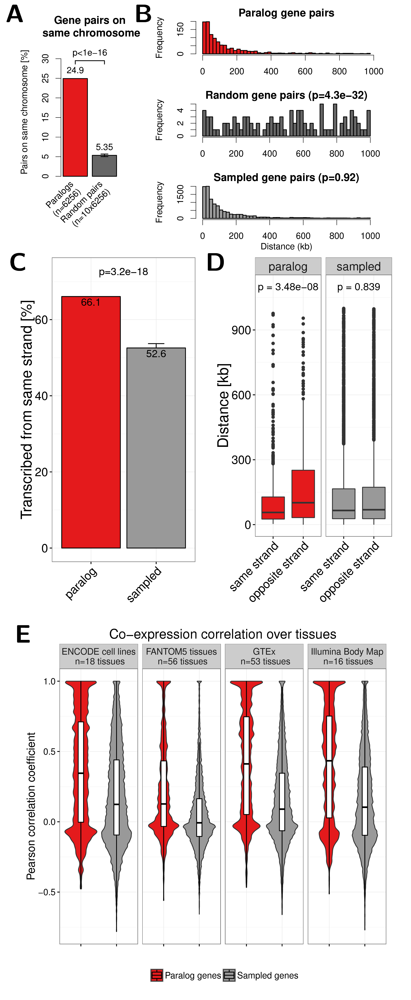
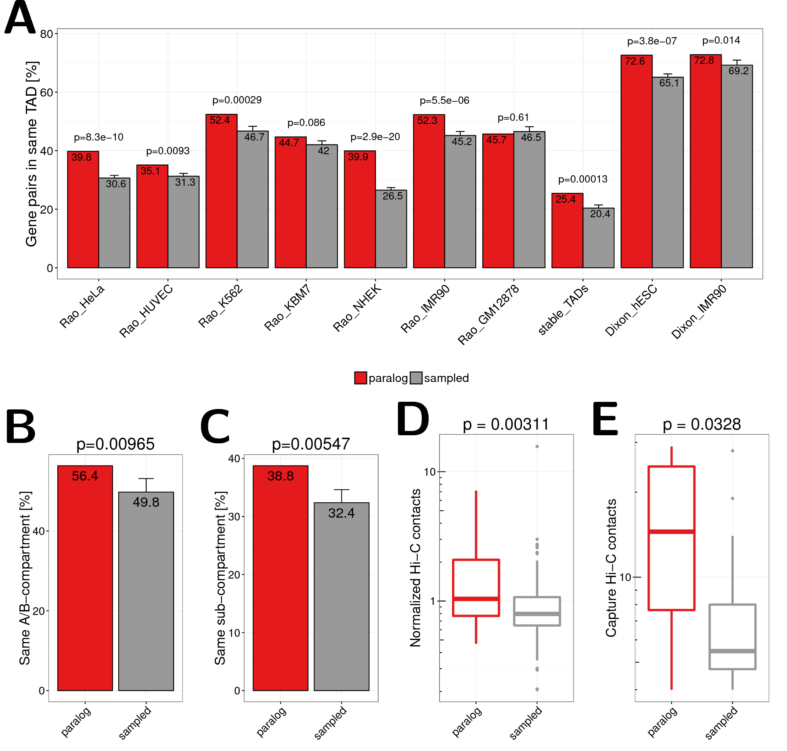
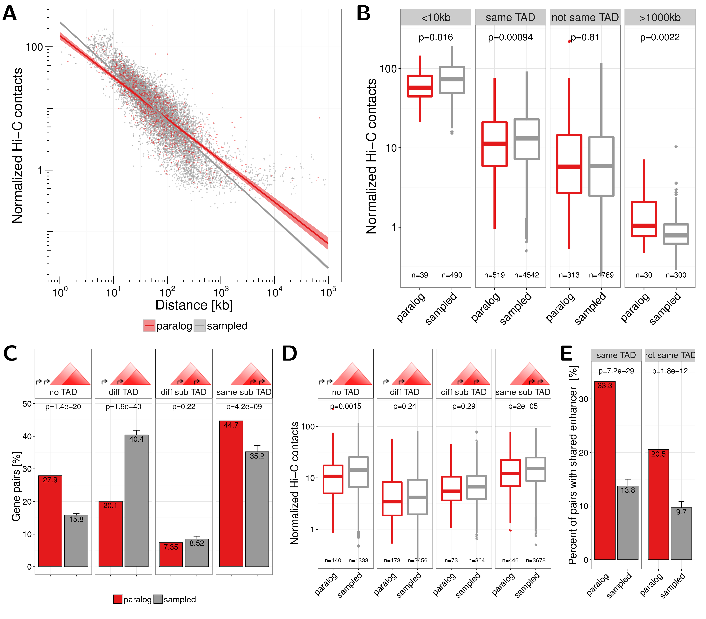
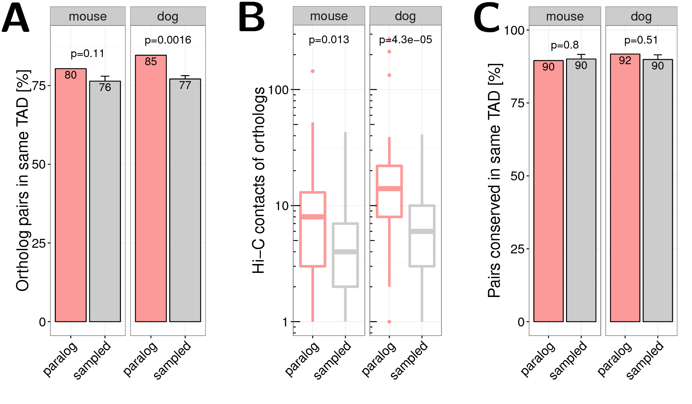

<!-- # Co-regulation of paralog genes in the three-dimensional chromatin architecture {#ch:paralog} -->
# Paralog genes in the 3D genome architecture

This chapter is published in Nucleac Acid Research [@Ibn-Salem2017].
The surce code for the complete analysis is available at GitHub:
[https://github.com/ibn-salem/paralog_regulation](https://github.com/ibn-salem/paralog_regulation)


Introduction
------------

Paralog genes arise from gene duplication events during evolution. The
resulting sequence similarity between paralog pairs might lead to
similar structure and function of encoded proteins [@Koonin2005]. Since
paralogs often form part of the same protein complexes and pathways, it
is advantageous for the cell to coordinate their expression
[@Makova2003].

In eukaryotes, genes are regulated in part by binding of transcription
factors to promoter sequences and to distal regulatory regions such as
enhancers. By chromatin looping, enhancer bound proteins can physically
interact with the transcription machinery at the promoter of
genes [@Ptashne1986; @Deng2012; @Carter2002; @Tolhuis2002; @Spitz2012].
These chromatin looping events can be measured by chromatin conformation
capture (3C) experiments [@Dekker2002], which use proximity-ligation,
and more recently high-throughput sequencing (Hi-C) to measure DNA-DNA
contact frequencies genome-wide [@Lieberman-Aiden2009].

These interaction maps revealed tissue-invariant chromatin regions,
named topologically associating domains (TADs), which have more
interactions within themselves than with other
regions [@Dixon2012; @Nora2012; @Sexton2012]. TADs seem to be stable
across cell types and conserved between
mammals [@Dixon2012; @Rao2014; @VietriRudan2015]. Regions within TADs
show concerted histone chromatin signatures [@Dixon2012; @Sexton2012],
gene expression [@LeDily2014; @Nora2012], and DNA replication
timing [@Pope2014]. Furthermore, disruption of TAD boundaries is
associated to genetic diseases [@Ibn-Salem2014; @Lupianez2015].

We wondered if the Hi-C data could reveal evolutionary pressure driving
paralogous expansion to favour the clustering of paralogs in the
three-dimensional chromatin architecture and their regulation by common
enhancer elements to enable the cell to fine-tune and coordinate their
expression. To do this, we collected Hi-C data from a number of studies
profiling contacts in several cell types from
human [@Dixon2012; @Rao2014], mouse and dog [@VietriRudan2015], and we
compared the properties of these data with respect to paralog genes. Our
results pinpoint that pairs of paralog genes tend to be co-regulated and
co-occur within TADs more often than equivalent control gene pairs. When
placed in different TADs, paralogs still tend to co-occur in the same
chromosome and have more contacts than control gene pairs. In contrast,
close paralogs in the same TAD have significantly less contacts with
each other than comparable gene pairs, which could indicate that these
pairs of paralogs encode proteins that functionally replace each other.

These observations have relevance for the study of the evolution of
chromatin structure and suggest that tandem duplications generating
paralogs are under selection according to how they contribute or not to
the fine structure of the genome as reflected by TADs. Thus TADs provide
a favorable environment for the co-regulation of duplicated genes, which
is likely followed by the evolutionary generation of additional
regulatory mechanisms allowing the separation of paralogs into different
TADs in the same chromosome but connected, and eventually their
migration into different chromosomes.

MATERIALS AND METHODS {#sec:paralog-methods}
---------------------

### Selection of pairs of paralog genes

All human genes and human paralog gene pairs were retrieved from Ensembl
GRCh37 (Ensembl 75) database by using the `biomaRt`
package [@Durinck2009b; @Durinck2005] from within the statistical
programming environment R. For each gene we downloaded the Ensembl gene
ID, HGNC symbol, transcription sense, transcription start site (TSS)
coordinates, and gene length. We only considered protein coding genes
with “KNOWN” status that are annotated in the 22 autosomes or the 2
sexual chromosomes. For each gene we used the earliest TSS coordinate.
Within this set of genes, all pairs of human paralog genes were
downloaded from Ensembl [@Vilella2009]. This resulted in a total of
19,430 human genes; more than half of those had at least one human
paralog gene (Fig. \@ref(fig:paraVSnonPara)A).

However, many human genes have more than one paralog (Fig. \@ref(fig:paraVSnonPara)B). To
avoid overrepresentation of genes, we filtered the pairs such that each
gene occurred only once. Thereby we selected the pairs by minimizing the
rate of synonymous mutations (dS) between them using a maximum-weighted
matching graph algorithm implement in the python package
`NetworkX` [@Galil1986]. The number of synonymous mutations between
paralogs has been used to approximate the duplication age [@Lan2015].
Therefore our implementation favours the selection of young paralog
pairs for larger paralog families and guaranties that each gene occurs
only once. This filtering strategy resulted in $6256$ unique paralog
pairs for downstream analysis (Table \@ref(tab:filter)). We observed that
modications of this strategy to select unique paralog genes did not
affect essentially the results of our study (e.g. by selecting pairs
while maximising dS; Fig. \@ref(fig:selectOldPairs)).

Analogously to the human data we downloaded all pairs of protein coding
paralog genes from the *Mus musculus* (GRCm38.p2) and *Canis lupus
familiaris* (CanFam3.1) genomes from Ensembl. The numbers of filtered
gene pairs are shown in Table \@ref(tab:filter) \. Furthermore, we related
human paralog genes to orthologs in mouse and dog only if there was a
unique one-to-one orthology relationship reported in the Ensembl
database.

Table: (\#tab:filter) Filtering of human paralog  gene pairs

Paralog pairs                            Human   Mouse    Dog
-------------                           ------  ------  ------
All paralog pairs                        46546  110490   28293
One pair per gene                         6256    7323    4959
On the same chromosome                    1560    2397     658
Close pairs (TSS distance $\leq$ 1 Mb)    1114    1774     455
Distal pairs (TSS distance $>$ 1 Mb)       446     623     203


### Enhancers to gene association

Human enhancer annotations, including their genome locations and the
corresponding genes they regulate, were obtained from the supplementary
data of a recent CAGE analysis [@Andersson2014]. In this study, the
activity of enhancers and genes was correlated within 500kb over
hundreds of human cell types to provide a regulatory interaction map
between 27,451 enhancers and 11,604 genes consisting of 66,942
interactions.

### Topological associating domains

We obtained topological associating domain (TAD) calls from two recently
published Hi-C studies in human cells [@Dixon2012; @Rao2014]. TAD
locations mapped to the hg18 genome assembly were converted to hg19
using the UCSC liftOver tool [@Hinrichs2006]. A/B-compartment and
sub-compartment annotations were obtained from high-resolution Hi-C
experiments in human GM12878 cells [@Rao2014].

### Hi-C interaction maps

Individual chromatin-chromatin contact frequencies from IMR90 cells at 5
kb resolution were retrieved from [@Rao2014](NCBI GEO accession:
GSE63525). We used only reads with mapping quality $\geq$ 30 and
normalized the raw contact matrices applying the provided normalization
vectors for KR normalization by the matrix balancing
approach [@Knight2013]. We only considered pairwise gene interactions if
the TSSs of the two genes were located in different bins of the Hi-C
matrix with normalized contacts $\geq$ 0. Capture Hi-C data between
promoter regions in human GM12878 cells were downloaded from
ArrayExpress (accession: E-MTAB-2323) [@Mifsud2015].

### Randomization

We analysed the distribution of paralog pairs over chromosomes depending
on the linear distance between them. For doing so, we sampled gene pairs
from all human genes with equal and independent probability and refer to
them as random gene pairs.

For strand analysis, co-localisation in TADs, and Hi-C contact
quantification between paralog pairs, we constructed a carefully sampled
control set of gene pairs as null-model. Thereby we accounted for the
linear distance bias observed for paralog pairs. First, we calculated
all possible non-overlapping pairs of human genes on the same
chromosome. From the resulting set of gene pairs we randomly sampled
pairs according to the linear distance distribution of paralog gene
pairs. Therefore, we assigned to each gene pair a sampling weight that
is proportional to the probability to sample the pair. The sampling
weight $w(g_{i}, g_{j})$ for a given pair of genes $g_{i}$ and $g_{j}$
with absolute distance $d_{i,j}$ is defined as

$$
w(g_{i}, g_{j}) = \frac{ f_{\mathrm{paralogs}}(d_{i,j}) }{f_{\mathrm{all}}(d_{i,j})}
$$

where $f_{\mathrm{paralogs}}$ is the observed frequencies of distances
in the paralog genes and $f_{\mathrm{all}}(d_{i,j})$ the frequency of
pairwise distances in the population of gene pairs from which we sample.
We computed the observed frequencies by dividing the distances into 90
equal-sized bins after $log_{10}$ distance transformation and counted
occurrences of gene pairs for each bin. The resulting sampling weights
for all gene pairs are normalized to sum up 1 and were then used as
probabilities for sampling:

$$
p_{\mathrm{dist}}(g_{i}, g_{j}) = \frac{ w(g_{i}, g_{j}) }{ \sum_{i,j} w(g_{i}, g_{j}) }
(\#eq:DistProb)
$$

Next, for comparison of shared enhancers we slightly modified the
sampling of gene pairs to account for the observation that paralogs tend
to be associated to more enhancers than non-paralogs (Fig. \@ref(fig:paraVSnonPara)D).
Assuming that the number of enhancers associated to genes is independent
from the distance, we computed sampling probabilities by
$$
p_{\mathrm{dist+eh}}(g_{i}, g_{j}) = p_{\mathrm{dist}}(g_{i}, g_{j}) \cdot p_{\mathrm{eh}}(n_{i}) \cdot p_{\mathrm{eh}}(n_{j})
$$
whereby $n_{i}$ and $n_{j}$ are the number of enhancers associated to
$g_{i}$ and $g_{j}$, respectively and $p_{\mathrm{eh}}(n)$ is the
probability to sample a gene associated to n enhancers:

$$
p_{\mathrm{eh}}(n) = \frac{ w_{\mathrm{eh}}(n) }{ \sum_{i=0}^{N} w_{\mathrm{eh}}(i) }
(\#eq:EhProb)
$$

and
$$
w_{\mathrm{eh}}(n) = \frac{ f_{\mathrm{paralogs}}(n) }{f_{\mathrm{all}}(n)}
$$

where $f_{\mathrm{paralogs}}(n)$ and $f_{\mathrm{all}}(n)$ gives the
frequency of genes associated to $n$ enhancers observed in the paralog
pairs and all gene pairs, respectively.

Analogously, we sampled sets of pairs accounting additionally for the
observed bias in paralog pairs to be in the same strand.
$$
p_{\mathrm{dist+eh+strand}}(g_{i}, g_{j}) = p_{\mathrm{dist}}(g_{i}, g_{j}) \cdot p_{\mathrm{eh}}(n_{i}) \cdot p_{\mathrm{eh}}(n_{j}) \cdot p_{\mathrm{strand}}(s_{i,j})
$$
whereby $s_{i,j}$ is $1$ if both genes, $g_{i}$ and $g_{j}$, are
transcribed from the same strand and $0$ otherwise. The probability
$p_{\mathrm{strand}}(s_{i,j})$ is computed in the same way as the
probability by number of enhancers $p_{\mathrm{eh}}(n)$ in equation
\@ref(eq:EhProb).

Lastly, we sampled a set of gene pairs by taking additionally the gene
length into account and computed sampling probabilities by
$$
p_{\mathrm{dist+eh+len}}(g_{i}, g_{j}) = p_{\mathrm{dist}}(g_{i}, g_{j}) \cdot p_{\mathrm{eh}}(n_{i}) \cdot p_{\mathrm{eh}}(n_{j}) \cdot p_{\mathrm{len}}(l_{i}) \cdot p_{\mathrm{len}}(l_{j})
$$

whereby $p_{\mathrm{len}}(l)$ for gene length $l$ is computed in the
same way as for distances between gene pairs (equation \@ref(eq:DistProb))
and by dividing gene lengths into 20 equal sized binds after $log_{10}$
transformation of gene lengths in bp.

For each paralog pair on the same chromosome within 1 Mb distance, we
sampled $10$ random gene pairs with this procedures each resulting in
$n=156,000$ sampled gene pairs that served as background in our
statistical analysis. These sampling approaches resulted in similar
distribution of linear distances (Fig. \@ref(fig:samplingDist)), associated enhancers of each
gene (Fig. \@ref(fig:samplingDistEh)), same strand (Fig. \@ref(fig:samplingDistEhStrand)), and gene lengths (Fig. \@ref(fig:samplingDistEhLen)).

### Statistical tests

We compared observed fractions of gene pairs, on the same chromosome,
with the same transcription sense, within the same TAD or compartment,
and with at least one shared enhancer between pairs of paralogs and
random or sampled pairs using the Fisher’s exact test. Hi-C contact
frequencies and genomic distances between TSS of gene pairs were
compared using a Wilcoxon rank-sum test. All analyses were carried out
in the statistic software R version 3.2.2.

RESULTS
-------

### Distribution of paralog genes in the human genome

Paralogs are homologous genes that arise from gene duplication events.
Their common ancestry and replicated sequence often leads to similar
structure and function in related pathways and protein complexes. We
therefore hypothesised that the transcription of paralogs should have a
tendency for co-regulation, which could correspond to their position in
the genome and within TADs. To test this hypothesis, we first focused on
the positions of paralogs in the linear genome.

From all $19,430$ protein coding genes in the human genome,
$13,690~(70.5\%)$ have at least one paralog (Fig. \@ref(fig:paraVSnonPara)A). However, many
human genes have several paralogs (Fig. \@ref(fig:paraVSnonPara)B). From all $46,546$ paralog
gene pairs we filtered for only one pair per gene $(n=6,256)$ and
further for non-overlapping pairs on the same chromosome $(n=1,560)$
(see ). We will refer to close paralogs if their transcription start
sites (TSSs) are within 1 Mb of each other $(n=1,114)$ and to distal
pairs for paralogs with TSSs separated by more than 1 Mb $(n=446)$
(Table \@ref(tab:filter)).

We first compared basic properties between genes that have at least one
paralog copy and genes without human paralogs. Paralogs have
significantly larger gene length than non-paralog genes
($p = 1.7 \times 10^{-53}$, Wilcoxon rank-sum test, Fig. \@ref(fig:paraVSnonPara)C), which
fits the observation from [@He2005] in yeast. Furthermore, paralogs tend
to be associated to more enhancers compared to non-paralog genes (on
average $3.8$ vs. $2.5$ enhancers per gene, $p=2.89\times10^{-70}$,
Fig. \@ref(fig:paraVSnonPara)D) and the distance to the nearest associated enhancer is
significantly shorter ($p=2.71\times10^{-22}$,Fig. \@ref(fig:paraVSnonPara)E).

Since most genome duplication events in humans emerge through tandem
duplications [@Newman2015], we expected some co-localization among pairs
of paralog genes. Indeed $24.9\%$ of paralog pairs are located on the
same chromosome. We compared this to random expectation by sampling
random gene pairs from all protein coding human genes and found only
$5.3\%$ of randomly sampled gene pairs on the same chromosome
($p<10^{-16}$, Fig. \@ref(fig:paraData)A).

```{r paraData, fig.cap='(ref:paraData)', out.width='50%', fig.align='center'}

```
(ref:paraData) **(A)** Percent of paralog (red) and random (dark grey) gene pairs that are located on the same chromosome. The error bar indicates the standard deviation observed in 10 times replicated random sampling of gene pairs.
 **(B)** Genomic distance distribution of paralogs gene pairs (top), random gene pairs (center) and gene pairs sampled according to distance distribution of paralogs (bottom). Distances are measured in kilo base pairs (kb) between TSS of genes in pairs. P-values are calculated using Wilcoxon rank-sum test.
    **(C)** Percent of paralog (red) and sampled (grey) gene pairs that are transcribed from the same strand. Only pairs on the the same chromosome within 1 Mb are considered here. Error bars indicate the standard deviation observed in 10 times replicated sampling of gene pairs.
    **(D)** Boxplot of the genomic distance between paralogs and sampled gene pairs with the same or opposite strands.
    **(E)** Distribution of Pearson correlation coefficients of gene expression values in four independent data sets between paralog gene pairs (red) and sampled control gene pairs (grey). White boxes show 25th, 50th and 75th percent quantile of the data and the filled areas indicate the density distribution..

We further analysed whether paralog pairs tend to be located in close
genomic distance on the same chromosomes. We compared the distance
between paralog gene pairs to the distance of completely random genes on
the same chromosome. As expected there is a strong bias of genomic
co-localization among paralog gene pairs that is not observed for random
gene pairs ($p=4.3\times10^{-32}$, Fig \@ref(fig:paraData)B).

We also observed that close paralog genes show more often than expected
the same transcription orientation. From all paralog pairs within 1 Mb
on the same chromosome $66.1\%$ have the same sense. This is
significantly more than for randomly sampled genes with the same
distance (52.6%, $p=3.2\times10^{-18}$, Fig. \@ref(fig:paraData)C).

Furthermore, we observed that paralogs in the same strand are closer to
each other on the chromosome than pairs in opposite strands
($p=3.48\times10^{-8}$, Fig. \@ref(fig:paraData)D).

Together, this shows that paralogs tend to be located within short
linear distance on the same chromosome and same transcription sense,
which might enable coordinated regulation by shared regulatory
mechanisms.

### Co-expression of paralog gene pairs across tissues

To assess whether paralog genes tend to be indeed co-regulated we
compared gene expression of paralog gene pairs over several human
tissues and cell lines.

We compared the Pearson correlation coefficient (PCC) of gene expression
values over $n = 18$ cell-lines analysed by the ENCODE consortium by
RNA-seq [@Djebali2012]. The distribution of PCC among paralog genes is
bimodal with one peak around $-0.1$ and another at nearly $1.0$, which
indicates that there exists a group of paralog pairs without expression
correlation and that the expression of other paralogs is highly
positively correlated. Notably, we did not find the latter signal for
positive correlation in our control set of carefully sampled gene pairs
(Fig. \@ref(fig:paraData)E).

We repeated the analysis with three other independent gene expression
data sets form FANTOM5 ($n=56$ tissues) [@Forrest2014], GTEx ($n=53$
tissues) [@GTExConsortium2015] and the Illumina Body Map ($n=16$
tissues), which we retrieved from the EBI Expression
Atlas [@Petryszak2015]. In all data sets we found more positively
correlated paralog pairs compared to the sampled gene pairs
(Fig. \@ref(fig:paraData)E). This shows that many paralogs are expressed
with high coordination in a tissue specific manner.

### Paralog genes share enhancers

We hypothesised that common gene regulation of close paralog genes is
likely to be facilitated by shared enhancer elements. Indeed we found
that paralog gene pairs within 1 Mb on the same chromosome are
associated to the same enhancer elements more often than expected by
chance (Fig. \@ref(fig:sharedEnhancer)). We estimated the expected
background distribution of shared enhancers by carefully sampling gene
pairs with the same distributions as paralogs in distances and
associated enhancers to single genes (Fig. \@ref(fig:samplingDistEh),
section \@ref(sec:paralog-methods)).


```{r sharedEnhancer, fig.cap='(ref:sharedEnhancer)', out.width='50%', fig.align='center'}
knitr::include_graphics("figures/paralog/fig2_09.png")
```
(ref:sharedEnhancer) Shared enhancers among paralog gene pairs.
**(A)** Percent of close paralog (red) and sampled control (grey) gene pairs with at least one shared enhancer.
**(B)** Percent of gene pairs versus number of shared enhancers for paralog and sampled control gene pairs.

While $27.2$% of the paralog gene pairs have at least one enhancer in
common, we observed this for only $11.7$% of the sampled gene pairs
($p=4.2\times10^{-40}$, Fig. \@ref(fig:sharedEnhancer)A). This could be
replicated when comparing against sampled gene pairs where in addition
to distance and number of enhancers linked to single genes, also the
transcription sense and gene length were taken into account during
sampling of control gene pairs ($p=3.4\times10^{-41}$ and
$p=5\times10^{-30}$, respectively; Fig. \@ref(fig:ehBySampType)). Next, we compared the
percent of gene pairs with shared enhancers as a function of the number
of shared enhancers between paralogs and sampled gene pairs. We observed
that paralog pairs are enriched for higher number of shared enhancers
compared to the sampled gene pairs (Fig. \@ref(fig:sharedEnhancer)B).
Together, these results indicate that paralog genes are more often
co-regulated by common enhancer elements than other genes.

### Co-localization of paralogs in TADs

To facilitate their function in gene regulation, distal enhancer
elements need to interact physically via chromatin looping with promoter
elements at the TSS of their target genes. These looping interactions
occur frequently within so called topological associating domains
(TADs). These are regions of hundreds of kb that show high rates of
self-interactions and few interactions across domain boundaries in
genome-wide Hi-C experiments [@Dixon2012; @Rao2014]. Genes within the
same TAD are therefore likely to have common gene regulatory programs
[@LeDily2014; @Nora2012].

We used TADs from Hi-C experiments in eight different human cell-types
(HeLa, HUVEC, K562, KBM7, NHEK, IMR90, GM12878, and hESC) from two
recent studies  [@Dixon2012; @Rao2014]. Notably, the called TADs differ
in size between the two publications due to different resolution of Hi-C
experiments and different algorithms used to call them from Hi-C contact
matrices (Fig. \@ref(fig:TADsize)). TADs from [@Rao2014] have a median size of around
240 kb and are nested, so that several small domains can occur within
one ore more larger domains. In contrast TADs from [@Dixon2012] are of 1
Mb on average and are defined as non-overlapping genomic intervals.

We hypothesised that paralog gene pairs might be located more often in
the same TAD than expected by chance. Indeed, we found that, depending
on cell-type and study, between $35\%$ and $73\%$ of close paralog pairs
are located in the same TAD (Fig. \@ref(fig:TAD)A). In seven out of nine
data sets this difference was significant ($p<0.05$) with respect to the
sampled control gene pairs with the same linear distance. We also
calculated a set of $n=2,624$ stable TADs that are found in more than
50% of cell types analysed in [@Rao2014]. Notably, we found for paralog
pairs a $1.25$ fold enrichment to be located in the same stable TADs
compared to sampled gene pairs ($p=0.00013$, stable\_TADs in
Fig. \@ref(fig:TAD)A).


```{r TAD, fig.cap='(ref:TAD)', out.width='50%', fig.align='center'}

```
(ref:TAD) **(A)** Co-localization of close paralog genes within the same TAD compared against sampled gene pairs for TAD data sets from different cell types and studies. The first seven bars show values for TADs called in HeLa, HUVEC, K562, KBM7, NHEK, IMR90, and GM12878 cells by [@Rao2014]. The eighth bar shows the value for stable TADs across cell types form this study (at least 90\% reciprocal overlap in 50\% of cells). The last two bars show data for TADs called in hESC and IMR90 cells by [@Dixon2012]. Error bars indicate standard deviation in 10 times replicated sampling of gene pairs. P-values are computed using Fisher's exact test.
**(B)** Percent of gene pairs annotated to same A/B compartment according to Hi-C data in GM12878 cells from [@Rao2014]. Pairs located in the very same compartment interval were excluded.
**(C)** Percent of gene pairs annotated to same sub compartment (A1, A2, B1, B2, B3, B4) according to [@Rao2014]. Pairs located in the same subcompartment interval were excluded.
**(D)** Normalized Hi-C contact frequencies between TSSs of distal paralog gene pairs and sampled background gene pairs.
**(E)** Promoter capture-C contact frequencies between distal paralog gene pairs and sampled background gene pairs.


Beside TADs, Hi-C interaction maps have revealed interaction patterns of
two compartments (A and B) that alternate along chromosomes in intervals
of several Mb. Thereby loci in A compartment preferentially associate
with other loci in A and loci in B with others in
B [@Lieberman-Aiden2009; @Rao2014; @Dekker2013]. We therefore asked
whether pairs of paralogs from the same chromosome are preferentially
located within the same compartment (both A or both B) whereby we
excluded pairs that are in the same compartment interval. We found that
$56.4\%$ of paralogs on the same chromosome but not in the same
compartment interval are in compartments of the same type. This was only
observed for $49.2\%$ of sampled pairs ($p=0.0046$, Fig. \@ref(fig:TAD)B).
Next we tested the same for recently distinguished sub-compartment types
from high-resolution Hi-C interaction maps [@Rao2014]. Again, paralogs
are enriched to be located within the same sub-compartment type
($38.9\%$ vs. $31.6\%$, $p=0.0046$, Fig. \@ref(fig:TAD)C).

These results show that close paralogs are enriched to be located in the
same regulatory unit of the genome as defined both by TADs and
compartments.

### Distal paralog pairs are enriched for long-range chromatin contacts

Since it was shown that actively transcribed genes are localized in the
same active spatial compartments and tend to contact each other
frequently in the nucleus (at their
promoters [@Cremer2015; @Mifsud2015]) we hypothesised that this might be
the case for distal paralogs on the same chromosome too. As spatial
proximity can be approximated by Hi-C contact
frequencies [@Lieberman-Aiden2009] we compared the number of normalized
Hi-C contacts between TSS of distal paralog genes (that have promoters
separated by more than 1 Mb) to the sampled gene pairs with the same
linear distances distribution. We used recently published in situ Hi-C
data from IMR90 cells at 5kb bin-size resolution [@Rao2014] and observed
significantly more normalized chromatin interactions between paralog
genes compared to sampled control gene pairs ($p=0.0022$,
Fig. \@ref(fig:TAD)D). We furthermore used an independent data set of high
resolution promoter-promoter interactions measured by capture
Hi-C [@Mifsud2015]. Again, we observed a strong enrichment of
promoter-promoter interactions between distal paralogs compared to
control genes pairs ($p=0.027$, Fig. \@ref(fig:TAD)E). This shows that also
distal paralogs are enriched for long-range interactions, indicating
that they tend to be in closer spatial proximity than other genes.

### Close paralogs have fewer contacts than expected

The observed enrichment of Hi-C contacts of paralogs is distance
dependent. We observe for close paralogs fewer Hi-C contacts than for
equally distant sampled gene pairs (Fig. \@ref(fig:closePairs)A). To
analyse this in more detail we focused on only those pairs on the same
chromosome that have a TSS distance of at least 10kb but less than 1Mb.
This is the distance range of most paralog pairs and allows to separate
genes in Hi-C interaction maps and TADs (Fig. \@ref(fig:closePairsInTAD)A). Consequently, we
observe paralogs more often in the same TAD in eight out of nine data
sets for this distance range (Fig. \@ref(fig:closePairsInTAD)B). For these pairs we observe
significant lower Hi-C contact frequencies if pairs are within the same
IMR90 TAD [@Rao2014] as compared to sampled genes ($p=0.00094$) but not
if pairs are in different TADs ($p=0.81$, Fig. \@ref(fig:closePairs)B). We
got comparable results when analysing the Capture Hi-C data the same way
(Fig. \@ref(fig:closePairsInTAD)C). Next, we tested whether this can be explained by the nested
sub-TAD structure of TADs called from high-resolution Hi-C in
IMR90 [@Rao2014]. We divided pairs into four groups, namely, ’no TAD’,
if both pairs are not in any TAD, ’different TAD’, if pairs do not have
at least one TAD in common, ’different sub-TADs’, if they have at least
one TAD in common but are in different sub-TADs, and ’same sub-TAD’, if
they overlap exactly the same set of TADs. While we saw that paralogs
are more often in the no TAD group ($p=1.4\times10^{-20}$), we found
that they were highly depleted from the different TAD group
($p=1.6\times10^{-40}$) and highly enriched to be located within the
same sub-TAD ($p=4.2\times10^{-9}$, Fig. \@ref(fig:closePairs)C). However,
although not always significant, paralogs have fewer Hi-C contacts than
sampled gene pairs in all of these groups (Fig. \@ref(fig:closePairs)D). In
addition, close paralogs within the same TAD share more enhancers than
close paralogs not being in the same TAD (Fig. \@ref(fig:closePairs)E).
However, the positive correlation of gene expression over different
tissues is not significantly higher for paralogs whether they are in the
same TAD or not (Fig. \@ref(fig:ExpByTAD)).


```{r closePairs, fig.cap='(ref:closePairs)', out.width='50%', fig.align='center'}

```
(ref:closePairs) **(A)** Normalized Hi-C contacts by genomic distance between paralog (red) and sampled (grey) gene pairs. Lines show linear regression fit separately for paralogs (red) and sampled (grey) pairs with 95\% confidence intervals in shaded areas.
**(B)** Normalized Hi-C contacts between pairs of paralogs (red) and sampled gene pairs (grey) for the groups: $<$10kb genomic distance, located in the same TAD, not in the same TAD, and with genomic distance $>$1000kb.
**(C)** Number of gene pairs located either in no TAD, in different TADs (or only one pair member in a TAD), both in a TAD but in different sub-TADs, or within the same sub-TAD, for paralogs (red) and sampled (grey) pairs. TADs from IMR90 cells from [@Rao2014] were used, which nested in contrast to TAD calls from [@Dixon2012].
**(D)** Normalized Hi-C contacts between pairs of paralogs (red) and sampled gene pairs (grey) for the four groups of pairs in sub-TAD structures shown in (C).
**(E)** Percent of gene pairs with at least one shared enhancer for paralog genes (red) and sampled control genes (grey) separated for pairs in the same IMR90 TAD (left) or not (right).


In summary, we observed that while close paralogs (situated at less than
1Mb) have more shared enhancers if they are in the same TAD than not,
these within TAD paralog pairs have fewer contacts compared to other
within TAD pairs of genes.

### Paralogs in mouse and dog genome

Next, we asked whether the co-localization and co-regulation of paralogs
is conserved in other species. For this, we conducted an analogous
analysis with paralog gene pairs from mouse (*M. musculus*) and dog (*C.
familaris*) genomes. Similar as for human data, we found that more than
two third of the genes had at least one paralog copy (Fig. \@ref(fig:paralogsSpecies)A,D),
paralog pairs clustered on the same chromosome (Fig. \@ref(fig:paralogsSpecies)B,E), and had
close linear distances (Fig. \@ref(fig:paralogsSpecies)C,F).

We sampled control gene pairs with the same distance distribution as
paralogs for both species separately (Fig. \@ref(fig:paralogsSpecies)C,F). We used TADs from
recently published Hi-C data in liver cells of mouse and
dog [@VietriRudan2015], which have a size distribution comparable to
TADs from human cells (Fig. \@ref(fig:TADsize)). We computed the fraction of paralog
pairs that are located in the same TAD for both species. Consistent with
the observation in human, we found that paralogs tend to colocalize more
frequently within the same TAD in mouse ($p=7.2 \times 10^{-22}$) and
dog ($p=0.00064$) than expected by chance
(Fig. \@ref(fig:paralogsMouseDog)A). We also quantified directly the
contact frequencies between promoters of distal paralogs on the same
chromosome and found them significantly more frequently in contact than
sampled gene pairs with the same genomic distance for paralogs in mouse
($p=7\times 10^{-7}$) and dog ($p=0.008$)
(Fig. \@ref(fig:paralogsMouseDog)B). Together, these results indicate that
enriched long-range interactions between paralogs are not human specific
but rather a general evolutionary conserved feature of genome
organization.

```{r paralogsMouseDog, fig.cap='(ref:paralogsMouseDog)', out.width='50%', fig.align='center'}
knitr::include_graphics("figures/paralog/fig5_09.png")
```
(ref:paralogsMouseDog)
**(A)** Co-occurrence of close paralog genes with the same TAD in mouse (left panel) and dog (right panel).
**(B)** Hi-C contacts between promoter of distal gene pairs in Hi-C experiments in liver cells from mouse (left panel) and dog (right panel). Hi-C data and TAD calls were taken from [@VietriRudan2015].


### Orthologs of human paralogs show conserved co-localization

Next, we wanted to test more directly whether the spatial
co-localization of human paralogs is indeed conserved during evolution.
In cases where the gene duplication event occurred before the separation
of human and mouse (or human and dog) we can eventually assign each
human gene of a pair of paralogs to one ortholog in mouse (or dog
genomes) (Fig. \@ref(fig:orthologModel)).

We could map $37.1\%$ ($n=579$) and $34.6\%$ ($n=540$) of the close
human paralogs to one-to-one orthologs in mouse and dog, respectively
(Fig. \@ref(fig:orthologsSpecies)A,D). We hypothesised that the two one-to-one orthologs of
human paralog pairs would also be close in the mouse and dog genomes.
Indeed, we found that the orthologs of human paralogs tend to cluster on
the same chromosome (Fig. \@ref(fig:orthologsSpecies)B,E) and are biased for close linear
distances (Fig. \@ref(fig:orthologsSpecies)C,F).

We further investigated how many one-to-one orthologs of the human
paralog pairs were located in the same TAD in mouse and dog genomes.
Although not significant, we found that mouse orthologs of close human
paralogs share more often the same TAD in mouse than orthologs of
sampled human gene pairs ($80\%$ vs. $76\%$, $p=0.11$;
Fig. \@ref(fig:orthologsMouseDog)A). Significant enrichment was observed
with orthologs in the dog genome ($85\%$ vs. $77\%$, $p=0.0016$;
Fig. \@ref(fig:orthologsMouseDog)A).

```{r orthologsMouseDog, fig.cap='(ref:orthologsMouseDog)', out.width='50%', fig.align='center'}

```
(ref:orthologsMouseDog) One-to-one orthologs of human paralog genes in mouse and dog genome.
**(A)**  Percent of mouse (left) and dog (right) orthologs of human paralog pairs that are in the same TAD in the mouse and dog genome, respectively.
**(B)** Normalized Hi-C contacts between promoters of one-to-one orthologs of human distal paralogs in the mouse (left) and dog (right) genome.
**(C)** Percent of gene pairs with conserved co-localization. Orthologs in the same TAD in mouse (left) and dog (right) as percent of all orthologs of human paralog pairs that are in the same TAD in human. For human TADs from IMR90 cells from  [@Rao2014] were used.


For distal human paralogs we quantified the promoter contacts of their
orthologs in mouse and dog and found enriched Hi-C contacts in mouse
($p=0.011$) and dog ($p=2.4\times 10^{-5}$;
Fig. \@ref(fig:orthologsMouseDog)B).

These results show that both the co-localization of paralogs in TADs and
the contacts between distal paralogs are only weekly conserved at the
evolutionary distances examined here. For example, we see that given a
pair of human genes in the same TAD the likelihood of their orthologs
being in the same TAD in mouse or dog is the same whether they are
paralogs or not (Fig. \@ref(fig:orthologsMouseDog)C).

All together, our results support the notion that tandem duplications
generate paralog gene pairs that are selected if they accommodate in
TADs but following evolutionary events allow their reorganization
outside TADs. While within oganisms distal paralog genes are
coordinated, such coordination can be eventually erased by evolution.

DISCUSSION
----------

The generation of large datasets of gene expression across multiple
tissues allowed the observation of clusters of pairs and triplets of
co-expressed genes in higher eukaryotes (e.g. in
*Drosophila* [@Boutanaev2002] or in mammals [@Purmann2007]) and it was
previously suspected that the structure of chromatin would have to do
with this [@Sproul2005], particularly cis-acting units [@Purmann2007].
The discovery and characterization of topologically associating domains
(TADs) has finally brought to the light the chromatin structure that
could be responsible for this co-regulation.

To study the interplay between TADs, gene co-regulation and evolution in
the human genome, we decided to focus on pairs of paralogs because they
have a tendency to be produced by tandem duplication [@Newman2015] and,
because of homology, result in proteins with related functions. However,
the particular emergence and evolution of paralogs are probably
responsible for special properties that distinguish them from
non-paralog genes as we described: greater gene length, more enhancers,
as well as a shorter distance to the next enhancer. These differences,
which could be partially explained by the observation that paralogs are
more often tissue specific (Fig. \@ref(fig:paraVSnonPara)F), complicated the methodology for
choosing meaningful control pairs (see section \@ref(sec:paralog-methods)).

Once we ensured the generation of the appropriate backgrounds, we could
study the position of pairs of paralogs respect to TADs. This allowed us
to test, on the one hand, the resilience of TADs to genome shuffling
and, on the other hand, the rate of accommodation and gain of
functionally related genes. Possibly, the generation of paralogs by
tandem duplication might continuously impose a strain in the
pre-existing genomic and regulatory structure, but also a chance for the
evolution of new functionality.

On the one hand, we observed many pairs of paralogs within TADs. On the
other hand, pairs of paralogs in different TADs, however distant from
each other, tend to have more contacts than control gene pairs. This
suggests a many-step mechanism where first tandem duplication fits TAD
structure but then subsequent chromosomal rearrangements relocate
paralogs at larger distances (while keeping contacts) and eventually
reorganization of regulatory control allow their increased independence
being eventually placed even in different chromosomes where contact is
no longer necessary. Thus, TADs are units of co-regulation but do not
have a strong preference for keeping co-regulated genes within during
evolution. This model agrees with the recent work from Lan and Pritchard
reporting that young pairs of paralogs are generally close in the
genome [@Lan2016].

A second effect that we observed was the existence of fewer contacts
between close pairs of paralogs than in comparable pairs of non-paralog
genes, particularly if they are in the same TAD
(Fig. \@ref(fig:closePairs)B), while sharing more enhancers
(Fig. \@ref(fig:closePairs)E). This result could reflect the existence of
pairs of paralogs encoding proteins that replace each other, for example
sub-units of a complex that occupy the same position in a protein
complex but are expressed in different cells. One such case is
exemplified by CBX2, CBX4 and CBX8, which occupy neighbouring positions
within the same TAD in human chromosome 17 and encode replaceable
subunits of the polycomb repressive complex 1 (PRC1) complex involved in
epigenetic regulation of cell specification [@Becker2015]. The
expression of such groups of paralogs require active coordination to
ensure exclusive expression of only one gene or a subset of genes per
condition, resulting in patterns of divergent expression. Since there
might be also conditions where none of these genes are expressed, such
divergent expression patterns are different from negative correlation.

Previous work studying gene expression of duplicated genes already
studied how after gene duplication paralogs tend to diverge in their
expression [@Makova2003; @Huminiecki2004; @Rogozin2014] but it was
observed that while some paralogs are co-expressed some others have
negative correlation across tissues [@Makova2003]. Our interpretation of
these observations together with our results is that the initial tandem
duplication event forming a paralog is advantageous to situate the new
copy in an environment that allows its controlled regulation, ideally
under the same regulatory elements than the original copy, and this can
be attained by duplicating both gene and surrounding regulatory
elements. This would preclude the duplication of genes with very
entangled regulatory associations. Once this happens, if the new protein
evolves into a replacement, then the regulatory constraints on its
coding gene are strong and there would be a tendency to keep it in the
vicinity of the older gene so that a divergent pattern of expression can
be ensured.

To support this hypothesis, we contrasted our data with the data
collected in the HIPPIE database of experimentally verified human
protein-protein interactions [@Schaefer2012]. We observed the well-known
fact that paralog pairs generally encode for proteins that interact more
often than non-paralog proteins (Fig. \@ref(fig:PPI)). But, most importantly, we
observed that the chances of close pairs of genes to encode for
interacting proteins raise $2.3$-fold if they are in the same TAD,
while, in contrast, if these genes are paralogs the difference is much
smaller ($1.2$-fold, Fig. \@ref(fig:PPI)). We interpret this result as evidence for
a significant population of within TAD paralog pairs encoding for
non-interacting proteins, which supports our hypothesis that paralog
pairs within the same TAD would have a tendency to encode for proteins
replacing each other.

CONCLUSION
----------

We propose that paralog genes generated by tandem duplication start
their life coregulated within TADs, then are moved outside to other
places in the chromosome and eventually to different chromosomes. TADs
would then fit genomic duplications situating the new copy in a
duplicated regulatory enviroment. Subsequent genomic rearrangements
would create divergent regulatory circuits eventually allowing their
disentanglement. An exception would be genes that precise to be strongly
co-regulated with the original copy, for example, to produce a
replacement protein.

TADs would thus act as protective nests for evolving newcomer genes.
This seems to be a reasonable evolutionary mechanism, much simpler than
creating from nothing a complete new regulatory environment for a new
gene.

ACKNOWLEDGEMENTS
----------------

The authors thank all members of the CBDM group for fruitful
discussions.


