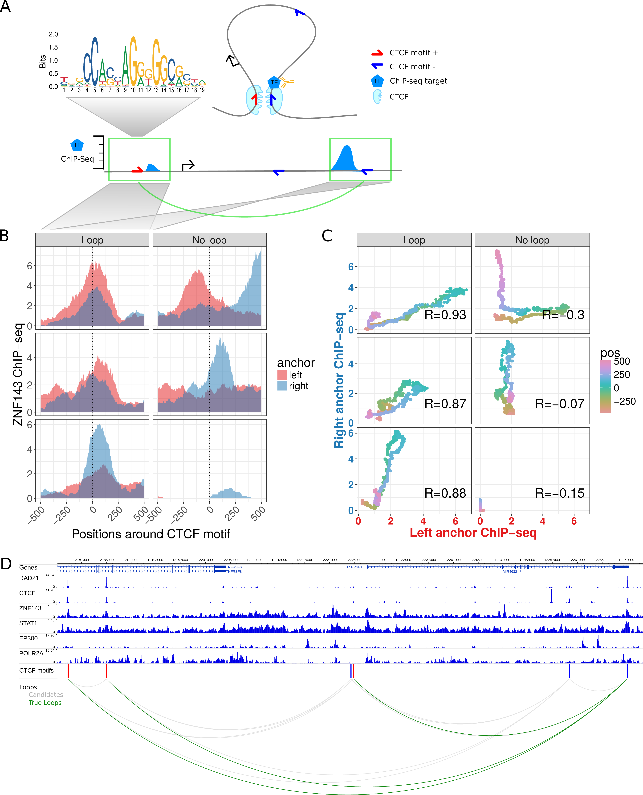

# Prediction of chromatin looping interactions {#loop}

### Preamble {-}
> 
> This chapter is submitted as a first-author paper to Genome Biology. A preprint is published at bioRxiv:
> 
> Ibn-Salem J^#^, Andrade-Navarro MA. Computational Chromosome Conformation Capture by Correlation of ChIP-seq at CTCF motifs. bioRxiv. 2018. [doi:10.1101/257584](https://doi.org/10.1101/257584).
>
> The preprint is availible online: https://www.biorxiv.org/content/early/2018/02/01/257584.
> My contributions to this publication is indicated in Table \@ref(tab:contribution). 
> The source code of the complete analysis is available at GitHub: https://github.com/Juppen/sevenC and https://github.com/Juppen/sevenC_analysis.
> Supplementary figures and links to supplementary tables are shown in Appendix [D](#loop-support).
> 
>^#^corresponding author
> 

### Abstract {-}

**Background:** Knowledge of the three-dimensional structure of the
genome is necessary to understand how gene expression is regulated.
Recent experimental techniques such as Hi-C or ChIA-PET measure
long-range interactions genome-wide but are experimentally elaborate and
have limited resolution. Here, we present Computational Chromosome
Conformation Capture by Correlation of ChIP-seq at CTCF motifs (7C).

**Results:** While ChIP-seq was not designed to detect contacts, the
formaldehyde treatment in the ChIP-seq protocol cross-links proteins
with each other and with DNA. Consequently, also regions that are not
directly bound by the targeted TF but interact with the binding site via
chromatin looping are co-immunoprecipitated and sequenced. This produces
minor ChIP-seq signals at loop anchor regions close to the directly
bound site. We use the position and shape of ChIP-seq signals around
CTCF motif pairs to predict whether they interact or not.

We applied 7C to all CTCF motif pairs within 1 MB in the human genome
and validated predicted interactions with high-resolution Hi-C and
ChIA-PET. A single ChIP-seq experiment from known architectural proteins
(CTCF, Rad21, Znf143) but also from other TFs (like TRIM22 or RUNX3)
predicts loops accurately. Importantly, 7C predicts loops in cell types
and for TF ChIP-seq datasets not used in training.

**Conclusion:** 7C predicts chromatin loops with base-pair resolution
and can be used to associate TF binding sites to regulated genes in a
condition-specific manner. Furthermore, profiling of hundreds of
ChIP-seq datasets results in novel candidate factors functionally
involved in chromatin looping. Our method is available as an R package:
https://ibn-salem.github.io/sevenC/

### Keywords {-}

Chromatin interactions, three-dimensional genome architecture,
transcription factors, ChIP-seq, 3C, 4C, 5C, Hi-C, 6C, ChIA-PET, 7C,
prediction, chromatin loops

## Introduction

The three-dimensional folding structure of the genome and its dynamic
changes play a very important role in the regulation of gene expression
[@Merkenschlager2016; @Krijger2016]. For example, while it was well known that transcription factors
(TFs) can regulate genes by binding to their adjacent promoters, many TF
binding sites are in distal regulatory regions, such as enhancers, that
are hundreds of kilo bases far from gene promoters [@Spitz2012]. These distal
regulatory regions can physically interact with promoters of regulated
genes by chromatin looping interactions [@Tolhuis2002; @Sanyal2012], thus it is not trivial
to associate TFs to regulated genes without information of the genome
structure [@Mora2015]. Such looping interactions can be measured by chromosome
conformation capture (3C) experiments [@Dekker2002] and its variations to either
study all interactions from single targeted regions (4C) [@Simonis2006] or
multiple target regions (5C) [@Dostie2006], interactions between all regions
genome-wide (Hi-C) [@Lieberman-Aiden2009; @Rao2014] or interactions mediated by specific
proteins (6C [@Tiwari2008] and ChIA-PET [@Fullwood2009; @Tang2015]).

While these experimental methods have brought many exciting insights
into the three-dimensional organization of genomes [@Merkenschlager2016; @Krijger2016; @Bonev2016], these
methods are not only elaborate and expensive but also require large
amounts of sample material or have limited resolution [@Sati2016; @Schmitt2016]. As a
consequence, genome-wide chromatin interaction maps are only available
for a limited number of cell types and conditions.

In contrast, the binding sites of TFs can be detected genome-wide by
ChIP-seq experiments, and are available for hundreds of TFs in many cell
types and conditions [@Dunham2012; @Davis2017]. Here, we propose that it is possible to
use these data to detect chromatin loops.

Recent studies provide functional insights about how chromatin loops are
formed and highlight the role of architectural proteins such as CTCF and
cohesin [@Merkenschlager2016]. CTCF recognizes a specific sequence motif, to which it
binds with high affinity [@Kim2007; @Nagy2016]. Interestingly, CTCF motifs are
present in convergent orientation at chromatin loop anchors
[@Rao2014; @Tang2015; @VietriRudan2015]. Furthermore, experimental inversion of the motif results
in changes of loop formation and altered gene expression [@Guo2015; @deWit2015].
Polymer simulations and experimental perturbations led to a model of
loop extrusion, in which loop-extruding factors, such as cohesin, form
progressively larger loops but stall at CTCF binding sites in convergent
orientation [@Sanborn2015; @Fudenberg2016]. According to these models, CTCF binding sites can
function as anchors of chromatin loops.

Our hypothesis is, that we can use convergently aligned CTCF motifs to
search for similar ChIP-seq signals at both sites of chromatin loops to
predict looping interactions from the largely available ChIP-seq data in
many diverse cell-types and conditions (Fig. \@ref(fig:LoopPred1)A). We then developed and
tested a computational method to predict chromatin looping interactions
from only genomic sequence features and TF binding data from ChIP-seq
experiments. We show that our method has high prediction performance
when compared to Hi-C and ChIA-PET loops and that prediction performance
depends on the ChIP-seq target, which allows screening for TFs with
potential novel functions in chromatin loop formation. The predicted
looping interactions can be used to (i) associate TF binding sites or
enhancers to regulated genes for conditions where Hi-C like data is not
available, and (ii) to increase the resolution of interaction maps,
where low resolution Hi-C data is available. We implemented our method
as the R package *sevenC*.

<!-- ---------------------------------------------------------------- -->
```{r LoopPred1, fig.cap='(ref:LoopPred1)', out.width='90%', fig.align='center'}

```

(ref:LoopPred1) **Chromatin looping interactions result in ChIP-seq coverage signals at direct and indirect bound loop anchors.** **(A)** Schematic illustration of a chromatin loop with CTCF motifs at the loop anchors (top right). A TF binds directly at the right loop anchor close to the CTCF motif. This results in a ChIP-seq coverage peak at the directly bound locus (bottom right) and in a minor signal at the other loop anchor (bottom left), both at the same distance to each CTCF motif. **(B)** Znf143 ChIP-seq coverage at six selected example CTCF motif pairs of which the ones in the left panel interact via loops according to Hi-C and ChIA-PET data and the ones in the right panel do not interact. The ChIP-seq coverage signal for each loci pair is shown in red for the left anchor region and in blue for the right anchor region, according to the distance to the CTCF motif (x-axis). Interacting CTCF motif pairs show more similar ChIP-seq coverage signals, which are often enriched at similar distances to the CTCF motif pairs, while the profiles of non-interacting pairs are less similar. **(C)** The similarity of ChIP-seq profiles by correlation of the ChIP-seq coverage signals of the selected motif pairs in (B). For each pair, the coverage at the right anchor is plotted versus the coverage at the left anchor at the same distance (color coded) from each CTCF motif. The Pearson correlation coefficient (R) of the dots is higher for interacting loci pairs. **(D)** Example loci on chromosome 1 shown in the genome-browser with six ChIP-seq tracks. Red and blue bars indicate CTCF recognition motifs on the forward and reverse strand, respectively. The bottom panel shows CTCF motif pairs in gray (candidates) and actually interacting pairs in green, according to ChIA-PET and Hi-C data.

<!-- ---------------------------------------------------------------- -->


## Results

### CTCF motif pairs as candidate chromatin loop anchors

In order to predict chromatin looping interactions from ChIP-seq data,
we first analyzed which features at looping anchors correlate with
interaction signals. As a starting point for all analyses we used 38,316
CTCF motif sites in the human genome as potential chromatin loop
anchors. We built a dataset of all CTCF motif pairs located within a
genomic distance of 1 Mb to each other. This resulted in 717,137
potential looping interactions; we expect that only a minority of these
motif pairs will be in physical contact for a given cell type and
condition. To label motif pairs as true loops, we used chromatin loops
from published high-resolution *in-situ* Hi-C data and ChIA-PET data for
CTCF and Pol2 in human GM12878 cells [@Rao2014; @Tang2015]. If a motif pair was
measured to interact in one of the data sets, we labeled it as true
interaction. Overall 30,025 (4.19 %) of CTCF motif pairs were considered
as true loops using these data sets.

### Similarity of ChIP-seq signals at looping CTCF motifs

The ChIP-seq protocol involves a cross-linking step, in which
formaldehyde treatment results in covalent bonds between DNA and
proteins [@Orlando1997]. This allows the pull-down and detection of sites
directly bound by the targeted protein. However, cross-linking occurs
also between proteins, which results in detection of sites that are
indirectly bound through protein-protein interactions or chromatin
looping interactions [@Hoffman2015; @Starick2015].

We hypothesized that if a protein binds directly to a genomic region in
chromatin contact with other genomic regions, DNA from both loci might
be pulled out in the cross-linking and DNA-purification step of ChIP-seq
protocols. As a result, we expect ChIP-seq signals (e.g. mapped reads)
at both genomic regions: the directly bound one and the chromatin loop
interaction partner locus (Fig. \@ref(fig:LoopPred1)A).

To test this hypothesis, we used CTCF motif pairs as anchors and
compared the ChIP-seq signal from one anchor to the (reversed) signal of
the corresponding anchor. We found similar ChIP-seq coverage patterns
around CTCF motifs more often when the two sites perform looping
interactions than when they do not (Fig. \@ref(fig:LoopPred1)B). To quantify the similarity
of ChIP-seq coverage from any two CTCF sites, we correlated their
ChIP-seq signals at +/- 500 bp around the CTCF motif (Fig. \@ref(fig:LoopPred1)C) (see
Methods for details). Measuring ChIP-seq profile similarity by
correlation has the advantage that the correlation can be high even if
the anchor that is not bound directly has a much lower ChIP-seq signal
(which is often the case).

Next, we compared ChIP-seq similarity at looping and non-looping CTCF
motif pairs for six selected TF ChIP-seq data sets (Fig. \@ref(fig:LoopPred1)D). Compared
to non-interacting CTCF sites the ChIP-seq correlation is significantly
higher at looping interactions (Fig. \@ref(fig:LoopPred2)A). However, the overall
correlation as well as the difference between looping and non-looping
CTCF sites varies between TF ChIP-seq datasets (Fig. \@ref(fig:LoopPred2)A). As expected,
we observed a large difference for the CTCF ChIP-seq dataset but,
interestingly, also for other known architectural proteins, such as
Rad21 and Znf143. Moreover, other TFs, such as STAT1 have significantly
higher ChIP-seq signal similarity at CTCF motifs that interact via
chromatin looping. Overall, this analysis shows that ChIP-seq signals
are more similar at interacting CTCF sites, indicating that this
similarity can be used to predict looping interactions.

<!-- ---------------------------------------------------------------- -->
```{r LoopPred2, fig.cap='(ref:LoopPred2)', out.width='100%', fig.align='center'}

```

(ref:LoopPred2) **ChIP-seq similarity and genomic features of looping and non-looping CTCF motif pairs.** **(A)** Boxplot of Pearson correlation coefficient of ChIP-seq signals between CTCF motif pairs for all CTCF motif pairs within 1 Mb genome-wide. The correlation is shown separately for non-looping and looping motif pairs (according to HI-C and ChIA-PET data in GM12878 cells), and for six selected ChIP-seq data sets in GM12878 cells. **(B)** Distance distribution between looping (green) and non-looping CTCF motif pairs. **(C)** Number of looping and non-looping CTCF motif pairs in convergent, divergent, both forward, or both reverse orientation. **(D)** Distribution of CTCF motif hit significance as $-\log_{10}$ transformed p-value for looping and non-looping CTCF motif pairs. For each motif pair only the less significant motif is considered.

<!-- ---------------------------------------------------------------- -->

### Genomic sequence features of CTCF motif pairs are associated with looping

The frequency of two genomic regions to physically interact depends on
their genomic distance [@Lieberman-Aiden2009]. Consequently, we observed that CTCF motif
pairs are more often in contact when they are close to each other in the
genomic sequence (Fig. \@ref(fig:LoopPred2)B). Recent studies on 3D chromatin structure led
to an increased understanding of the molecular mechanism of chromatin
loop formation and suggested a functional role of CTCF proteins, which
bind specific DNA sequences [@Merkenschlager2016]. The canonical CTCF motif is
non-palindromic and therefore occurs either in the positive or in the
negative DNA strand. Importantly, it is known that CTCF motifs occur
predominantly in convergent orientation to each other at chromatin loop
anchors [@Rao2014; @VietriRudan2015]. Experimental inversions of CTCF motifs lead to
changes of the interactions and expression of the associated genes
[@Guo2015; @deWit2015]. Accordingly, we observed that 55.6% of the looping CTCF pairs
have convergent orientation versus only 25.3% of the non-looping pairs
(Fig. \@ref(fig:LoopPred2)C). We also observed that the motif match strength, as measured
by the significance of a motif location to match the canonical CTCF
motif [@Khan2018], is higher for motifs involved in looping interactions
(Fig. \@ref(fig:LoopPred2)D). Together, the linear genome encodes several features, such as
motif strength, orientation, and distance, that correlate with chromatin
looping and can be used to predict such interactions.

### Chromatin loop prediction using 7C

To make use of both the condition specific ChIP-seq signals and the
genomic features of CTCF motifs to predict chromatin loops, we
trained a prediction model that takes only ChIP-seq data as input.
To this end, we built a logistic regression model that takes into
account only four features: the correlation coefficient between the
ChIP-seq signals of the paired CTCF motifs (in a window of 1000 bp
around the motif), the genomic distance between motifs, the
orientation, and the (minimum) motif hit significance score (see
Methods for details). For each ChIP-seq data set, we trained and
evaluated a separate model. The method is implemented as the R
package ‘sevenC’, which predicts chromatin loops using as only input
a bigWig file from a ChIP-seq experiment.

### Prediction performance evaluation

We used 10-fold cross-validation to assess the performance of the
predictions on independent data that was not seen in the training phase.
For each cutoff on the predicted interaction probability score, we
computed the sensitivity, specificity, precision and recall to plot
receiver operator characteristic (ROC) and precision recall curves
(PRC). Since only 4.2% of CTCF pairs are measured to interact, we mainly
used the area under the PRC (auPRC) to evaluate prediction performance
since, compared to ROC, the PRC gives a more accurate classification
performance in imbalanced datasets in which the number of negatives
outweighs the number of positives significantly [@Saito2015]. Furthermore, we
defined an optimal cutoff for the prediction probability *p* based on
optimizing the f1-score. The six selected TF ChIP-seq data sets have
optimal f1-scores at about *p* = 0.15 (Figure S1B). For binary
prediction, we provide a default prediction score threshold as the
average of thresholds with optimal f1-score for the 10 best performing
TF ChIP-seq datasets.

### Prediction performance of 7C with sequence features and single TF ChIP-seq data sets

First, we evaluated how the sequence-encoded features can predict
chromatin interactions. For this, we built regression models that use
only these features. Each of these features alone, CTCF motif hit
significance, motif orientation or distance, were very poor predictors,
and resulted in auROC between 0.67 and 0.74 (Fig. \@ref(fig:LoopPred3)A) and auPRC scores
between 0.08 and 0.09 (Fig. \@ref(fig:LoopPred3)C). Using the three sequence features
together improved prediction performance (auROC = 0.85, auPRC = 0.22).

<!-- ---------------------------------------------------------------- -->
```{r LoopPred3, fig.cap='(ref:LoopPred3)', out.width='100%', fig.align='center'}

```

(ref:LoopPred3) **Prediction performance using cross-validation. (A)** ROC plot for different models to predict chromatin looping interactions. The sensitivity (y-axis) is shown against the false discovery rate (1 – specificity, x-axis) for thresholds of the prediction score. Curves show averages of 10-fold cross-validation experiments. The models “Dist”, “Orientation”, and “Motif” contain only a single feature as indicated and all three genomic features are combined in the model “Dist+Orientation+Motif”. The models “RAD21”, CTCF”, “ZNF143”, “STAT1”, “EP300”, and “POLR2A”, contain the genomic features and the ChIP-seq correlation of the indicated factor. The model “all\_TF” contains the genomic features and correlation of all indicated TFs. The model “across\_TFs” contains the genomic features and a single correlation feature across the six ChIP-seq datasets as described in the main text. **(B)** PRC plot of precision against the recall for different prediction models. Color code as in (A). **(C)** Values of the area under the ROC (top) and PRC curves (bottom) as prediction performance. Error bars indicate standard deviation in 10-fold cross-validation experiments. **(D)** Example region on chromosome 11 in the genome browser showing: human genes, RAD21 ChIP-seq data in GM12878, CTCF motifs, CTCF motif pairs with that interact according to Hi-C or ChIA-PET data (green arcs) and predicted chromatin loops from RAD21 ChIPseq data using 7C (blue arcs). **(E)** Prediction performance of 7C as auPRC values for models with 124 TF ChIP-seq data sets from ENCODE. Error bars as in (C).

<!-- ---------------------------------------------------------------- -->

Next, we tested the addition of ChIP-seq data as feature in the
prediction model using ChIP-seq data for each of six different TFs.
Three of them, CTCF, RAD21, and ZNF143, have known function in chromatin
loop formation [@Merkenschlager2016; @Ye2016b; @Bailey2015], while STAT1, P300, and POL2, are to our
knowledge not directly involved in chromatin loop formation (Fig. \@ref(fig:LoopPred1)D).
Adding any of these TF ChIP-seq datasets to the model increased
prediction performance. STAT1, EP300, and POL2 only moderately increased
prediction performance with auROC values between 0.86 and 0.87 (Fig. \@ref(fig:LoopPred3)A)
and auPRC between 0.24 and 0.26 (Fig. \@ref(fig:LoopPred3)B, C). However, ChIP-seq of the
known architectural proteins CTCF, RAD21, and ZNF143 resulted in
markedly increased prediction performance with auPRCs of 0.31, 0.37, and
0.38 for CTCF, RAD21, and ZNF143, respectively (Fig. \@ref(fig:LoopPred3)B, C). For visual
comparison, we show the actual looping interactions and 7C predictions
on an example region at chromosome 11 (Fig. \@ref(fig:LoopPred3)D).

Finally, we built a full model using the sequence based features and the
ChIP-seq data of all six selected TFs. This only resulted in a slight
increase of prediction performance to auPRC = 0.42 (Fig. \@ref(fig:LoopPred3)B, C),
indicating that a single ChIP-seq experiment might be sufficient for
accurate prediction of chromatin loops.

We also tested if a single value of correlation of ChIP-seq signal at
both loop anchors across the six different TFs is predictive. Indeed, we
find high prediction performance of auPRC = 0.34 for this approach.
However, this was lower than using the correlation from single TF
ChIP-seq experiments for RAD21 or ZNF143 and has the disadvantage of
relying on ChIP-seq data from multiple experiments.

Together, these results show that sequenced based features alone have
only a limited loop prediction performance, but integrating them with a
single ChIP-seq experiment, 7C can predict chromatin loops with high
accuracy.

### Comparison of transcription factors by prediction performance

Our results can be used to better understand the molecular mechanisms of
chromatin loop formation. We hypothesize that TFs whose ChIP-seq
provides high prediction performance are likely to be functionally
involved in chromatin looping. These TFs would be therefore interesting
targets for further investigation of their potential function in
chromatin looping.

To investigate this for as many TFs as possible, we used all available
124 TF ChIP-seq datasets from ENCODE for the human cell line GM12878 and
compared transcription factors by their prediction performance. Notably,
nearly all TF ChIP-seq data sets could increase the prediction
performance of sequence-based features alone (Fig. \@ref(fig:LoopPred3)E). However, there
was a large variance in performance between TFs and a subset of TFs with
high predictive power could be identified. These include for example the
known architectural proteins mentioned above, CTCF, cohesin (RAD21 and
SMC3), and ZNF143, but also factors, such as TRIM22, RUNX3, BHLHE40, or
RELA, which might be interesting candidate factors with functional roles
in chromatin loop formation.

### Prediction performance in other cell types and for different TFs

Next, we wanted to test if 7C is general enough to predict looping
interactions in a cell type different to the one used to train it. To
test this, we used the models presented above (trained with data from
human GM12878 cells) to predict loops using as input ChIP-seq data from
human HeLa cells. The prediction performance was assessed using as
positives 12,480 loops (1.74 % of all motif pairs) identified in HeLa
cells [@Rao2014; @Tang2015]. While prediction performance in HeLa cells is slightly
lower as compared to the cross-validation in GM12878 cells, we see
overall very good prediction performance also in HeLa cells by ROC
curves (auPRC up to 0.91, Fig. \@ref(fig:LoopPred4)A) and PRC curves (auPRC up to 0.27,
Fig. \@ref(fig:LoopPred4)B,C).

<!-- ---------------------------------------------------------------- -->
```{r LoopPred4, fig.cap='(ref:LoopPred4)', out.width='100%', fig.align='center'}

```

(ref:LoopPred4) **Prediction performance in HeLa cells using 7C trained in GM12878 cells. (A)**  ROC curve of prediction performance of six selected TF ChIP-seq data sets. The 7C model was trained using ChIP-seq and true loop data in human GM1287 but loops were predicted using ChIP-seq data of the same TFs in HeLa cells and true loop data in HeLa cells. **(B)** Precision-Recall curves for the same analysis as in (A). **(C)** Prediction performance as auPRC (top) and auROC (bottom) in HeLa for the six TF ChIP-seq data sets (x-axis) and 7C models trained for the specific TF (left), 7C with parameters averaged across all 124 TF models (center), and 7C with parameters as average of the 10 best performing TF ChIP-seq data sets (right). **(D)** Example region on human chromosome 21 with genes, RAD21 ChIP-seq data in HeLa, CTCF motifs, true loops in HeLa cells according to Hi-C and ChIA-PET (green arcs) and predicted chromatin loops from RAD21 ChIP-seq data in HeLa (blue arcs).

<!-- ---------------------------------------------------------------- -->


In this analysis, we compared the prediction performance of each
specific TF model. However, in an application use case, one might not be
able to train the model for a specific TF of interest and the model
should predict loops for TFs that were not used in the training.
Therefore, we built default 7C models by either averaging model
parameters from all 124 TF models or by averaging across the model
parameters of only the 10 best performing TFs.

While all three approaches result in good prediction performance for the
six selected TFs (Fig. \@ref(fig:LoopPred4)C), the model averaging parameters across all
TFs performs poorer than the ones of only the best 10 models, which are
actually nearly as good as the specific TF models. This is consistent
with similar results from cross-validation analysis in GM12878 data
(Fig. S1C). Furthermore, we visually inspected chromatin loop
predictions from RAD21 ChIP-seq data in HeLa at an example loci on
chromosome 21 (Fig. \@ref(fig:LoopPred4)D). In summary, these results show that 7C can
predict chromatin looping interactions in different cell types that were
not used to train it. Similarly, the 7C default prediction model
performs nearly as good as a TF specific model. This makes 7C applicable
for ChIP-seq data from diverse TFs in many different cell types and
conditions.

### The high resolution of ChIP-nexus improves prediction performance

We wondered if the similarity of other genomics signals at loop anchors
could potentially indicate looping interactions. Therefore, we used
different genomic assays, such as DNase hypersensitivity (DNase-seq),
ChIP-nexus and only ChIP-seq input material as input to our prediction
methods (Fig. \@ref(fig:LoopPred5)). 
<!-- ---------------------------------------------------------------- -->
```{r LoopPred5, fig.cap='(ref:LoopPred5)', out.width='80%', fig.align='center'}
knitr::include_graphics("figures/loop_prediction/fig5_v04.png")
```

(ref:LoopPred5) **Higher resolution of ChIP-exo and ChIP-nexus improves prediction performance.** Prediction performance as area under the precision recall curve (auPRC, x-axis) for 7C models with different input data sets to predict chromatin looping (y-axis). Input data sets are grouped by signal-type (middle panel) and assay-type (right panel) and colored according to the TF (if any) used in the experiment.

<!-- ---------------------------------------------------------------- -->
Furthermore, we compared different signal types of
ChIP-seq. During computational processing of ChIP-seq raw data, reads
are shifted in 5’ direction by the estimated average fragment size
[@Zhang2008; @Hansen2015]. The coverage of these shifted reads is then compared to
coverage of input control experiment (fold change over control).
Furthermore, a recent study quantified read pairs (qfrags) in a specific
distance to each other as estimate for the actual fragment numbers
detected by ChIP-seq [@Hansen2015]. For most of the TFs tested here, we
observed that the ChIP-seq signal types ‘shifted reads’ and ‘qfrag’ have
better loop prediction performance than the ‘fold change over control’
(Fig. \@ref(fig:LoopPred5)). Interestingly, also the ChIP-seq input signal alone results in
better prediction performance than sequence features alone, indicating
that cross-linking efficiency and density of chromatin itself is
specifically distributed at chromatin loop anchors (Fig. \@ref(fig:LoopPred5)). Also,
DNase-seq, which measures chromatin accessibility, predicts looping
interactions with similar accuracy than ChIP-seq input control (Fig. \@ref(fig:LoopPred5)).
This is consistent with specific open-chromatin profiles at TF binding
sites [@Pique-Regi2011; @Yardmc2014].

However, using ChIP-nexus data for RAD21 and SMC3 [@Tang2015], we could
markedly improve chromatin loop predictions using 7C (Fig. \@ref(fig:LoopPred5)).
ChIP-nexus and ChIP-exo are variations of the ChIP-seq protocol, in
which additionally, an exonuclease digestion step is applied to trim the
DNA from the 5’ end until the actual bound protein [@Rhee2011; @He2015a]. These
signals result in high-resolution binding footprints that can be used to
identify different TF binding modes and cooperation with co-factors
[@Starick2015]. Therefore, we conclude, that the high-resolution binding
profiles from ChIP-nexus allow to compute a more predictive binding
signal similarity at chromatin loop anchors.

In summary, the comparison of different genomic signal types shows that
cross-linking effect and chromatin density at chromatin anchors are
predictive signals for long-range chromatin interactions and higher
resolution TF binding assays, such as ChIP-nexus, result in improved
prediction performance.

## Discussion

We have developed 7C to reuse ChIP-seq data, profiling the interactions
of proteins with genomes, for the prediction of chromatin looping
interactions. We present this method as an alternative to dedicated
techniques like Hi-C that directly measure genomic contacts. Since the
results of ChIP-seq experiments are increasingly available for a large
number of proteins, species, tissues, cell types, and conditions, our
method offers a valid alternative when Hi-C data is not available, or
cannot be produced due to cost or material limitations. Another major
advantage of our method over Hi-C is that the predictions are at a base
pair resolution, while Hi-C only reaches resolutions of at best kilo
base pairs at a high cost.

Other computational approaches were developed to predict genomic
contacts or assign regulatory regions to target genes. A commonly used
approach is to compare activity signals at enhancers and promoters
across many different conditions or tissues [@Sheffield2013; @Fishilevich2017; @Andersson2014; @OConnor2014]: high correlation
indicates association and potential physical interactions between
enhancers and genes. However, these approaches lose the tissue
specificity of the interactions. Other approaches integrate many diverse
chromatin signals such as post-translational histone modifications,
chromatin accessibility, or transcriptional activity [@Roy2015; @Whalen2016; @Zhu2016; @Schreiber2017; @Dzida2017], and
combine them with sequence features [@Zhao2016], or evolutionary constrains
[@Naville2015]. While these methods predict enhancer-gene association with good
performance, they require for each specific condition of interest a
multiplicity of input datasets, which are often not available.

Further computational approaches try to directly predict chromatin
interactions by using diverse sequence features [@Nikumbh2017] or multiple
chromatin features such as histone modifications [@Brackley2016; @Chen2016] or
transcription [@Rowley2017]. One study makes use of the more recently
discovered CTCF motif directionality to predict loop interactions from
CTCF ChIP-seq peak locations [@Oti2016]. Another study combines CTCF binding
locations and motif orientation with polymer modeling to predict Hi-C
interaction maps [@Sanborn2015]. However, none of these studies predicts
chromatin loops from ChIP-seq signals of TFs different from CTCF by
taking the CTCF motif orientation into account. Furthermore, CTCF
binding sites are often only considered, when the signal is strong
enough for peak calling algorithms to identify binding sites. In
contrast, 7C takes the distribution of ChIP-seq signals from all TFs
into account without a peak-calling step. Furthermore, the other studies
do not provide a tool for the direct prediction of pairwise interactions
from single ChIP-seq experiments. Interestingly, shadow peaks in
ChIP-seq data of insulator proteins in *Drosophila* were previously
associated to long-range interactions [@Liang2014] and used to study the
contribution of sequence motifs and co-factors in loop formation [@Mourad2017],
but not to directly predict chromatin loop interactions.

Compared to the predictive methods mentioned above, our approach has the
clear advantage to directly predict chromatin looping interactions, and
not enhancer-promoter associations, by making use of ChIP-seq signals
from a single experiment with respect to CTCF motifs. This gives the
prediction a base pair resolution since it relies in the alignment of a
pair of CTCF motifs. In fact, given several CTCF motifs within a 1kb
genomic bin, our looping prediction approach can be used to decide which
of the CTCF sites is actually involved in the measured interactions and
thus increase resolution even when Hi-C data is available. We showed
that our approach, 7C, can work with just a single ChIP-seq experiment
for many different TFs, making it usable for many diverse conditions of
interest. Therefore, 7C can be used complementary to existing
enhancer-promoter association tools or can be integrated in such
predictive models to improve them.

Association of distal cis-regulatory elements, such as TF binding sites
or enhancers, to their regulated target gene is a common problem in
genomic studies [@Mora2015], and this can be addressed by methods mapping
contacts at a base pair resolution. While Hi-C measures pairwise
contacts genome-wide in an unbiased manner and experimentally measuring
genomic interactions is now becoming feasible due to the recent advances
in 3C based technologies [@Sati2016], a main drawback of the Hi-C method is
the limitation of resolution. While the first Hi-C study analyzed
chromatin interactions at bin sizes of 1Mb [@Lieberman-Aiden2009], structural features
such as topologically associating domains (TADs) were later called at
40kb bin resolution [@Dixon2012], and the highest resolution for the human
genome, reached only recently, is 1kb [@Rao2014]. This higher resolution
requires largely increased sequencing depths [@Rao2014; @Bonev2017]. Capture Hi-C
identifies only the interactions of per-defined target regions such as
promoters [@Dryden2014; @Mifsud2015]. ChIA-PET restricts the interactions to those where
a specific protein of interested is involved [@Heidari2014; @Fullwood2009; @Tang2015]. Therefore
these experiments are not always applicable and require a large amount
of sample material. Ultimately, even in high resolution Hi-C it is not
trivial to connect enhancers to interacting genes in a unique way, since
enhancers are often found in clusters within short distances in the
genome [@Whyte2013; @Parker2013].

Currently, our method, by using CTCF motifs, focuses on CTCF mediated
chromatin loops. It is very likely that other DNA binding proteins
mediate loops: for example, recent studies suggest that other TFs are
involved in enhancer promoter interactions during differentiation [@Bonev2017]
and knockout of transcriptional repressor YY1 and other candidate
factors result in loss of chromatin loops [@Weintraub2018]. Using motifs predicted
for these different transcription factors, or combinations thereof, are
open avenues for the future extension of our method.

## Conclusion

We demonstrated that TF binding signals of ChIP-seq experiments at CTCF
motifs are predictive for chromatin looping. We provided a method, 7C,
that is simple to use and integrates these signals with genomic sequence
features to predict long-range chromatin contacts from single ChIP-seq
experiments. 7C is freely available as R package
(https://ibn-salem.github.io/sevenC/). The analysis of ChIP-seq
experiments for 124 different TFs highlighted the role of cohesin,
ZNF143 and CTCF in chromatin loop formation, but also suggested many
other TFs, such as TRIM22, RUNX3, and BHLHE40, to be functionally
involved in chromatin looping, likely in cooperation and protein
interaction (direct or indirect) with CTCF at loop anchors.

Since our method needs only a single ChIP-seq experiment as input, it
enables the analysis of chromatin interactions in diverse cell types and
conditions, where Hi-C like data is not available. Therefore, 7C can be
used to enable condition specific associations of distal TF binding
sites and enhancers to promoters of target genes. These might allow the
interpretation of non-coding genetic variants by genes in physical
contact with the variant loci in a specific cell type or condition of
interest. Furthermore, 7C might improve the resolution of Hi-C
interaction maps by facilitating base-pair specific pairing of CTCF
motifs located in bins of several kb. With these applications, 7C
increases the value of ChIP-seq datasets, which now can be used to
improve the analysis of 3D genome folding and their dynamic changess
between diverse cell types and conditions.

## Methods

### CTCF motifs in the human genome

The recognition motif of CTCF is well defined and available from the
JASPAR database (MA0139.1) [@Mathelier2015]. We downloaded TF binding site
predictions with the CTCF motif (MA0139.1) in the human genome hg19 from
the JASPAR database
([*http://expdata.cmmt.ubc.ca/JASPAR/downloads/UCSC\_tracks/2018/hg19/tsv/MA0139.1.tsv.gz*](http://expdata.cmmt.ubc.ca/JASPAR/downloads/UCSC_tracks/2018/hg19/tsv/MA0139.1.tsv.gz)).
Motif hits were filtered for p-value ≤ 2.5 x 10^-6^, resulting in 38,316
highly significant CTCF motif hits genome-wide and 717,137 motif pairs
within 1 Mb genomic distance that are considered as potential loop
interaction anchors in this study.

### Loop interaction data for training and validation

For training and validating the prediction model we used 9,448 published
loops derived from high-resolution *in-situ* Hi-C experiments [@Rao2014] and
206,399 CTCF and Pol2 ChIA-PET interactions [@Tang2015] in human GM12878
cells. We considered each CTCF motif pair as positive (true looping
interaction) if there was at least one measured looping interaction for
which each loop anchor overlapped one of the CTCF motifs. Overlaps were
calculated using the R package *InteractionSet* [@Lun2016]. This resulted in
30,025 (4.2%) of 717,137 candidate motif pairs that were labeled as true
looping interactions in GM12878. For the prediction validation in HeLa
cells we used the 3,094 Hi-C loops and 402,722 ChIA-PET interactions for
CTCF and Pol2 in HeLa from the same studies [@Rao2014; @Tang2015] and labeled 12,480
(1.7 %) of motif pairs as true loops in HeLa cells.

### ChIP-seq datasets in GM12878 cells

We downloaded publicly available ChIP-seq data from the ENCODE data
portal [@Dunham2012; @Davis2017] by requiring the assay to be ChIP-seq, the target to be
a transcription factor, the biosample term name to be GM12878, the
genome assembly to be hg19, and the file-type to be bigWig. Furthermore,
we filtered the data to have output type ‘fold change over control’ or
‘signal’ and to be built from two replicates. Then we selected for each
TF only one unique experiment as bigWig file with either output type
‘fold change over control’ or, if unavailable, output type ‘signal’.
This resulted in 124 ChIP-seq experiments for different TFs ([Table S1](#LoopPredSupTab)).
ChIP-seq data for HeLa were retrieved analogously and filtered for the
selected targets: RAD21, CTCF, ZNF143, STAT1, EP300, and ZNF143 ([Table S2](#LoopPredSupTab)).

### ChIP-seq data types

To analyze the effect of different ChIP-seq signal types and other
genomic assays on loop prediction performance, we selected five TFs
(ZNF143, STAT1, SMC3, RAD21, and CTCF) and downloaded the mapped reads
of ChIP-seq experiments as BAM files from the ENCODE data portal [@Davis2017]
and from the UCSC Genome Browser [@Hinrichs2006]. Furthermore, we downloaded
signal tracks as bigWig files for ChIP-seq input control experiment and
DNase-seq experiments in GM12878 cells. File accession identifiers and
download links are provided in [Table S3](#LoopPredSupTab). We used the ChIP-seq peak
caller *Q* [@Hansen2015] with option ‘-w’ for each human chromosome to generate
signal tracks in BED format of shifted reads and qfrags. ‘Shifted reads’
are counts of mapped reads that are shifted in 5’ direction by half of
the estimated fragment size. ‘qfrags’ are pairs of forward and reverse
mapped reads within a given distance [@Hansen2015] and are shown to improve
signal to noise ratio in ChIP-seq peak calling [@Hansen2015]. We then combined
resulting BED files from all chromosomes and converted them to the
bedGraph and bigWig formats using the *bedtools* [@Quinlan2010] and
*bedGrpahtoBigWig* tools from the UCSC Genome Browser [@Kent2010].

### ChIP-nexus data processing for RAD21 and SCM3


ChIP-nexus data for RAD21 and SMC3 in GM12878 cells were published
recently [@Tang2015]. We downloaded the corresponding raw reads from the
Sequence Read Archive (SRA) (Run IDs SRR2312570 and SRR2312571).
Reads were processed using *felxcut* for barcode removal and adapter
trimming as recommended in the user guide of the *Q-nexus* tool
[@Hansen2016]. Reads were than mapped to human genome hg19 using *Bowtie*
version 2.3.2 with default settings. Duplicate reads were removed
using *nexcat* [@Hansen2016]. Finally, we created shifted-reads and qfraq
profiles using *Q-nexus* [@Hansen2016] with options ‘--nexus-mode’ and ‘-w’
for each chromosome and combined them to bigWig files as described
above.

### Similarity of ChIP-seq profiles as correlation of coverage around motifs

For each CTCF sequence motif in the human genome, we quantified the
number of reads overlapping each base within +/- 500 bp around the motif
center. This results in a vector $x_i = (x_{i,1}, x_{i,2}, ..., x_{i,n})$ where $x_{i,k}$ is the coverage signal at position
$k$ around CTCF motif $i$. Coverage vectors for motif hits reported on
the minus strand were reversed because CTCF motif sites are assumed to
be symmetrically aligned to each other when cooperating at loop anchors
(Fig. \@ref(fig:LoopPred1)A) [@Rao2014; @Tang2015; @Guo2015; @deWit2015; @Sanborn2015]. 
For all considered pairs of CTCF motifs $i$ and $j$,
we calculated the ChIP-seq profile similarity as Pearson correlation
coefficient $r_{i,j}$ of the corresponding coverage vectors $x_i$ and $x_j$.

### Genomic sequence features of chromatin loops

Besides the correlation of ChIP-seq profiles, we used genomic features
of motif pairs as features to predict interactions. The distance *d* is
the number of bp between the two motif centers. The categorical variable
orientation *o* is either, *convergent*, *forward*, *reverse*, or
*divergent*, depending on the orientation of CTCF motifs in the pair
(+-, ++, –, and -+, respectively). The motif hit similarity *s* is the
minimum of the two motif hit scores in each pair; we derived these motif
scores from the JASPAR motif hit tracks as $-\log_{10}$ transformed p-values
[@Khan2018].

### Chromatin Loop prediction model

We used a logistic regression model to predict the log-likelihood
probability of CTCF motif pairs to perform chromatin looping
interactions. The probability $p$ that two sites interact is modeled as:
$$
\ln (\frac{p}{1-p}) = \beta_0 + \beta_1 x_1, + ... + \beta_k x_k
$$
where $\beta$ are the unknown model parameters and $x_1, ..., x_k$ the features.

More specifically, for the 7C model with a single ChIP-seq experiment as
input, the logistic regression model for the interaction probability *p*
is:
$$
\ln (\frac{p}{1-p}) = \beta_0 + \beta_1 d, + \beta_2 o + \beta_3 s + \beta_4 r
$$

Parameters were estimated using the function ‘glm()’ with option
‘family=binomial()’ in R during model training as described below.

### Training and validation of prediction model

We used the R package *rsample* for 10-fold cross-validation. Thereby,
we randomly split the dataset of CTCF motif pairs into ten equal sized
subsets. For each round of cross-validation one subset is held out (test
dataset) and the model parameters are trained on the remaining 90% of
the samples (training dataset). The model parameters are shown for six
selected TFs and combined models in Figure S1A. For each split, the
performance of the model is than evaluated on the test dataset. For
prediction performance in HeLa cells, we trained on all motif pairs
using ChIP-seq and true loops from GM12878 cells and evaluated
performance on all motif pairs using the true loop data in HeLa.

### Analysis of prediction performance

We quantified prediction performance using the receiver operating
characteristic (ROC) and precision recall curves (PRC) as implemented in
the R package *precrec* [@Saito2017].

Given the number of true positives (TP), true negatives (TN), false
positives (FP), and false negatives (FN), the sensitivity is defined as
TP/(TP+FN), specificity as TN/(TN+FP), precision as TP/(TP+FP), and
recall as TP/(TP+FN). For each cross-validation split, the area under
the curve is computed separately, and the mean across splits together
with the standard deviation reported. To get binary prediction outputs,
we computed the f1-score as harmonic mean of precision and recall for
all prediction scores on all cross-validation folds using the R package
*ROCR* [@Sing2005]. Then we computed the prediction score that maximizes the
f1-score as default cutoff for binary prediction output (Fig. \@ref(fig:LoopPredS1)B).

### Implementation of 7C and compatibility to other tools

We implemented 7C as R package, termed *sevenC*, by using existing
infrastructure for chromatin interaction data from the *interactionSet*
package [@Lun2016] and functionality for reading bigWig files from the
*rtracklayer* package [@Lawrence2009] from the Bioconductor project [@Huber2015].
Predicted loops can be written as interaction tracks for visualization
in the WashU Epigenome Browser [@Zhou2013] or as BEDPE format using the
*GenomicInteractions* package [@Harmston2015] for visualization in the Juicebox
tool [@Durand2016]. The package is freely available and easy to install from
GitHub under
[*https://ibn-salem.github.io/sevenC/*](https://ibn-salem.github.io/sevenC/)
and has been submitted to the Bioconductor project [@Huber2015]. All analysis
presented in this work were implemented in R and all scripts used have
been made available in a separate GitHub repository:
[*https://github.com/ibn-salem/sevenC\_analysis*](https://github.com/ibn-salem/chromloop_analysis).

## Declarations

### Ethics approval and consent to participate

Not applicable

### Consent for publication

Not applicable

### Availability of data and material

The source code for the *sevenC* package is available on GitHub:
[*https://github.com/ibn-salem/sevenC*](https://github.com/ibn-salem/sevenC).
The source code for all analyses in this manuscript is available on
GitHub:
[*https://github.com/ibn-salem/sevenC\_analysis*](https://github.com/ibn-salem/sevenC_analysis).
All the genomic data used for analyses are freely available to be
downloaded from the GEO repository or ENCODE as described in the methods
section.

### Competing interests

The authors declare that they have no competing interests.

### Funding

Not applicable.

### Authors‘ contributions

JI developed and implemented the method, conceived the study and
performed all analyses. MA supervised the study. JI and MA wrote the
manuscript.

### Acknowledgments

The authors thank all members of the CBDM group for fruitful
discussions, especially Katerina Taškova for ideas on modeling and
cross-validation. We further thank Idan Gabdank (Stanford University)
for support in understanding ENCODE data set and updating it, Takaya
Saito (University of Bergen) for updating and improving the *precrec* R
package, Peter Hansen (Charité, Berlin) for support in ChIP-seq and
ChIP-nexus analysis using *Q*, Morgane Thomas-Chollier (Ecole normale
supérieure) for discussions on genome-wide motif analysis, and
Sebastiaan Meijsing (Max Planck Institute for Molecular Genetics) for
initial discussions on ChIP-exo profiles at chromatin loop anchors.

