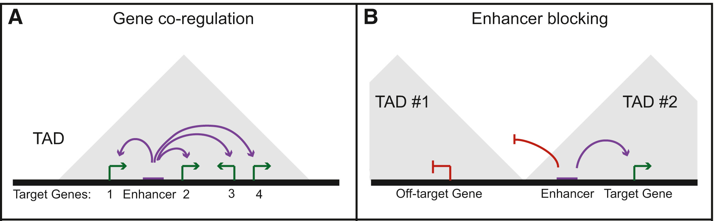

# Discussion {#thesis-discussion}

Recent developments in proximity-ligation methods allow measuring pairwise chromatin interactions genome-wide. Resulting interaction maps revealed a hierarchical organization of genome folding with the intrinsic property of interphase chromosomes to fold into frequently interacting domains, called TADs. 
This non-random organization lead to many fundamental questions of how genome folding contributes to functional segregation in genomes and how domain organization ensures precise regulation of gene expression (see chapter [1](#intro)).

Chromatin interaction data can be integrated computationally with one-dimensional measurements along the genome. This allows annotating folding structures with diverse functional data such as epigenetic marks, protein binding signals, tissue-specific gene expression, or sequence conservation across genomes. Work in this thesis applied such approaches to analyze the functions of TADs for gene regulation in the contexts of evolution and diseases. The results highlight the role of TADs as regulatory environments for gene expression, their stability during millions of years of evolution and disruptions by disease-associated genetic variants. Furthermore, recent insights into molecular mechanisms of chromatin loop formation are used to predict long-range interactions genome-wide from protein binding data. 

This section discusses the results of chapters \@ref(paralog-regulation), \@ref(TAD-evolution), \@ref(position-effect), and \@ref(loop) in light of the most recent literature and suggest further research perspectives.

## Co-regulation of functionally related genes in TADs

The ability to measure gene expression genome-wide in many different tissues and conditions
allowed the observation of clusters of co-expressed genes in higher eukaryotes [@Boutanaev2002; @Purmann2007]. It was previously speculated that the structure of the chromatin and cis-acting units might be responsible for the observed co-expression [@Sproul2005; @Purmann2007]. 
The ability to measure chromatin interactions leads to the discovery and characterization of TADs and enforces the question whether TADs insulate regulatory units in the genome to allow co-regulation of functionally similar genes.

To study the interplay between TADs, gene co-regulation, and evolution in the human genome, mouse, and dog genome, we decided to focus on pairs of paralog genes. 
Paralog genes arise from gene duplication events during evolution. 
Because of their homology and resulting sequence similarity, paralogs genes encode for proteins with related functions. This makes them an interesting model for functionally related and co-regulated genes. 
Indeed, gene expression data from various sources across different cell types and tissues 
have significantly increased expression correlation compared to other close genes.

Most duplications appear to be created by tandem duplications in direct orientation [@Newman2015], which explains the clustering of paralogs in the genome with short genomic distances and enrichment for beeing transcibed from the same DNA strand (Fig. \@ref(fig:paraData)). 
The resulting properties of paralog pairs complicated our analysis by the need for an adequately sampled control set of gene pairs. 
However, the development of careful sampling techniques results in control gene pairs that have similar properties regarding genomic distance, transcription strand, number of enhancers per gene, and the distance of enhancers to genes. This sampling approach allowed us to compare properties of paralog gene pairs to background distribution that model expectations by chance. 

<!-- ---------------------------------------------------------------- -->
```{r CoRegTAD, fig.cap='(ref:CoRegTAD)', out.width='80%', fig.align='center'}

```

(ref:CoRegTAD) **Co-regualtion by shared enhancers in TADs.** **(A)** Example diagram showing the co-regulation of multiple genes by a single regulatory element within a TAD. **(B)** Diagram of the potential for TAD boundaries to serve an enhancer blocking role that restricts enhancers to target genes within the same TAD. Figure adapted from [@Dixon2016].

<!-- ---------------------------------------------------------------- -->


Our analysis shows that paralogs are significantly enriched in TADs, frequently share the same regulatory enhancer and have increased Hi-C contacts, even when they are more than 1 Mb apart in the linear genome. 
These results show that evolutionary and functionally related genes tend to be co-regulated within TADs. Importantly, this highlights a functional organization of the three-dimensional genome, in which domain organization segregates distinct regulatory environments.

The association of gene expression with gene localizing in TADs is consistent with a very recent computational study with the aim to separate the proportion of expression associated with genome organization from independent sources. A large fraction of expression can be attributed to the positioning of genes in genome architecture and highly informative for TAD activity and organization [@Rennie2018]. 


## Evolution by gene duplications and altered regulatory environments
<!-- Creation of new genes in shared regulatory environments -->

However, the analysis of paralog regulation with respect to three-dimensional genome folding allows further conclusions about the evolutionary history of genes and how new functionality by novel genes is most efficiently created during evolution. 
Loss-of-function mutations degrade most young duplicated genes into pseudogenes [@Lynch2003].
These observations raise the question of which mechanisms led to the survival and expression of the many paralog genes. Some models explain paralog genes by sub- or neo-functionalization or sharing of gene dosage [@Lan2016].
Our observation of co-regulated paralogs in the regulatory environments of TADs is consistent with a very recent analysis of expression pattern between young and old paralogs [@Lan2016].
This study often finds one copy of young paralogs to be downregulated, indicating that dosage-sharing allows for initial survival of duplicated genes and slow functional adaption later on [@Lan2016].


The creation of paralogs by tandem duplication might also be an efficient evolutionary mechanism to introduce additional functionality to a gene by keeping the original gene unaffected.
We observe that very close paralogs seems to have decreased Hi-C contacts between their promoters when located in the same TAD, but show enriched association to the same regulatory elements. 
This somewhat unexpected phenomenon can be explained by a subset of paralogs that functionally replace each other, for example as alternative units in protein complexes.
This replacing functionality would require actively regulated exclusive expression of paralogs. 
Interestingly, a similar mechanism was reported for olfactory receptor genes that contact each other even across different chromosomes to facilitate particular expression of only a single receptor gene per cell [@Monahan2015; @Monahan2017]. 

The results of our analysis together with recent literature suggest a many-step mechanism of paralog evolution (Fig. \@ref(fig:ParalogSeparation)).
First, tandem duplications generate paralog genes, which start their life coregulated within TADs.
Then subsequent chromosomal rearrangements relocate paralogs to larger distances to their homologs but retaining increased contacts.
Further, eventual reorganization of regulatory control allows their increased independence being eventually placed even on different chromosomes where contact is no longer necessary. 
An exception would be genes that precise to be strongly co-regulated with the original copy, for example, to produce a replacement protein.

<!-- ---------------------------------------------------------------- -->
```{r ParalogSeparation, fig.cap='(ref:ParalogSeparation)', out.width='80%', fig.align='center'}
knitr::include_graphics("figures/model_paralog_expansion.png")
```

(ref:ParalogSeparation) **Model of paralog gene creation in TADs and evolving regulatory context and TADs over time.** Tandem-duplication accounts for the creation of most paralogs. Duplication within a TAD allows the new copy of the gene to be regulated by the same environment (top left). Over evolutionary time, the interactions pattern and regulatory input might change to allow for more independent expression regulation (top center). Evolutionary rearrangements might even relocate the genes to different chromosomes (top right). Alternatively, the two copies might stay in the same TAD to enable them to be coordinately regulated (bottom).

<!-- ---------------------------------------------------------------- -->

Several mechanisms can explain the creation of new functionality and morphological diversity between species across evolution.
A key component and driver for new gene function in evolution or neo-functionalization can be the birth of new enhancers through the acquisition of transcription factor binding and subsequent novel regulatory functions [@Long2016]. 
Similarly, deletion or duplication of TAD boundaries could change the folding structure of genomic regions and enable regulatory contacts with previously insulated regulatory elements [@Ibn-Salem2014; @Lupianez2015; @Franke2017].
In agreement with these mechanisms observed in genetic diseases, we find that evolutionary rearrangements disrupting TADs are associated with divergent gene expression patterns between mouse and human. 
These findings indicate an evolutionary mechanism by which structural variations lead to altered domain organization with associated expression changes which might enable novel functions and morphologies.
One example of altered physiological morphologies upon structural variations is the Liebenberg Syndrom that is characterized by malformation of upper limbs, showing the characteristic bone morphology of hind-limbs [@Spielmann2012]. This syndrome is caused by deletions or translocations that disrupt a TAD boundary element which exposes the *PITX1* gene to the activation by an enhancer with specific lower-limb activity [@Spielmann2013a]. 
This example and other pathogenic phenotypes caused by TAD disruptions [@Lupianez2015; @Franke2016; @Flottmann2017] show that altered genome folding upon TAD disruption can ptentially also lead to physiological and morphological novelties during evolution.

Together, our data suggest that TADs act as protective nests for evolving newcomer genes. 
Duplicating genes within TADs seems to be a reasonable evolutionary mechanism, much more straightforward than creating from nothing an entirely new regulatory environment for a new gene. 
Genetic variations that alter genome folding and expose genes to new regulatory environments can then create new functions of the gene by expression in different contexts leading to physiological or morphological novelties.

## TADs are stable across large evolutionary time-scales

As consequence of these association of TADs with co-regulation, enhancer sharing, and co-expression, we hypothesized that TADs provide regulatory environments for genes and are therefore conserved during evolution.
More specifically, we asked whether genomic rearrangement between distantly related species would more frequently occur at TAD boundaries or within TAD regions. 
Furthermore, we hypothesized that disruption of TADs during evolution might be associated with changes in gene expression programs between the species.

We find evolutionary rearrangements between distant vertebrate species highly enriched at TAD boundaries and depleted within TADs (Chapter \@ref(TAD-evolution)).
This is consistent with recent findings of enriched non-coding sequence conservation in TADs [@Harmston2017; @Polychronopoulos2017]. 
Furthermore, these results are consistent with a very recent study investigating the requirement of the ultra-conserved non-coding regions containing enhancers by knock-out experiments in mice [@Dickel2018]. Knock-out mice that lack individual or combination of enhancers were viable but showed strong neurological phenotypes.
These effects indicate that the remarkably strong sequence conservation likely results from fitness deficit that appear subtle in a laboratory setting [@Dickel2018].
This effect could be similar for targeted deletions of conserved TAD boundaries.

Interestingly, genetic variation data across human populations revealed that loci in the same TAD have a reduced recombination rate [@Liu2016b]. 
Consistent with this finding, the linkage disequilibrium (LD), which measures co-transmission of genetic variants in populations, correlates with Hi-C interaction frequencies [@Gerber2018].
This association indicates functional interactions between alleles in regulatory domains [@Liu2016b]. 

We observed enrichment for expression conservation for genes in TADs and even stronger for genes in conserved TADs.
This is somewhat consistent with a very recent study, analyzing promoter and enhancer activity in liver samples from 15 species [@Berthelot2017]. 
In this study gene expression conservation could best be explained by the number and conservation of surrounding enhancers and promoters.

These results, together with the strong non-coding conservation in TADs [@Harmston2017], and our finding of reduced rearrangements of TADs and association to conserved gene expression indicates, that selective pressure acts on the integrity of TADs. 

The analysis of genomic rearrangements between human and other species during evolution leads to the conclusion that TADs are essential regulatory building blocks of genomes. 
This is supported by strong enrichment for non-coding conservation in TADs [@Harmston2017].
Furthermore, changes of expression profiles are associated with the disruption of TADs during evolution. 
This altered regulation upon TAD disruption might be beneficial for an organism and allow evolutionary leaps (as discussed above).
However, in most cases, these gene miss-expressions might be detrimental for an organism, as was observed in genetic diseases [@Ibn-Salem2014; @Lupianez2015] and cancers (as discussed below).
Therefore, we interpret the depletion of evolutionary rearrangements in TADs and the expression change associated with TAD disruption to be a consequence of selective pressure on TAD structure.

<!-- Connection from TAD-evolution to position effect -->
<!-- While miss-regulation upon TAD disruption might be beneficial for an organism and allow evolutionary leaps (as discussed above), in most cases TAD disruptions might be detrimental for an organism, as can be seen in genetic diseases and cancers (as discussed below).  -->

## Gene expression changes by altered TADs in disease {#TAD-disease}

Their conservation during evolution supports the functional importance of TADs.
However, if TADs are indeed crucial for proper gene regulation during development, one would expect that TAD disruptions are associated with disease and lead to phenotypes by dysregulation of phenotypically relevant genes.

We analyzed balanced chromosomal rearrangements in 17 subjects with diverse pathogenic phenotypes. 
The rearrangement breakpoints are in non-coding regions but frequently disrupt TADs. 
Furthermore, we reported disruption of long-range chromatin interactions between several enhancers and genes whose annotated clinical features are strongly associated with the subjects phenotypes. 
For some candidate genes, we confirm gene expression changes in cell lines derived from subjects with such rearrangements (Chapter \@ref(position-effect)). 
Importantly, effects of rearrangements in disease genomes are consistent with the comparative genomic analysis finding selective pressure on TAD disruptions.

The causal relationship between TAD disruption, miss-expression and pathogenic phenotypes has been studied recently in more detail (reviewed for example in @Krijger2016; @Achinger-Kawecka2017; @Yu2017; @Andrey2017). 
In these studies, the authors linked observed pathogenic phenotypes of congenital diseases and cancers to structural variations identified in the subjects genomes. 
The observed phenotypes could not be explained, when only the disruption of protein-coding sequence or gene dosage was considered. However, when considering the genome folding structure and TADs together with enhancer activity, the pathogenic effect mechanism became apparent. 

Deletions of TAD boundaries can lead to ectopic activation of genes by enhancers in neighboring TADs (Fig. \@ref(fig:TadDisruptions)A). 
This effect mechanism was first shown to be relevant by computationally integrating hundreds of deletions with tissue-specific enhancers, phenotype-gene associations, and TAD positions.
A significant proportion of deletion cases could be best explained by such an enhancer adaption mechanism [@Ibn-Salem2014].

Experimentally validated examples include the locus of the *LMNB1* gene [@Giorgio2015].
Deletion of a TAD boundary upstream of *LMNB1* results in ectopic contact of enhancers with the *LMNB1* promoter, and overexpression of *LMNB1*.
This pathomechanism leads to autosomal dominant adult-onset demyelinating leukodystrophy [@Giorgio2015].

Miss-expression due to ectopic contacts with enhancer can be validated now using CRISPR-derived methodologies to induce structural variants in mice [@Kraft2015; @Andrey2017]. 
These approaches could experimentally validate that, deletion of the centromeric or telomeric boundary of a TAD containing the *EPHA4* gene causes activation of *IHH* or *PAX*, leading to brachydactyly or polydactyly, respectively [@Lupianez2015].
Interestingly and in line with the insulating function of TAD boundaries, introducing of a slightly shorter deletion, that did not overlap the TAD boundary, did not cause up-regulation [@Lupianez2015; @Symmons2016]. 
Other examples include the locus of the *LMNB1* gene [@Giorgio2015].
Deletion of a TAD boundary upstream of *LMNB1* result in ectopic contact of enhancers with the *LMNB1* promoter, and overexpression of *LMNB1*.
This pathomechanism leads to autosomal dominant adult-onset demyelinating leukodystrophy [@Giorgio2015].

<!-- ---------------------------------------------------------------- -->
```{r TadDisruptions, fig.cap='(ref:TadDisruptionsCap)', out.width='80%', fig.align='center'}
knitr::include_graphics("figures/Andrey2017_Fig5.png")
```

(ref:TadDisruptionsCap) **Structural variants can affect TAD structure and enhancer-promoter interactions.** Structural variants can induce ectopic increase or loss of gene expression leading to disease. Here, topologically associating domains (TADs) are represented by shaded triangles, genes by gray blocks, and enhancers by colored ovals. Gene expression patterns driven by enhancers in ebrioinc day 10.5 mouse embryos are shown. A representative chromatin configuration is shown above the TADs. **(A)** In the wild-type chromatin conformation, Enhancer C (E-C) controls Gene 3 (G-3) in the neural tube. **(B)** The deletion of a TAD boundary element leads to ectopic contact between Enhancer C (E-C) and gene 1 (G-1) (red arrow), which results in the ectopic expression of Gene 1 in the neural tube. **(C)** In the case of a rearrangment  through an inversion (blue arrows) or translocation that leads to the repositioning of functional elements, Enhancer C (E-C) from a neighboring TAD is free to activate Gene 1 (G-1), resulting in the ectopic expression of Gene 1 in the neural tube. The inversion also leaves Enhancer C insulated from its native target Gene 3 (G-3) by a boundary, resulting in the loss of Gene 3 expression in the neural tube. **(D)** The duplication of a region allows a new chromatin domain (a neo-TAD; green triangle) to form that contains regulatory region(s) and gene(s), which produce new expression patterns. Here, the duplicated Enhancer C′ (E-C′) and Gene 2′ (G-2′), which both locate to the insulated neo-TAD, produce the ectopic expression of Gene 2′ in the neural tube. Figure and figure caption adpated from [@Andrey2017].

<!-- ---------------------------------------------------------------- -->

Depending on their size and positioning, also duplications can bring enhancers into contact with gene promoters, which were before separated by a TAD boundary (Fig. \@ref(fig:TadDisruptions)D).
Duplications involving no regulatory elements and contained entirely within a TAD (intra-TAD) have in general no major effect on genes in the same TAD, as enhancer-promoter contacts are mainly invariant of genomic distance within TADs [@Symmons2016]. 
This lack of regulatory phenotype can also explain why paralog genes are often created by tandem-duplications within TADs during evolution without affecting the regulatory environments of other genes (Chapter \@ref(paralog-regulation)). 
However, when an intra-TAD duplication contains regulatory environments with several enhancers, increased regulatory inputs can lead to over-expression. 
This mechanism leads to upregulation of the *SOX9* gene and in turn cases female to male sex reversal [@Franke2016].
However, further extension of the duplication at the *SOX9* locus, encompassing a TAD boundary and the nearby *KCN72* gene, leads to the formation of a new TAD, called neo-TAD.
Since both, *SOX9* enhancers and the *KCN72* gene are included in the duplicated regions, *KCN72* gets activated by the *SOX9* enhancers leading to Cooks syndrome [@Franke2016].

Beside deletions and duplications, balanced chromosomal abnormalities (BCA) like inversion or translocation can disrupt TAD and lead to similar effect mechanism without gain or loss of genetic material.
Inversions of TAD boundaries can bring promoters under the control of enhancers, that were before in different TADs (Fig. \@ref(fig:TadDisruptions)C).
Such a mechanism leads for example to F-syndrome, where inversion of the centromeric boundary of the *EPHA4* TAD cause activation of the *WNT6* gene [@Lupianez2015].
Another recent study analyzed BCAs in 273 subjects with a spectrum of congenital abnormalities and find 7.3% of them disrupting TADs encompassing known syndromic loci. 
Eight rearrangement breakpoints were localized in a single TAD containing the *MEF2C* gene and resulted in decreased expression of *MEF2C* in these subjects [@Redin2017]. 

Also, somatic mutation can disrupt TAD boundaries and lead to cancers. 
For example, in T-cell acute lymphoblastic leukemia, two oncogenes, *TAL1* and *LMO2* are close to a TAD boundary and get activated upon boundary deletion in HEK-293T cells [@Hnisz2016].
Furthermore, in *IDH* mutant gliomas, TET proteins, which are involved in active demethylation, are repressed. This effect leads to hypermethylation of several CTCF binding sites and in turn, decreased insulation functions of TAD boundaries. 
This result in ectopic contact of constitutively active enhancers and the oncogene *PDGFRA* leading to its upregulation [@Flavahan2016].
In conjunction with these findings, CTCF and cohesin binding sites are frequently mutated by single nucleotide variants in several cancer types, suggesting oncogene activation by TAD disruptions as a common mechanism in cancers [@Katainen2015; @Yu2017].

Together, these studies confirm our findings of computationally predicted pathomechanism of TAD disruptions upon deletions [@Ibn-Salem2014] or balanced rearrangements (Chapter \@ref(position-effect)).
TAD disruptions can lead to miss-expression not only during evolution but also in disease manifestation. 
Therefore, it will be increasingly important to take the three-dimensional genome folding structure into account to interpret the effect of genetic variants. 

## Genome folding data can explain the pathomechanism of structural variants

Structural variation, either inherited or arising from de novo germline or somatic mutations, make up the majority of different nucleotides among human genomes [@Sudmant2015; @Auton2015].
By their ability to alter gene dosage, promote gene fusions, unmask recessive alleles, or disrupt associations between genes and their regulatory elements, structural variants are involved in numerous congenital syndromes and cancers [@Stankiewicz2010].
However, many structural variants affect only non-coding regions in the genome and are therefore difficult to interpret in modern molecular diagnoses. 

In several syndromes, structural variants disrupt TADs and rewire regulatory interactions between enhancers and genes (Section TAD-disease). 
These effects suggest that molecular diagnoses can benefit from taking the genome folding structure into account to identify the underlying pathogenic effect mechanism. 

In previous work [@Ibn-Salem2014] and Chapter \@ref(position-effect), we demonstrate how publicly available chromatin interaction data can be used together with diverse genomic and structured phenotype data to predict regulatory effect mechanism and candidate genes. 
Utilizing such publicly available data, we discovered 16 genes for 11 DGAP cases that are top-ranking position effect candidates for the subjects’ clinical phenotypes. 
Importantly, we also applied our computational pipeline to cases with known pathogenic genes from the DGAP cohort, and correctly prediction 52 out of 57 genes, indicating a high sensitivity of this approach.
Compared to more elaborate experimental screenings, our computational analysis is rapid and can provide additional information to benefit the clinical assessment of both coding and non-coding genome variants. 

While the existence of other subjects with related phenotypes to the DGAP cases does not prove the involvement of neighboring genes in the etiology of these phenotypes, it is a step forward towards prediction of pathogenic effects starting from a simple computational analysis, pointing to a better phenotypic categorization when clinically examining affected individuals. 
Therefore, computational integration of genomic and phenotypic data is a crucial step towards prediction of pathogenic consequences of non-coding variation observed in prenatal samples.

However, the here presented computational prediction method is limited by the quality of genomic and phenotypic data. 
An essential step in our analysis was the quantification of phenotype similarities between phenotypes annotated to genes, on the one hand, and phenotypes observed in the subject, on the other hand. 
This gene prioritization was only possible by detailed phenotypic annotation data of subjects using the Human Phenotype Ontology (HPO). 
The HPO provides a standardized vocabulary of phenotypic abnormalities encountered in human disease and relations between them. Furthermore, HPO links phenotype terms to genes using data from mono-genic diseases [@Kohler2014]. 
The brought application of such deeply structured phenotypic information will be essential for correctly interpreting genomic variants causing individual abnormalities observed in heterogeneous patient cohorts [@Brookes2015]. 
While the continuously decreasing sequencing costs allow variant detection at high-resolution in large cohorts and populations, the detailed and precise phenotypical annotation using standardized vocabularies is lacking often behind.  

The crucial implications of genome folding structure on the influence of genetic variants highlight the importance of taking genome folding data into account in clinical practice. 
However, an apparent limitation in predicting the effect of genetic variants on genome folding is the lack of high-resolution chromatin interaction data that is specific for the tissue of interest. 
While TAD boundaries are mostly stable between cell-types [@Dixon2012; @Rao2014; @Schmitt2016] and during differentiation [@Dixon2015], many regulatory interactions are cell type-specific [@LeDily2014; @Dixon2015].
This tissue-specificity raises the question of whether chromatin interaction data from different tissues can be used to predict regulatory interactions changes in the cell-types and tissues relevant for pathogenesis.
Although genome-wide contact maps become increasingly available in recent years, high heterogeneity between proximity-ligation methods makes it challenging to train prediction methods on data across different studies.
Therefore, it will be crucial to computationally predict long-range interaction in the tissue of interest from other tissue-specific genomic data that is measured along the linear genome. 

Another critical challenge is to predict not only the disrupted chromatin interactions but also gained interactions and resulting domain organization. Similar to the creation of neo-TADs by tandem-duplication of TAD boundaries, inversion and translocations can create novel folding structures by connecting loci that were before separated by TAD boundaries or even on different chromosomes. However, which regions in such fused TADs interact across rearrangement breakpoints is not clear and can currently only be measured experimentally in transgenic mouse models.
Computational models that predict long-range interactions from genomic sequence could help here. A prediction model could be trained on the unaffected genome to learn sequence features that predict chromatin interactions. The model can then be applied to the genome sequence that is altered by structural variations to predict the resulting folding structure. Such prediction models can help to understand better if and how new TADs are formed and which regulatory interactions are gained upon structural variations.

We provide initial support for such an approach by developing 7C to predict chromatin looping interactions from protein binding data and sequence motifs (Chapter \@ref(loop)). 
Approaches, like 7C, allow predicting genome folding by taking into account both, the tissue specificity and potentially altered genomic sequence. 
However, the application on predicting folding in rearranged genomes needs to be demonstrated. 

## Towards studying condition specific genome folding

Understanding the variability of genome folding is a key challenge faced by ongoing and future genomic research. 
It becomes increasingly clear that condition-specific long-range interaction data is needed to (i) associate genetic variants to affected target genes, (ii) associate TF binding sites and enhancers to genes, (iii) understand the variability of long-range contacts across individuals and (iv) reveal the contribution of single cells to folding structures observed for cell populations. 

### Interpretation of genetic variants by interacting genes

The majority of disease-associated variants uncovered by genome-wide association studies (GWAS) reside in noncoding sequences. Many variants are located near cis-regulatory sequences and enhancers and could, therefore, contribute to pathogenesis by affecting transcription of specific genes [@Hindorff2009]. 
The ability to measure long-range chromatin interactions allows understanding the role of non-coding variants by predicting its interacting target gene [@Smemo2014; @Visser2012]. 
This has been shown by measuring the interactions of promoters in 17 human primary hematopoietic cells types revealing more than 2,400 potential disease-associated genes liked to thousands of GWAS SNPs [@Javierre2016].
In another study, the noncoding variants associated with schizophrenia could be annotated using Hi-C contact maps from human cerebral cortex [@Won2016].
These studies demonstrate how genome folding information can help to interpret not only structural variants but also single nucleotide variants. Furthermore, these examples highlight the need for tissue-specific interaction maps. 

While proximity-ligation experiments are still costly and time-intensive to produce for each tissue or individual of interest, computational predictions of such interactions from ChIP-seq and motif data, as we provide with the 7C too, will likely become and fast and accurate alternative for such studies. 

### Cell type-specific regulatory interactions between enhancers and genes

While TADs seems to be mostly stable across different cell types [@Dixon2012] and during differentiation [@Dixon2015], individual interactions distal TF binding sites or enhancers with their regulated target gene occur in cell-type or condition-specific manner [@Bonev2016; @Andrey2017]. 
Enhancers are often located several hundred kb apart from their gene promoter, and most enhancers do not regulate the nearest gene [@Sanyal2012].
Therefore, tissue and condition-specific interactions of regulatory elements with genes are essential to predict gene-regulatory events correctly. 
Since many enhancer-gene interactions appear to be in enclosed CTCF loops [@Hnisz2016a], our prediction tool 7C can be used to predict such interactions by taking condition specific signals such as ChIP-seq as input.

### Variability of long-range interactions across individuals

Interestingly, initial studies start to analyze ChIP-seq data of histone modifications across populations [@Grubert2015].  The variability of histone marks correlates with single nucleotide variants. These histone quantitative trait loci (hQTLs) cluster in TADs. However, it is not clear yet, how TADs or individual loops vary across individuals. Therefore, predictive modeling approaches like 7C could fill this gap to analyze the variability of chromatin looping contacts cross individuals. 
When combined with SNP data from the same individuals, one could potentially correlate genetic variants and loop variations across individuals to find loop quantitative trait loci (loopQTLs).

### Genome folding in single cells

In contrast to imaging-based methods, genome-wide proximity-ligation experiments such as Hi-C and ChIA-PET measure chromatin contacts in cell populations. 
This raises the question whether observed structures like A/B compartments, TADs, or loops appear only in a subset of cells or appear from variable contacts in every single cell. 
Recently the Hi-C protocol has been adapted to measure contacts in single cells [@Sekelja2016; @Ulianov2017]. 
A/B compartment structure has been confirmed by imaging methods on single chromosomes [@Wang2016d]. TADs were also observed in single-cell Hi-C data [@Nagano2013].
Imaging and single-cell Hi-C studies have illustrated significant cell-to-cell variability regarding 3D genome organization [@Nagano2013; @Ramani2016; @Flyamer2017; @Stevens2017].
Accordingly, TADs seem to emerge from cell population averages and do not exist as static structures in individual cells.
However, it is unclear how this variability relates to gene regulation in single cells. 
It will be an exciting challenge to improve single-cell protocols in a way to separate RNA from chromatin to measure from the same cell both, gene expression and genome folding by single-cell RNA-seq and single-cell Hi-C, respectively. 

Given the sparsity of coverage in current single-cell protocols [@Nagano2013; @Flyamer2017; @Stevens2017], it would be interesting to computationally predict single cell structures from other genomic data measured along the linear genome in individual cells.
Although single-cell ChIP-seq is published [@Rotem2015], ChIP-seq needs a lot of sample material as input. Therefore,  it will be challenging to produce TF binding profiles in single cells with high coverage.
However, thanks to single-cell ATAC-seq [@Buenrostro2015], prediction approaches like 7C could use chromatin accessibility data from single cells to predict variability in looping interactions across single cells.

### Constantly improving targeted experimental methods. 

While 7C archives high prediction accuracy (Chapter \@ref(loop)), it can only be as good as current experimental methods. 
Currently, high-resolution Hi-C and ChIA-PET can be considered as gold standard for CTCF mediated long-range interactions [@Rao2014; @Tang2015]. 
However, from the recent literature, it becomes clear, that there will be a continuously increasing development of experimental methods to probe interactions in a more efficient and targeted way [@Denker2016; @Schmitt2016; @Davies2017]. 
Beside the first generation of genome-wide 3C methods, like Hi-C and ChIA-PET (see section \@ref(proximity-ligation)), more recent experimental developments improve resolution and efficiency by often capturing only a specific subset of interest among all interactions. 
These methods include, for example, 
TCC [@Kalhor2011],
Capture-Hi-C [@Dryden2014],
Capture-C [@Hughes2014],
HiCap [@Sahlen2015],
NG Capture-C [@Davies2016],
HiChIP [@Mumbach2016],
or T2C [@Kolovos2018].
These methodological advances together will enable analysis of the plasticity and dynamics of chromatin interactions across diverse conditions.

## Architectural proteins mediate chromatin looping

A strong focus of current research in the field of three-dimensional chromatin architecture is to understand the molecular mechanism behind the formation of chromatin loops and TADs.
It is not clear how molecular interactions between proteins at the nanometer scale organize micron-long protein-bound DNA molecules and how TAD formation can lead to insulating or facilitating interactions between specific genomic elements?

Enrichment of CTCF at TAD boundaries, the convergent orientation of CTCF motifs in chromatin loops, as well as extensive polymer modeling result in the loop extrusion model (Section \@ref(loop-mechanism)).
According to this model, loops and TADs are formed by active extrusion of chromatin through a loop-extruding molecule Thereby, barrier elements, such as CTCF can arrest the extrusion and lead to stable loops. Multiple further extrusion processes within such loops can explain TAD like structures in Hi-C [@Fudenberg2018]. 

- Cohesin removal [@Schwarzer2017]
- CTCF removal [@Rao2017]

However, it is not clear which other factors might drive loop formation. 
Using our loop prediction tool 7C, we could screen ChIP-seq datasets from 124 different TF to quantify the ability of the TF binding signals to predict chromatin looping events.
Interestingly, we could confirm the implication of many known architectural proteins, such as cohesin, CTCF, and ZNF143. 

These findings are largely consistent with recent perturbation studies that analyze the effect of cohesin or CTCF depletion or knock-out on genome folding. 

Cohesin knockout studies reveal that cohesin is not required for the segregation of chromatin into A/B compartments. On the contrary, compartmentalization increased upon cohesin depletion.


<!-- - How loops and TADs are formed.  -->
<!-- - Analysis of features -> screening of TFs  -->

<!-- The screening of hundreds of TF for their predictive value in loop formation lead to several known and novel factors in chromatin loop formation. -->

<!-- - Which factors mediated long-range interactions. -->

<!-- - Consistent with very recent perturbation studies.  -->
<!-- - CTCF knockout  -->
<!-- - Rad21 Knockout and perturbation -->

<!-- - leads to loop-extrustion model  -->


## Further directions
- Many open questions in the field of three-dimensional genome folding.
- Neo-TADs by tandem-duplication in evolution [@Franke2016]
- Plasticity and dynamics of chromatin interactions
- Single-cell resolution 
    - Single cell Hi-C studies: [@Nagano2017; @Stevens2017]
    - Computational modeling of single cells [@Sekelja2016].
- Functional mechanism
  - Loop extrusion
  - CTCF and cohesin depletion experiments
  - Establishment of compartments / TADs / loops
  - Independent mechanism for loops and domains on the one hand and compartments on the other hand. 
    - Compartmental segregation was increased on CTCF (or cohesin?) knock out. 
    - Phase-separation model [@DiPierro2017; @Strom2017; @Hnisz2017].
  - How are loop formation and domain organization regulated?
- 4D Nucleosome initiative 

### Limitation of the analysis
- Limitations of 3C based methods
   - Resolution
   - Discuss GAM [@Beagrie2017].
   - Interacinots quantification over population of cells (bulk Hi-C)
   - Discuss single cell Hi-C

## Conclusions

Recent methodological advances in chromatin conformation capture experiments resulted in genome-wide contact maps of genomes. 
These data lead to many fascinating insights into the folding structures of genomes.
One important discovery was that chromosomes fold locally into discreet genomic domains, called TADs. 

The work described in this thesis shows that TADs are not only structural units of genomes but that they are also functionally essential for the correct regulation of gene expression. 
TADs represent a regulatory environment that restricts the interaction landscape of enhancers.
Indeed, functionally related genes, such as paralogs, are co-regulated within TADs. 
During evolution, new genes can emerge by duplication and find established regulatory environments within TADs. 
Therefore, TADs represent productive nests for novel genes in evolution.
Their stability further stressed the functional importance of TADs during million years of evolution. Indeed stable TADs are associated with conserved expression profiles of genes. 

Disruption of TADs by rearrangements is associated with changes in gene expression profiles during evolution as well as in genomes of subjects with developmental diseases. 
While these disruptions of TADs might be beneficial for an organism and lead to evolutionary leaps in some cases, I show in disease genomes, that disruptions of TADs can result in severe phenotypes like mental retardation. 
Therefore, the three-dimensional folding structure of genomes, including TADs and enhancer-promoter interactions have to be considered for the interpretation of genomic variants of patient genomes.  

While continually decreasing costs of sequencing will further enable the analysis of individual genomes in many genetic syndromes or cancers, it will be increasingly important to interpret these variants within their functional genomic context correctly. 
To this end, we need a deeper understanding of the functional role of genome folding including its dynamics between single cells as well as its changes in specific cell types and conditions. 
To integrate diverse types of functional data that is measured along the genomes with the chromatin folding patterns and their interplay, we need carefully designed computational models. 
This will address not only fundamental questions such as the evolution of genomes, mechanisms of gene regulation in differentiation and development but also solve practical problems such as the interpretation of genetic variants in disease genomes for better developments of diagnosis and treatments.

