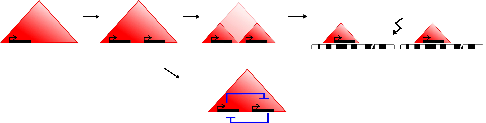
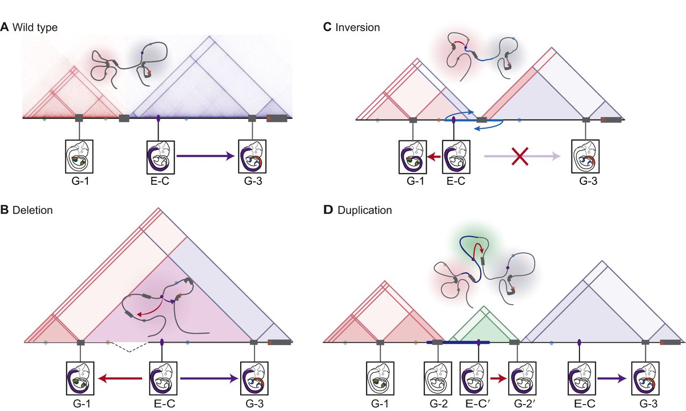

# Discussion {#thesis-discussion}

- Notes
   - evtl devide discussion of paralogs into two part, 
      - the regualtlinl and TAD association
      - and new gene creation

## (Introduction to discussion)

<!-- Summary of the whole work -->

- summarize current knowledge of genome folding and gene-regulation (from the introduction)
- This leads to many fundamental questions of how genome folding contributes to the functional organization of genomes regarding gene regulation.
- This data can be computationally integrated with one-dimensional measurements along the genome
and lead to exciting findings of a higher-order organization. 
- In this thesis, I analysed the functions of TADs for gene regulation and highlight their stability in evolution as well as their consideration when analyzing genomic variations in patient genomes.
- Summarize main findings from chapters 2-5
- In this section the results of this theses from chapters are discussed and related to the most recent literature. 

### Limitation of the analysis
- Limitations of 3C based methods
   - Resolution
   - Discuss GAM [@Beagrie2017].
   - Interacinots quantification over population of cells (bulk Hi-C)
   - Discuss single cell Hi-C

## Co-regulation of functionally related genes in TADs

The ability to measure gene expression genome-wide in many different tissues and conditions
allowed the observation of clusters of co-expressed genes in higher eukaryotes [@Boutanaev2002; @Purmann2007]. It was previously speculated that the structure of the chromatin and cis-acting units might be responsible for the observed co-expression [@Sproul2005; @Purmann2007]. 
The ability to measure chromatin interactions lead to the discovery and characterization of TADs and enforce the question whether TADs insulate regulatory units in the genome two allow co-regulation of functionally similar genes.

To study the interplay between TADs, gene co-regulation, and evolution in the human genome, mouse, and dog genome, we decided to focus on pairs of paralog genes. 
Paralog genes arise from gene duplication events during evolution. 
Because of their homology and resulting sequence similarity, paralogs genes encode for proteins with related functions. This makes them an interesting model for functionally related and co-regulated genes. 
Indeed, gene expression data from various sources across different cell types and tissues show 
have significantly increased expression correlation compared to other close genes.

Most duplications appear to be created by tandem duplications in direct orientation [@Newman2015], which explains the clustering of paralogs in the genome with short genomic distances and often the same transcription senes (Fig. \@ref(fig:paraData)). 
The resulting properties of paralog pairs complicated our analysis by the need for an adequately sampled control set of gene pairs. 
However, the development of careful sampling techniques results in control gene pairs that have similar properties regarding genomic distance, transcription strand, number of enhancers per gene, and the distance of enhancers to genes. This sampling approach allowed us to compare properties of paralog gene pairs to background distribution that model expectations by chance. 

Our analysis shows that paralogs are significantly enriched in TADs, frequently share the same regulatory enhancer and have increased Hi-C contacts, even when they are more than 1 Mb apart in the linear genome. 
These results show that evolutionary and functionally related genes tend to be co-regulated within TADs. Importantly, this highlights a functional organization of the three-dimensional genome, in which domain organization segregates distinct regulatory environments.

The association of gene expression with gene localizing in TADs is consistent with a very recent computational study with the aim to separate the proportion of expression associated with genome organization from independent sources. A large fraction of expression can be attributed to the positioning of genes in genome architecture and highly informative for TAD activity and organization [@Rennie2018]. 

## Creation of new genes in shared regulatory environments

However, the analysis of paralogs with respect to three-dimensional genome folding allows further conclusions about the evolutionary history of genes and how new functionality by novel genes is most efficient created during evolution. 
Loss-of-function mutations degrade most young duplicated genes into pseudogenes [@Lynch2003].
These observations raise the question of which mechanisms led to the survival and expression of the many paralog genes. Some models explain paralog genes by sub- or neo-functionalization or sharing of gene dosage [@Lan2016].
Our observation of co-regulated paralogs in the regulatory environments of TADs is consistent with a very recent analysis of expression pattern between young and old paralogs [@Lan2016].
This study often finds one copy of young paralogs to be downregulated indicating that dosage-sharing allows for initial survival of duplicated genes a slower functional adaption [@Lan2016].


The creation of paralogs by tandem duplication might also be an efficient evolutionary mechanism to introduce additional functionality to a gene by keeping the original gene unaffected.
We observe that very close paralogs seems to have decreased Hi-C contacts between their promoters when located in the same TAD, but show enriched association to the same regulatory elements. 
This somewhat unexpected phenomenon can be explained by a subset of paralogs that functionally replace each other, for example as alternative units in protein complexes.
This replacing functionality would require actively regulated exclusive expression of paralogs. 
Interestingly, a similar mechanism was reported for olfactory receptor genes that contact each other even across different chromosomes to facilitate particular expression of only a single receptor gene per cell [@Monahan2015; @Monahan2017]. 

The results of our analysis together with recent literature suggest a many-step mechanism of paralog evolution (Fig. \@ref(fig:ParalogSeparation)).
First, tandem duplications generate paralog genes, which start their life coregulated within TADs.
Then subsequent chromosomal rearrangements relocate paralogs to larger distances to their homologs but retaining increased contacts.
Further, eventual reorganization of regulatory control allows their increased independence being eventually placed even on different chromosomes where contact is no longer necessary. 
An exception would be genes that precise to be strongly co-regulated with the original copy, for example, to produce a replacement protein.

<!-- ---------------------------------------------------------------- -->
```{r ParalogSeparation, fig.cap='(ref:ParalogSeparation)', out.width='80%', fig.align='center'}

```

(ref:ParalogSeparation) **Model of paralog gene creation in TADs and evolving regulatory context and TADs over time.** Tandem-duplication accounts for the creation of most paralogs. Duplication within a TAD allows the new copy of the gene to be regulated by the same environment (top left). Over evolutionary time, the interactions pattern and regulatory input might change to allow for more independent expression regulation (top center). Evolutionary rearrangements might even relocate the genes to different chromosomes (top right). Alternatively, the two copies might stay in the same TAD to enable them to be coordinately regulated (bottom).

<!-- ---------------------------------------------------------------- -->


Several mechanisms can explain the creation of new functionality and morphological diversity between species across evolution.
A key component and driver for new gene function in evolution or neo-functionalization can be the birth of new enhancers through the acquisition of transcription factor binding and subsequent novel regulatory functions [@Long2016]. 
Similarly, deletion or duplication of TAD boundaries could change the folding structure of genomic regions and enable regulatory contacts with previously insulated regulatory elements [@Franke2017].
However, our data suggest that TADs act as protective nests for evolving newcomer genes. 
This seems to be a reasonable evolutionary mechanism, much more straightforward than creating from nothing an entirely new regulatory environment for a new gene. 

<!-- Connection to TAD evolution -->

## TADs are stable across large evolutionary time-scales

As consequence of these association of TADs with co-regulation, enhancer sharing, and co-expression, we hypothesized TADs provide regulatory environments for genes and are therefore conserved during evolution.
More specifically, we asked whether genomic rearrangement between distantly related species would more frequently occur at TAD boundaries or within TAD regions. 
Furthermore, we hypothesized that disruption of TADs during evolution might be associated with changes in gene expression programs between the species.

- Discussion on findings
  - Relate to GRBs and CNE clusters [@Harmston2017; @Polychronopoulos2017]
  - Follow up studies might experimentally support the functional importance of TADs that are evolutionary conserved. 

Interestingly, also regions in the same TAD have a reduced recombination rate, 
indicating functional interactions between alleles in such regulatory domains [@Liu2016b]. The relation of variant co-transmission in population, in general, measured as linkage disequilibrium (LD) correlates with Hi-C interaction frequencies [@Gerber2018].


A very recent study investigated the requirement of the ultra-conserved non-coding region containing enhancers by knock-out experiments in mice [@Dickel2018]. Knock-out mice that lack individual or combination of enhancers were viable but showed strong neurological phenotypes.
These effects indicate that the remarkably strong sequence conservation likely results from fitness deficit that appear subtle in a laboratory setting [@Dickel2018].
This effect could be similar for targeted deletions of conserved TAD boundaries.

The increased expression conservation of genes within TADs is somewhat consistent with a very recent study, analyzing promoter and enhancer activity in liver samples from 15 species [@Berthelot2017]. In this study gene expression conservation could best be explained by the number and conservation of surrounding enhancers and promoters.

<!-- Connection from TAD-evolution to position effect -->

The analysis of genomic rearrangements between human and other species during evolution lead to the conclusion that TADs are essential regulatory building blocks of genomes. 
Indeed the changes of expression profiles are associated with the disruption of TADs during evolution.
Altered gene regulation likely lead to severe disadvantages to the organism, as was observed for example in genetic diseases [@Ibn-Salem2014; @Lupianez2015] and cancers.
Therefore, we interpret the depletion of evolutionary rearrangements in TADs and the expression change associated with TAD disruption to be a consequence of selective pressure on TAD structure. 
Therefore selective pressure is likely to act on TAD structures.

## The genome folding structure explains pathomechanism of structural variants

- Introduce from the evolutionary perspective
- Check discussion of position effect section
- Discuss and review TAD disease studies (see intro).
- Need for contact maps in clinical practice
- Limitation of non-tissue-specific interaction data in this project
- Tissue-specific interactions needed


<!-- ---------------------------------------------------------------- -->
```{r TadDisruptions, fig.cap='(ref:TadDisruptions)', out.width='80%', fig.align='center'}

```

(ref:TadDisruptions) **Structural variants affect TAD structure and enhancer-promoter interactions.** Structural variants (SVs) can induce ectopic or loss of gene expression leading to disease. Here, topologically associating domains (TADs) are represented by shaded triangles, genes by gray blocks, and enhancers by colored ovals. Gene expression patterns driven by enhancers in E10.5 mouse embryos are shown. A representative looped chromatin configuration is shown above the TADs. **(A)** In the wild-type chromatin conformation, Enhancer C (E-C) controls Gene 3 (G-3) in the neural tube. **(B)** The deletion of a boundary element between the two TADs leads to ectopic contact between Enhancer C (E-C) and Gene 1 (G-1) (red arrow), which results in the ectopic expression of Gene 1 in the neural tube. **(C)** In the case of a rearragment through an inversion (blue arrows) or translocation that leads to the repositioning of functional elements, Enhancer C (E-C) from a neighboring TAD is free to activate Gene 1 (G-1), resulting in the ectopic expression of Gene 1 in the neural tube. The inversion also leaves Enhancer C insulated from its native target Gene 3 (G-3) by a boundary, resulting in the loss of Gene 3 expression in the neural tube. **(D)** The duplication of a region allows a new chromatin domain (a neo-TAD; green triangle) to form that contains regulatory region(s) and gene(s), which produce new expression patterns. Here, the duplicated Enhancer C′ (E-C′) and Gene 2′ (G-2′), which both locate to the insulated neo-TAD, produce the ectopic expression of Gene 2′ in the neural tube. Figure adpated from [@Andrey2017].

<!-- ---------------------------------------------------------------- -->


The crucial implications of genome folding structure on the effect of genetic variants highlight the importance of taking genome folding into account. 
However, although genome-wide contact maps become increasingly available in recent years,
to interpret regulatory variants one needs to the folding structure of the genome in the specific cell-type or tissue in which the subject's phenotype manifests. 

## Prediction of chromatin interactions

- Discuss need for both
  - condition specific interaction maps
  - Which factors mediated long-range interactions.
  - Plasticity and dynamics of chromatin interactions
- See discussion of seven C manuscript. 
- The screening of hundreds of TF for their predictive value in loop formation lead to several known and novel factors in chromatin loop formation
   - Discuss loop and TAD were abolishing upon CTCF and cohesin KO.
- Discuss C-technologies and their specific limitation. 
- However, from very recent work it becomes clear, that there will be a continously increasing development of further methods to probe interactions in a more efficient and targeted way. 

<!-- Discussing loop prediction for association of variants to disease target genes -->
The majority of disease-associated variants uncovered by genome-wide association studies (GWAS) reside in noncoding sequences. Many variants are located near cis-regulatory sequences and enhancers and could, therefore, contribute to pathogenesis by affecting transcription of specific genes [@Hindorff2009]. 
The ability to measure long-range chromatin interactions makes it possible to understand the role of non-coding variants by predicting its interacting target gene [@Smemo2014; @Visser2012]. 
This has been shown by measuring the interactions of promoters in 17 human primary hematopoietic cells types revealing more than 2,400 potential disease-associated genes liked to thousands of GWAS SNPs [@Javierre2016].
In another study, the noncoding variants associated with schizophrenia could be annotated using Hi-C contact maps from human cerebral cortex [@Won2016].

## Conclusions
Recent methodological advances in chromatin conformation capture experiments resulted in genome-wide contact maps of genomes. 
These data lead to many fascinating insights into the folding structures of genomes.
One important discovery was that chromosomes fold locally into discreet genomic domains, called TADs. 

The work described in this thesis shows that TADs are not only structural units of genomes but that they are also functionally essential for the correct regulation of gene expression. 
TADs represent a regulatory environment that restricts the interaction landscape of enhancers.
Indeed, functionally related genes, such as paralogs, are co-regulated within TADs. 
During evolution, new genes can emerge by duplication and find established regulatory environments within TADs. 
Therefore, TADs represent productive nests for novel genes in evolution.
Their stability further stressed the functional importance of TADs during hundred million years of evolution. Indeed stable TADs are associated with conserved expression profiles of genes. 

Disruption of TADs by rearrangements is associated with changes in gene expression profiles during evolution as well as in genomes of subjects with developmental diseases. 
While these disruptions of TADs might be beneficial for an organism and lead to evolutionary leaps in some cases, I show in disease genomes, that disruptions of TADs can result in severe phenotypes like mental retardation. 
Therefore, the three-dimensional folding structure of genomes, including TADs and enhancer-promoter interactions have to be considered for the interpretation of genomic variants of patient genomes.  

While continually decreasing costs of sequencing will further enable the analysis of individual genomes in many genetic syndromes or cancers, it will be increasingly important to interpret these variants within their functional genomic context correctly. 
To this end, we need a deeper understanding of the functional role of genome folding including its dynamics between single cells as well as its changes in specific cell types and conditions. 
To integrate diverse types of functional data that is measured along the genomes with the chromatin folding patterns and their interplay, we need carefully designed computational models. 
This will address not only fundamental questions such as the evolution of genomes, mechanisms of gene regulation in differentiation and development but also solve practical problems such as the interpretation of genetic variants in disease genomes for better developments of diagnosis and treatments.

## Further directions
- Many open questions in the field of three-dimensional genome folding.
- Neo-TADs by tandem-duplication in evolution [@Franke2016]
- Plasticity and dynamics of chromatin interactions
- Single-cell resolution 
    - Single cell Hi-C studies: [@Nagano2017; @Stevens2017]
    - Computational modeling of single cells [@Sekelja2016].
- Functional mechanism
  - Loop extrusion
  - CTCF and cohesin depletion experiments
  - Establishment of compartments / TADs / loops
  - Independent mechanism for loops and domains on the one hand and compartments on the other hand. 
    - Compartmental segregation was increased on CTCF (or cohesin?) knock out. 
    - Phase-separation model [@DiPierro2017; @Strom2017; @Hnisz2017].
  - How are loop formation and domain organization regulated?
