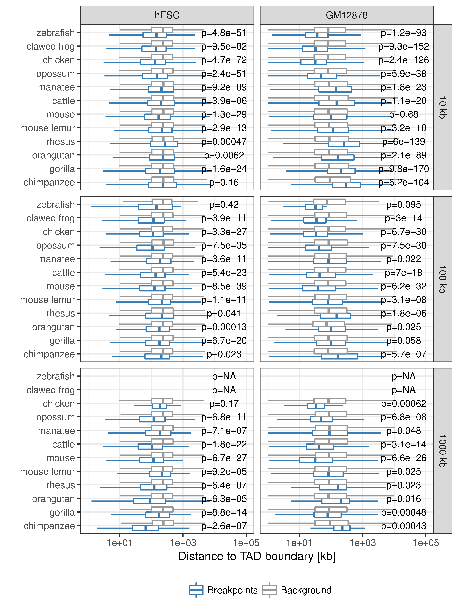

# (APPENDIX) Appendix {-} 

<!-- Ugly hack to put content before sub-section ------------------- -->
`r if (knitr:::is_html_output()) ' '`
<!-- ---------------------------------------------------------------- -->

<!-- # Co-regulation of paralog genes: Supporting Information {#sup-paralog-regulation} -->
# Supporting Information: Co-regulation of paralog genes {#sup-paralog-regulation}


<!-- FIGURE S1 ---------------------------------------------------------------->
```{r paraVSnonPara, fig.cap='(ref:paraVSnonPara)', out.width='80%', fig.align='center'}

```

(ref:paraVSnonPara) **(A)** Number of paralog and non-paralog genes in the human genome. **(B)** Paralog group size distribution in the human genome. **(C)** Gene length of paralog and non-paralog genes. **(D)** Distribution of the number of enhancers linked to single genes compared between paralog genes (red) and non-paralog genes (blue).  **(E)** Genomic distance to nearest enhancer for paralogs and non-paralog genes. **(F)** Number of housekeeping genes among paralogs and non-paralog human genes. A recently published set of housekeeping genes was used here [@Eisenberg2013]. The p-values shown in this figure were calculated using the Wilcoxon rank-sum test.

<!-- FIGURE S2 ---------------------------------------------------------------->
```{r selectOldPairs, fig.cap='(ref:selectOldPairs)', out.width='80%', fig.align='center'}

```

(ref:selectOldPairs)  Main results of this study by changing the selection of paralog pairs from families with more than two paralogs. Here pairs are selected by maximizing the rate of synonymous mutations between them instead of minimizing, as in the main text. **(A)** Percent of paralogs pairs on the same chromosome compared to random pairs. **(B)** Distance distribution between pairs of paralogs (red), random pairs (dark grey), and sampled pairs according to the distances of paralogs (grey). **(C)** Genomic distance between close paralogs and sampled pairs separated by same strand or not same strand of gene pairs. **(D)** Percent of close paralogs and sampled pairs with at least one shared enhancer. **(E)** Percent of close gene pairs located within the same TAD for different TAD data sets. **(F)** Percent of paralog and sampled pairs that are in the same A/B compartment. **(G)** Percent of paralog and sampled pairs that are in the same subcompartment.  **(H)** Normalized Hi-C contacts between distal paralogs and sampled genes. **(I)** Promoter capture-C contacts between distal paralogs and sampled genes.

<!-- FIGURE S3 ---------------------------------------------------------------->
```{r samplingDist, fig.cap='(ref:samplingDist)', out.width='80%', fig.align='center'}
knitr::include_graphics("figures/paralog/SI/figS3.png")
```

(ref:samplingDist) **Sampling of gene pairs by distance.** Distance distribution of paralog pairs (red) and sampled background gene pairs (grey) and quantile-quantile plot of these two distributions in linear axis (third column) and log scaled axis (fourth column).

<!-- FIGURE S4 ---------------------------------------------------------------->
```{r samplingDistEh, fig.cap='(ref:samplingDistEh)', out.width='80%', fig.align='center'}
knitr::include_graphics("figures/paralog/SI/figS4.png")
```

(ref:samplingDistEh)  **Sampling of gene pairs by distance and number of enhancers.** Top row: Distance distribution of paralog pairs (red) and sampled background gene pairs (grey) and quantile-quantile plot of these two distributions in linear axis (third column) and log scaled axis (fourth column). Bottom row: Distance of the number of enhancers linked to each single gene in the pairs of paralogs (red) and sampled background gene pairs (grey) and quantile-quantile plot of these two distributions in linear axis (third column) and log scaled axis (fourth column).

<!-- FIGURE S5 ---------------------------------------------------------------->
```{r samplingDistEhStrand, fig.cap='(ref:samplingDistEhStrand)', out.width='80%', fig.align='center'}

```

(ref:samplingDistEhStrand) **Sampling of gene pairs by distance, number of enhancers, and same strand frequency.** Top row: Distance distribution of paralog pairs (red) and sampled background gene pairs (grey) and quantile-quantile plot of these two distributions in linear axis (third column) and log scaled axis (fourth column). Middle row: Distance of the number of enhancers linked to each single gene in the pairs of paralogs (red) and sampled background gene pairs (grey) and quantile-quantile plot of these two distributions in linear axis (third column) and log scaled axis (fourth column). Bottom row: Percentages of pairs of genes with opposite or same strand of transcription for paralog pairs (red) and sampled pairs (grey).

<!-- FIGURE S6 ---------------------------------------------------------------->
```{r samplingDistEhLen, fig.cap='(ref:samplingDistEhLen)', out.width='80%', fig.align='center'}

```

(ref:samplingDistEhLen) **Sampling of gene pairs by distance, number of enhancers, and same strand frequency.** Top row: Distance distribution of paralog pairs (red) and sampled background gene pairs (grey) and quantile-quantile plot of these two distributions in linear axis (third column) and log scaled axis (fourth column). Middle row: Distance of the number of enhancers linked to each single gene in the pairs of paralogs (red) and sampled background gene pairs (grey) and quantile-quantile plot of these two distributions in linear axis (third column) and log scaled axis (fourth column). Bottom row: Distribution of gene lengths of each single gene in the pairs of paralogs (red) and sampled background gene pairs (grey) and quantile-quantile plot of these two distributions in linear axis (third column) and $\log_{10}$ of gene lengths (fourth column).

<!-- FIGURE S7 ---------------------------------------------------------------->
```{r ehBySampType, fig.cap='(ref:ehBySampType)', out.width='50%', fig.align='center'}

```

(ref:ehBySampType) Percent of gene pairs with at least one shared enhancer in paralog pairs and four different types of sampled gene pairs. Only pairs with TSS distance $\leq$ 1Mb are considered. Error bars indicate standard variation of ten times replicated sampling.

<!-- FIGURE S8 ---------------------------------------------------------------->
```{r TADsize, fig.cap='(ref:TADsize)', out.width='60%', fig.align='center'}
knitr::include_graphics("figures/paralog/SI/figS8.png")
```

(ref:TADsize) **Size distribution of TADs in different cell-types, studies, and species.** Each box shows the size-distribution of one data set of TADs. The labels indicate the study (Rao [@Rao2014], or Dixon [@Dixon2012]), cell type and number of TADs in each data set. The last two boxes are for TADs from Hi-C experiments in mouse and dog Hi-C liver cells [@VietriRudan2015].

<!-- FIGURE S9 ---------------------------------------------------------------->
```{r closePairsInTAD, fig.cap='(ref:closePairsInTAD)', out.width='80%', fig.align='center'}
knitr::include_graphics("figures/paralog/SI/figS9.png")
```

(ref:closePairsInTAD)  **(A)** Number of paralog (red) and sampled (grey) gene pairs that are in the same TAD or not separated in three groups of genomic distances (0-10kb, 10-1000kb and $>$ 1000kb). TADs called from IMR90 cells by [@Rao2014] were used here. **(B)** Co-localization of gene pairs with genomic distances between 10kb and 1000kb within the same TAD for paralogs and sampled gene pairs and separated by TAD data sets from different cell types and studies. The first seven bars show values for TADs called in HeLa, HUVEC, K562, KBM7, NHEK, IMR90, and GM12878 cells by [@Rao2014]. The eighth bar shows the value for stable TADs across cell types form this study (at least 90\% reciprocal overlap in 50\% of cells). The last two bars show data for TADs called in hESC and IMR90 cells by [@Dixon2012]. Error bars indicate standard deviation in 10 times replicated sampling of gene pairs. P-values are computed using Fisher's exact test. **(C)** Promoter capture-C contacts between pairs of paralogs (red) and sampled gene pairs (grey) for the groups: $<$10kb genomic distance, located in the same TAD, not in the same TAD, and with genomic distance $>$1000kb.

<!-- FIGURE S10 --------------------------------------------------------------->
```{r ExpByTAD, fig.cap='(ref:ExpByTAD)', out.width='80%', fig.align='center'}
knitr::include_graphics("figures/paralog/SI/figS10.png")
```

(ref:ExpByTAD) Distribution of Pearson correlation coefficients of gene expression values in four independent data sets between close paralog gene pairs (red) and sampled control gene pairs (grey) separated for gene pairs within the same IMR90 TAD (top) or not in the same TAD (bottom). Boxes show 25th, 50th and 75th percent quantile of the data and the filled areas indicate the density distribution.

<!-- FIGURE S11 --------------------------------------------------------------->
```{r paralogsSpecies, fig.cap='(ref:paralogsSpecies)', out.width='80%', fig.align='center'}
knitr::include_graphics("figures/paralog/SI/figS11.png")
```

(ref:paralogsSpecies) Paralog gene pairs in mouse (left) and dog (right) genome cluster on chromosome within short genomic distances. **(A)** Number of genes with paralogs (red) and without (blue) in mouse genomes. **(B)** Percent of filtered mouse paralog pairs on the same chromosome (red) and random gene pairs on the same chromosome (dark grey). Error-bars indicate standard deviation of 10 times replicated randomizations. **(C)** Distribution of linear genomic distances between mouse gene pairs for filtered paralog genes (top, red), random genes (center, dark grey) and sampled gene pairs (bottom, grey).  **(D, E, F)** show the same data for the dog genome as figures A, B, C, respectively.

<!-- FIGURE S12 --------------------------------------------------------------->
```{r orthologModel, fig.cap='(ref:orthologModel)', out.width='50%', fig.align='center'}
knitr::include_graphics("figures/paralog/SI/figS12.png")
```

(ref:orthologModel) Phylogenetic gene tree model of a gene that is duplicated before the separation of mouse and human and consequently leads to two paralogs in mouse and human that are one-to-one orthologs to each other and a single ortholog in the dog genome that cannot be assigned uniquely to a human gene.

<!-- FIGURE S13 --------------------------------------------------------------->
```{r orthologsSpecies, fig.cap='(ref:orthologsSpecies)', out.width='80%', fig.align='center'}
knitr::include_graphics("figures/paralog/SI/figS13.png")
```

(ref:orthologsSpecies) One-to-one orthologs of human paralogs in mouse (left) and dog (right) genome. **(A)** Percent of filtered human paralog pairs with one-to-one orthologs for both genes in mouse genome compared to random genes.  **(B)** Percent of one-to-one orthologs on the same chromosome in the mouse genome (light red) and one-to-one orthologs of random human gene pairs on the same chromosome (dark grey). Error-bars indicate standard deviation of 10 times replicated randomizations. **(C)** Distribution of linear genomic distances between gene pairs for mouse one-to-one orthologs of human paralog gene pairs (top, light red) and one-to-one orthologs of random human gene pairs (bottom, dark grey). **(D, E, F)** show the same data for the dog genome as figures A, B, C, respectively.

<!-- FIGURE S14 --------------------------------------------------------------->
```{r PPI, fig.cap='(ref:PPI)', out.width='30%', fig.align='center'}
knitr::include_graphics("figures/paralog/SI/figS14.png")
```

(ref:PPI) Percent of close paralogs (red) and sampled (grey) gene pairs in the same IMR90 TAD (left bar) or not same TAD (right bar) that have a direct protein protein interaction (PPI) with each other in the HIPPIE database [@Schaefer2012]. 

<!-- =========================================================================== -->

<!-- # Supplementary Data: Evolutionary stability of TADs {#sup-tad-evolution} -->
<!-- # TAD evolution: Supporting Information {#sup-tad-evolution} -->
# Supplementary Data: Stability of TADs in evolution {#sup-tad-evolution}

<!-- Ugly hack to put content before sub-section ------------------- -->
`r if (knitr:::is_html_output()) ' '`
<!-- ---------------------------------------------------------------- -->

## Supplementary Tables {#TadEvoSupTab}

**Table S1** **Matching tissues and samples with CAGE expression data in human and
mouse.**
https://www.biorxiv.org/highwire/filestream/70793/field_highwire_adjunct_files/2/231431-3.tsv


**Table S2** **Ortholog genes in human and mouse with gene expression correlation
across tissues.**
https://www.biorxiv.org/highwire/filestream/70793/field_highwire_adjunct_files/3/231431-4.tsv

## Supplementary Figures

<!-- ----------------------------------------------------------------------- -->
```{r TadEvoS1, fig.cap='(ref:TadEvoS1)', out.width='80%', fig.align='center'}

```

(ref:TadEvoS1) **Distribution of evolutionary rearrangement breakpoints between human and 12 vertebrate genomes around domains.**  Relative breakpoint numbers from human and different species (horizontal panels) around hESC TADs (left), GM12878 contact domains (center), and GRBs (left). Blue color scale represents breakpoints from different fill-size thresholds. Dotted lines in gray show simulated background controls of randomly placed breakpoints.

<!-- ----------------------------------------------------------------------- -->

<!-- ----------------------------------------------------------------------- -->
```{r TadEvoS2, fig.cap='(ref:TadEvoS2)', out.width='80%', fig.align='center'}

```

(ref:TadEvoS2) **Distance between rearrangement breakpoints and random controls to closest TAD boundary.** For each species (y-axis) and fill size threshold (vertical panels) the distances from all identified rearrangement breakpoints to its closest TAD boundary (x-axis) are compared between actual rearrangements (blue) and 100 times randomized background controls (gray). The left panel shows distances to next hESC TAD boundary and the right panel distances to closest GM12878 contact domain boundary. P-values according to Wilcoxon’s rank-sum test.

<!-- ----------------------------------------------------------------------- -->

<!-- ======================================================================= -->
<!-- # Supplemental Data: Computational Prediction of Position Effects of Apparently Balanced Human Chromosomal Rearrangements {#sup-position-effect} -->
<!-- # Position Effect: Supplemental Data {#sup-position-effect} -->
# Supplemental Data: Position effects of rearrangements in disease genomes  {#sup-position-effect}

<!-- Ugly hack to put content before sub-section ------------------- -->
`r if (knitr:::is_html_output()) ' '`
<!-- ---------------------------------------------------------------- -->

<!-- Supplemental Data include a Supplemental Note detailing clinical case reports, a Supplemental Note detailing the karyotypes of DGAP subjects, 1 figure, and 22 tables and can be found with this article online at http://dx.doi.org/10.1016/j.ajhg.2017.06.011. -->

## Supplemental Note 

### Case Reports

**DGAP017**

46,X,t(X;10)(p11.2;q24.3)dn.arr(1-22,X)x2

Newborn female with a bicornuate uterus, diaphragmatic hernia, thenar
hypoplasia, pulmonary hypoplasia, absent right olfactory lobe, loose
skin, scoliosis, small thorax, hypoplastic labia, right clinodactyly and
camptodactyly, as well as a scaphoid abdomen. This collection of
features was reminiscent of Fryns syndrome (FRNS [MIM: 229850]). This
case was obtained from the NIGMS Human Genetic Cell Repository at the
Coriell Institute for Medical Research (GM00972) [@Tang2013]. An Affymetrix
Genome-Wide Human SNP Array 6.0 performed at Coriell is reportedly
normal.

**DGAP111**

46,XY,t(16;20)(q11.2;q13.2)dn.arr[hg18] 1q23.3(159763523\_159905125)x3

Six-year-old male with congenital heart disease (one atrial septal
defect, seven small ventricular septal defects), eye anomaly (Duane
syndrome), poor growth, developmental delay, chronic constipation, left
undescended testis, history of scoliosis (resolved), history of weak
ankles and feet requiring braces (resolved), and asthma. Microarray
analysis of DNA extracted from the DGAP111 EBV-transformed cell line
contributed from DGAP to the NIGMS Human Genetic Cell Repository
(GM22709, Coriell) was performed on the Affymetrix Genome-Wide Human SNP
Array 6.0 and revealed a duplication of \~141.6 Kb in 1q23.3
(159763523-159905125) that was interpreted as likely benign.

**DGAP113**

46,XY,t(1;3)(q32.1;q13.2)dn

One-year-old male with bilateral congenital cataracts (TORCH screen,
positive IgG and negative IgM for rubella, cytomegalovirus, herpes
simplex virus; rubella virus isolation from urine and lens was
negative), and mild developmental delay. Cranial magnetic resonance
imaging (MRI) revealed prominent extra-axial cerebrospinal fluid spaces
of uncertain significance, and the subject has marked macrocephaly (head
circumference &gt;95th percentile) [@Lachke2012]. No microarray was performed.

**DGAP126**

46,XX,t(5;10)(p13.3;q21.1)dn.arr[hg18] 7q34(142030226\_142154515)x1

Ten-year-old female with significant developmental delay with
regression, autistic tendencies, and receptive and expressive language
delay, disruptive behavior disorder, enuresis, dysthymia, sleep
disturbance, self-injurious behaviors, and agitation. She had delays in
gross and fine motor skills. No dysmorphic features were observed.
Microarray analysis of DNA extracted from the DGAP126 EBV-transformed
cell line contributed from DGAP to the NIGMS Human Genetic Cell
Repository (GM18825, Coriell) was performed on the Affymetrix
Genome-Wide Human SNP Array 6.0 and revealed a deletion of \~124.3 Kb in
region 7q34 (142030226-142154515) that was interpreted to be benign.

**DGAP138**

46,XY,t(1;6)(q23;q13)dn.arr(1-22)x2,(X,Y)x1

Seven-year-old male with intellectual disability, fat distribution
around trunk, gastroesophageal reflux, feeding problems (gastrostomy),
seizure disorder, movement disorder (random, writhing type movements),
wheelchair-dependence, Pierre-Robin sequence (mild micrognathia and
cleft of the soft palate) (PRBNS [MIM: 261800]), microcephaly,
pseudogynecomastia, and low growth hormone and high cortisone levels.
Normal microarray results were reported from of DNA extracted from the
DGAP138 EBV-transformed cell line contributed from DGAP to the NIGMS
Human Genetic Cell Repository (GM20568, Coriell) on the Affymetrix
Genome-Wide Human SNP Array 6.0.

**DGAP153**

46,X,t(X;17)(p11.23;p11.2)dn.arr(1-22,X)x2

Eight-year-old female with dysmorphic features (including mild
synophrys, a flat philtrum and thin upper lip vermilion), mild
developmental delay, sleep disturbance, and behavior problems (including
temper tantrums, self-biting, and agitation). Deletion testing was
negative for Smith-Magenis syndrome (SMS [MIM: 182290]). No cryptic
aneusomies were reported to be detected by clinical aCGH. The DGAP153
EBV-transformed cell line was contributed to the NIGMS Human Genetic
Cell Repository (GM20572, Coriell).

**DGAP163**

46,XY,t(2;14)(p23;q13)dn.arr(1-22)x2,(X,Y)x1

Four-year-old male with severe global developmental delay, absent
speech, dysmorphic/distinctive facies, hypospadias (repaired), seizures
as an infant (now seizure free), myopia, nystagmus, small left retinal
coloboma, and conductive hearing loss (history of otitis media). MRI
showed periventricular white matter changes of unknown origin (no record
of anoxic event), and recent electroencephalograms (EEGs) were normal.
Fluorescence *in situ* hybridization (FISH) for SMS, DiGeorge syndrome
(DGS [MIM: 188400]) and Velocardiofacial syndrome (VCFS [MIM:
192430]) was reportedly normal, as was aCGH using a 1M Agilent array
with a resolution of 6.3 Kb.

**DGAP176**

46,Y,inv(X)(q13q24)mat

Four-year-old male with congenital, severe, bilateral sensorineural
hearing loss, cognitive impairment, plagiocephaly, lax joints, and
coordination difficulties. Dysmorphic features include macrocephaly,
broad forehead, hypertelorism, downslanting palpebral fissures,
epicanthic folds, flat midface, rounded nasal tip, flat nasal root,
downturned corners of the mouth, simple helix of left ear, and full
lips. He also had fifth finger clinodactyly and bridged palmar creases.
No mutations were detected in the coding regions of gap junction protein
beta 2 (*GJB2* [MIM: 121011]) or gap junction protein beta 6 (*GJB6*
[MIM: 604418]). The mother is mosaic for inv(X)(q13q24) and 45,X but
is reportedly healthy [@Anger2014]. No microarray was performed.

**DGAP249**

46,XX,t(2;11)(q33;q23)dn.arr(1-22,X)x2

Seven-year-old female with a history of global developmental delay. She
has gross and fine motor delays, atypical oral motor skills and limited
exploration of sensory materials. At four years she had an abnormal
sleep-deprived EEG and increased bilateral electrocortical excitability;
at six years EEG results were significantly abnormal with bifrontal
symptoms consistent with epileptiform disturbance recorded in the
interictal state. She has decreased visual motor integration, and a
composite intellectual coefficient (IQ) of 71. Normal clinical
microarray results were reported.

**DGAP252**

46,XY,t(3;18)(q13.2;q11.2)dn.arr(1-22)x2,(X,Y)x1

Four-month-old male whose prenatal course was complicated by
polyhydramnios with an accompanying abnormal prenatal ultrasound and
MRI, revealing an abnormal cerebellum, dilated cisterna magna, right
lung apex cyst, intra-abdominal cysts and bilateral abnormal feet.
Delivery was at term with two right posterior mediastinal cysts
identified as a foregut duplication cyst and a bronchogenic cyst by
pathology after surgical excision. Three ileal cysts were identified as
duplication cysts with complete muscularis propria, small bowel/colon,
and gastric oxyntic type mucosa by pathologic examination after
excision. Cerebellar hypoplasia was noted by MRI of his brain at one day
of age. A wide anterior fontanelle (three finger widths) was observed,
and his head was reportedly mildly turricephalic with a high forehead
and a round bony protrusion of his skull at the occipital base. Normal
clinical microarray results (CMA-HR + SNP (v.8.3)) were reported.

**DGAP275**

46,XX,t(7;12)(p13;q24.33)dn.arr(1-22,X)x2

Nine-year-old female with severe unexplained short stature (&lt;4 SDs)
and normal radiographs. An extensive endocrine workup revealed a normal
growth hormone axis and no evidence of precocious puberty. She was
non-dysmorphic and had normal cognitive development. A normal clinical
Affymetrix Cytoscan SNP microarray was reported.

**DGAP287**

46,XY,t(10;14)(p13;q32.1)dn.arr(1-22)x2,(X,Y)x1

Four-year-old male with a history of global developmental delay and
asymmetric spastic diplegia. He is ataxic, non-verbal, and drools
frequently. He is non-dysmorphic, and a brain MRI was normal. Normal
clinical Affymetrix Cytoscan HD SNP microarray results were reported.

**DGAP288**

46,XX,t(6;17)(q13;q21)dn.arr(1-22,X)x2

Prenatal case enrolled in study at 15 weeks, following ultrasound at 11
weeks revealing a cystic hygroma and chorionic villus sampling (CVS) at
12 weeks revealing the t(6;17) apparently balanced chromosome
translocation. Normal clinical Affymetrix Cytoscan HD SNP microarray
results were reported at 13 weeks. Micrognathia was seen on ultrasound
at 18 weeks. At 19 weeks, DGAP sequencing results revealed no genes
disrupted by the translocation, and the pregnancy was continued.
Polyhydramnios and micrognathia were noted at 28 weeks. Fetal MRI at 34
weeks revealed a small jaw index consistent with micrognathia and
retrognathia, glossoptosis, and cleft palate without cleft lip; findings
were suspicious for PRBNS. Following delivery at 39 weeks, initial exams
revealed a cleft palate. She was placed on continuous positive airway
pressure, but otherwise was considered well.

**DGAP315**

46,XX,inv(6)(p24q11)dn.arr(1-22,X)x2

Fifteen-year-old female with severe static encephalopathy of unknown
etiology. She uses a wheelchair, is microcephalic, nonverbal, and has
severe generalized spasticity with poorly controlled epilepsy. She had a
normal echo and eye examination and reportedly normal aCGH results.

**DGAP319**

46,XX,t(4;13)(q31.3;q14.3)dn.arr(1-22,X)x2

Thirteen-year-old female with intellectual disability, and height,
weight, and head circumference below the 3rd percentile. She has a grade
II-IV systolic murmur, abnormal facies, finger and toe abnormalities.
This case was obtained from the NIGMS Human Genetic Cell Repository at
the Coriell Institute for Medical Research (GM00972) [@Tang2013]. This case was
previously reported [@Jenkins1975]. The Affymetrix Genome-Wide Human SNP Array 6.0
performed at Coriell is reportedly normal.

**DGAP322**

46,XY,t(1;18)(q32.1;q22.1).arr(1-22)x2,(X,Y)x1

Male subject of unknown age with genitourinary malformations, third
degree hypospadias, labialized scrotum with palpable descended testes,
mild developmental delay, growth delay, and apparently intact hormonal
axis. This case was obtained from the NIGMS Human Genetic Cell
Repository at the Coriell Institute for Medical Research (GM16438) [@Tang2013; @Frizell1998].
The Affymetrix Genome-Wide Human SNP Array 6.0 performed at Coriell
is reportedly normal.

**DGAP329**

46,XX,t(2;14)(q21;q24.3)dn.arr[GRCh37/hg19]
18q22.3(72545050\_72692202)x1 pat

Five-year-old female with a progressive neurologic disorder. She has
nearly constant choreoathetosis, dystonia (including painful neck
dystonia), and myoclonic movements, which are exacerbated by fatigue and
emotional stress and are worsening with time. She is profoundly
hypotonic and non-ambulatory. She is nonverbal but able to follow simple
commands. She had a reported normal clinical CytoSure ISCA 8x60K v2.0
microarray, although a paternally inherited 150 Kb deletion at 18q22.3
from her phenotypically normal father was detected.

### Nucleotide Level Nomenclature for DGAP karyotypes

Karyotypes of DGAP cases are described using a revised nomenclature that
incorporates next-generation sequencing positions from Ordulu *et al*.,
2014.

**DGAP017**

46,X,t(X;10)(p11.2;q24.3)dn.arr(1-22,X)x2.seq[GRCh37/hg19]
t(X;10)(10pter-&gt;10q25.1(107,711,256)::TATCCTTTG::Xp11.22(51,702,992)-&gt;Xpter;10qter-&gt;10q25.1(107,714,387)::GAGAAAAC::Xp11.22(51,707,815)-&gt;Xqter)dn

**DGAP111**

46,XY,t(16;20)(q11.2;q13.2)dn.arr[hg18]
1q23.3(159763523\_159905125)x3.seq[GRCh37/hg19]
(16,20)cx,der(16)(16pter-&gt;16q11.2(46,396,774)::16q11.2(46,397,625-46,397,900)::16q11.2(46,408,942-464093{69-70})::20q13.2(53,969,64{0-1}-53,970,162)::20q13.2(53,970,203)-&gt;20qter),der(20)(20pter-&gt;20q13.2(53,969,63{5-6})::16q11.2(46,403,29{1-2})-&gt;16qter)dn

**DGAP113**

46,XY,t(1;3)(q32.1;q13.2)dn.seq[GRCh37/hg19]
t(1;3)(1pter-&gt;1q31.3(198,076,14{1})::3q13.13(110,275,76{4})-&gt;3qter;3pter-&gt;3q13.13(110,275,769)::AGAA::1q31.3(198,076,137)-&gt;1qter)dn

**DGAP126**

46,XX,t(5;10)(p13.3;q21.1)dn.arr[hg18]
7q34(142030226\_142154515)x1.seq[GRCh37/hg19]
t(5;10)(10qter-&gt;10q21.3(67,539,99{7-5})::5p13.3(29,658,44{0-2})-&gt;5qter;10pter-&gt;10q21.3(67,539,99{0})::5p13.3(29,658,42{6})-&gt;5pter)dn

**DGAP138**

46,XY,t(1;6)(q23;q13)dn.arr(1-22)x2,(X,Y)x1.seq[GRCh37/hg19]
t(1;6)(1pter-&gt;1q31.2(193,491,602)::6q16.2(100,159,181)-&gt;6qter;6pter-&gt;6q16.2(100,159,182)::A::1q31.2(193,491,602)-&gt;1qter)dn

**DGAP153**

46,X,t(X;17)(p11.23;p11.2)dn.arr(1-22,X)x2.seq[GRCh37/hg19]
t(X;17)(17pter-&gt;17p11.2(20,682,69{0-1})::Xp11.3(44,372,16{4-5})-&gt;Xqter;17qter-&gt;17p11.2(20,682,68{7-4})::Xp11.3(44,372,1{72-69})-&gt;Xpter)dn

**DGAP163**

46,XY,t(2;14)(p23;q13)dn.arr(1-22)x2,(X,Y)x1.seq[GRCh37/hg19]
t(2;14)(14qter-&gt;14q13(31,717,834)::G::2p23(39,206,240-39,206,384)::2p23(39,206,414)-&gt;2qter;14pter-&gt;14q13(31,717,73{3})::2p23(39,206,24{2})-&gt;2pter)dn

**DGAP176**

46,Y,inv(X)(q13q24)mat.seq[GRCh37/hg19]
inv(X)(pter-&gt;q13(82,275,014)::ATCAATTTA::q24q13(108,129,970-82,320,86{7-5})::q24(108,149,24{9-7})-&gt;qter)mat

**DGAP249**

46,XX,t(2;11)(q33;q23)dn.arr(1-22,X)x2.seq[GRCh37/hg19]
t(2;11)(2pter-&gt;2q33.1(199,943,78{1-9})::11q24.1(121,642,3{46-54})-&gt;11qter;11pter-&gt;11q24.1(121,638,616)::AGATCT::2q33.1(199,943,805)-&gt;2qter)dn

**DGAP252**

46,XY,t(3;18)(q13.2;q11.2)dn.arr(1-22)x2,(X,Y)x1.seq[GRCh37/hg19]
t(3;18)(3pter-&gt;3q13.11(104,627,622)::TCAATACCTTTTA::18q11.2(19,498,398)-&gt;18qter;18pter-&gt;18q11.2(19,498,400)::AAAAATGGC::3q13.11(104,627,629)-&gt;3qter)dn

**DGAP275**

46,XX,t(7;12)(p13;q24.33)dn.arr(1-22,X)x2.seq[GRCh37/hg19]
t(7;12)(12qter-&gt;12q24.33(132,983,131)::TC::7p12.3(46,111,841)-&gt;7qter;12pter-&gt;12q24.33(132,983,129)::7p12.3(46,111,839)-&gt;7pter)dn

**DGAP287**

46,XY,t(10;14)(p13;q32.1)dn.arr(1-22)x2,(X,Y)x1.seq[GRCh37/hg19]
t(10;14)(14qter-&gt;14q32.13(95,212,573)::AGTAAAGGGTTGGGTTAC::10p14(10,161,500-10,161,740)::TCG::10p14(10,161,685)-&gt;10qter;14pter-&gt;14q32.13(95,212,572)::TATCAG::10p14(10,161,498)-&gt;10pter)dn

**DGAP288**

46,XX,t(6;17)(q13;q21)dn.arr(1-22,X)x2.seq[GRCh37/hg19]
t(6;17)(6pter-&gt;6q21(112,976,04{2-4})::17q24.3(69,728,01{7-9}-&gt;17qter;17pter-&gt;17q24.3(69,728,006)::CCCTTTA::6q21(112,976,031)-&gt;6qter)dn

**DGAP315**

46,XX,inv(6)(p24q11)dn.arr(1-22,X)x2.seq[GRCh37/hg19]
inv(6)(qter-&gt;q11.1(63,115,715)::p24.3q11.1(9,394,991-63,115,685)::T::p24.3(9,394,994)-&gt;pter)dn

**DGAP319**

46,XX,t(4;13)(q31.3;q14.3)dn.arr(1-22,X)x2.seq[GRCh37/hg19]
t(4;13)(4pter-&gt;4q32.2(161,913,247)::13q21.1(59,345,837)-&gt;13qter;13pter-&gt;13q21.1(59,345,83{5-6})::4q32.2(161,913,24{7-8})-&gt;4qter)dn

**DGAP322**

46,XY,t(1;18)(q32.1;q22.1)dn.arr(1-22)x2,(X,Y)x1.seq[GRCh37/hg19]
t(1;18)(1pter-&gt;1q32.2(208,544,055)::ACTCCTCCAACTCCTATGTAGTTG::18q22.1(63,566,045)-&gt;18qter;18pter-&gt;18q22.1(63,566,053)::TACA::1q32.2(208,544,091)-&gt;1qter)dn

**DGAP329**

46,XX,t(2;14)(q21;q24.3)dn. arr[GRCh37/hg19]
18q22.3(72545050\_72692202)x1 pat.seq[GRCh37/hg19]
t(2;14)(2pter-&gt;2pter-&gt;2q22.3(145,110,93{6})::14q31.1(83,574,72{4})-&gt;14qter;14pter-&gt;14q31.1(83,574,71{5-9}::2q22.3(14,511,09{37-41}-&gt;2qter)dn


## Supplemental Figure

<!-- ----------------------------------------------------------------------- -->
```{r position-effect-S1, fig.cap='(ref:position-effect-S1)', out.width='60%', fig.align='center'}
knitr::include_graphics("figures/position_effect/FigureS1.png")
```

(ref:position-effect-S1)  **Assessment of gene expression changes for DGAP176-derived LCLs.** Control gene expression is shown in blue and surveyed genes are marked in different colors. Each column represents the ΔCT results of three culture replicates, with four technical replicates each, compared to three sex-matched control cell lines. Error bars indicate the standard deviation calculated from the biological replicates per gene.

<!-- ----------------------------------------------------------------------- -->


## Supplemental Table Legends  {#position-effect-sub-tab}

Supplemental Tables can be found with this article online at http://dx.doi.org/10.1016/j.ajhg.2017.06.011.

**Table S1. Table describing the 17 cases with both breakpoints in non-coding regions.** 
Case identifiers are provided per studied subject
(Subject ID), in addition to their karyotypes using the International
System for Human Cytogenetic Nomenclature (ISCN2016) and array
information reported in hg19 unless otherwise stated in hg18. Each case
has two reported breakpoints (A and B), and for each we provide
cytogenetic band and nucleotide locations in hg19 coordinates for the
derivative chromosomes involved in their generation (der(A) and der(B)).
We also report the sequencing reads by which the breakpoints were
identified, and the overlap with known annotated genes (Disrupted gene 1
and Disrupted Gene 2), as well as the two nearest genes (Closest Gene 1
and Closest Gene 2) and their distance in base pairs (bp) to the
breakpoint locations (Distance to gene 1 and Distance to Gene 2) in the
derivative chromosomes. Negative distance numbers indicate genes
upstream of the breakpoint position, while positive numbers indicate
genes located downstream of the breakpoint.

**Table S2. Overlap of non-coding DGAP breakpoint positions with gene
promoters.** Table reporting the number of annotated Ensembl GRCh37 gene
promoters (Ensembl\_GRCh37\_promoters) that overlap non-coding DGAP
breakpoints (DGAP id, chr, start, end).

**Table S3. Overlap of non-coding DGAP breakpoint positions with
transcription factor binding sites.** Table reporting the number of
annotated Ensembl GRCh37 transcription factor binding sites
(Ensembl\_GRCh37\_tfbindingsites) that overlap non-coding DGAP
breakpoints (DGAP id, chr, start, end).

**Table S4. Overlap of non-coding DGAP breakpoint positions with
enhancers.** Table reporting the number of primary cell
(Primary\_cell\_enhancers), tissue (Tissue\_enhancers), H1-ESC
(ChromHMM\_H1\_ESC\_enhancers), GM12878 (ChromHMM\_GM12878\_enhancers),
and VISTA (VISTA\_db\_hg19) enhancers that overlap non-coding DGAP
breakpoints (DGAP id, chr, start, end). Enhancer positions were obtained
from Andersson *et al*., 2014, ENCODE, and the VISTA enhancer database
human version hg19. Highlighted green rows indicate breakpoints which
overlapped one or more of the enhancer categories analyzed.

**Table S5. Overlap of non-coding DGAP breakpoint positions with DNaseI
hypersensitive sites.** Table reporting the number of DNaseI
hypersensitive sites from H1-hESC, GM06990, GM12878, and the master
table (a compilation of 125 cell lines DNaseI clusters) from ENCODE that
overlap non-coding DGAP breakpoints (DGAP id, chr, start, end).
Highlighted green rows indicate breakpoints which overlapped one or more
of the DNaseI hypersensitive sites in the different cell lines analyzed.

**Table S6. Overlap of non-coding DGAP breakpoint positions with CTCF
binding sites.** Table reporting the number of ENCODE CTCF binding sites
from H1-hESC and GM12878 that overlap non-coding DGAP breakpoints (DGAP
id, chr, start, end). Highlighted green rows indicate breakpoints which
overlapped one or more of the CTCF binding sites in the two cell lines
analyzed.

**Table S7. Overlap of non-coding DGAP breakpoint positions with ENCODE
chromatin state segments.** Table reporting the ENCODE chromatin state
segment classifications per non-coding DGAP breakpoint (DGAP id, chr,
start, end) for H1-hESC and GM12878 cell lines. Chromatin state segment
coordinates and other bed file information is displayed starting from
column \#bin until column itemRGB. Please refer to ENCODE’s bed items
description from here:
<http://rohsdb.cmb.usc.edu/GBshape/cgi-bin/hgTables>. Chromatin state
names CTCF = CTCF binding site, E = enhancer, WE = weak enhancer, T =
transcriptionally active, R = transcriptionally repressed.

**Table S8. Overlap of non-coding DGAP breakpoint positions with
repetitive elements.** Table reporting the number of repetitive elements
as assessed by Repeat Masker that overlap non-coding DGAP breakpoints
(DGAP id, chr, start, end). Repetitive elements information such as
coordinates (Rep\_chr, Rep\_start, Rep\_end), name, class and family are
provided for each overlap.

**Table S9. Overlap of non-coding DGAP breakpoint positions with
topologically associating domains (TADs).** Table reporting the number
of TADs in H1-hESC and IMR90 (Dixon *et al*., 2012) that overlap
non-coding DGAP breakpoints (DGAP id, chr, start, end). TAD information
such as coordinates (TAD\_chr, TAD\_start, TAD\_end) are provided for
each overlap.

**Table S10. Overlap of non-coding DGAP breakpoint positions with
high-resolution chromatin subcompartments and arrowhead domains.** Table
reporting the number of high-resolution chromatin subcompartments and
arrowhead domains in IMR90 and GM12878 (Rao *et al*., 2014) that overlap
non-coding DGAP breakpoints (DGAP id, chr, start, end). Chromatin
subcompartments and arrowhead domains information such as coordinates
and class are provided for each overlap.

**Table S11. Disruption of chromatin contacts by non-coding DGAP
breakpoint positions.** Table reporting the number of chromatin contacts
disrupted by non-coding DGAP breakpoint positions (DGAP id, chr, start,
end) within their analysis windows (window\_start, window\_end) in Hi-C
datasets of 20 and 40 Kb resolution of H1-hESC (Dixon *et al*., 2012)
(Esc\_20kb\_HindIII\_rep1, Esc\_20kb\_HindIII\_rep2,
Esc\_40kb\_hindIII\_combined, Esc\_40kb\_hindIII\_rep1,
Esc\_40kb\_hindIII\_rep2), 20 and 40 Kb resolution of IMR90 (Dixon *et
al*., 2012) (IMR90\_20kb\_hindIII\_rep1, IMR90\_20kb\_hindIII\_rep2,
IMR90\_40kb\_hindIII\_combined, IMR90\_40kb\_hindIII\_rep1,
IMR90\_40kb\_hindIII\_rep2), 100Kb and 1Mb resolution of GM06990
(<http://epigenomegateway.wustl.edu/>) (GM06990\_obsexp\_100kb,
GM06990\_obsexp\_1mb) and looplists from Rao *et al*., 2014 for GM12878
and IMR90 (GSE63525\_GM12878\_primary+replicate\_HiCCUPS\_looplist,
GSE63525\_IMR90\_HiCCUPS\_looplist).

**Table S12. Disruption of GM12878 chromatin contacts at various
resolution levels by non-coding DGAP breakpoint positions.** Table
reporting the number of chromatin contacts disrupted by non-coding DGAP
breakpoint positions (DGAP id, chr, start, end) within their analysis
windows (window\_start, window\_end) in the 50Kb, 100Kb, 250Kb, 500Kb
and 1Mb resolution Hi-C datasets from Rao *et al*., 2014 for GM12878.

**Table S13. Disruption of predicted disrupted ENCODE distal
DHS/enhancer–promoter connections by non-coding DGAP breakpoint
positions.** Table reporting the number of predicted ENCODE distal
DHS/enhancer–promoter connections (Thurman *et al*., 2012)
(promoter\_DHS\_chr, promoter\_DHS\_start, promoter\_DHS\_end,
promoter\_DHS\_gene, distal\_DHS\_chr, distal\_DHS\_start,
distal\_DHS\_end, promoter\_distal\_DHS\_correlation) by non-coding DGAP
breakpoint positions (DGAP id, chr, start, end) within their ±500 Kb
analysis windows (window\_start, window\_end).

**Table S14. Genes with predicted disrupted ENCODE distal
DHS/enhancer–promoter connections by the non-coding DGAP breakpoint
positions.** Table reporting the names of genes (Genes) separated from
their predicted enhancers (Disrupted\_enh\_prom\_interactions) (Thurman
*et al*., 2012).

**Table S15. Identification of genes with potential position effects.**
Table reporting the candidate genes (ensembl\_gene\_ID, Gene\_chr,
Gene\_start, Gene\_end, Gene\_name) and their various lines of selection
evidence for each non-coding DGAP breakpoint position (DGAP id, chr,
start, end) within their analysis windows (window\_start, window\_end).
Evidence lines include Hi-C domain inclusion (Hi\_domain, HiC\_chr,
HiC\_start, HiC\_end), haploinsufficiency (HI\_chr, Gene-start,
gene\_end, HI\_prob, Haploinsufficiency\_score,), triplosensitivity
(Triplosensitivity\_score), phenomatch score (PhenoScore, MaxPhenoScore,
Phone\_percentile, count\_Pheno\_percentile, MaxPheno\_percentile,
count\_MaxPheno\_percentile, Percentile\_final\_count). All of the
evidence information is summarized (6Mb, 2Mb, TAD, DHS, Count\_haplo,
count\_triplo) and the gene rankings are presented in the
PERC+DHS+TAD+HAPLO+TRIPLO and PERC+DHS+2Mb+HAPLO+TRIPLO columns which
take different evidence lines into considerarion. Green row highlight
indicates highest ranking gene, and yellow row highlight indicates
second best ranking genes.

**Table S16. Translation of DGAP clinical features to HPO terms.** Table
reporting the HPO identifiers per DGAP case.

**Table S17. Identification of genes with potential position effects for
known pathogenic positive controls.** Table reporting the candidate
genes (ensembl\_gene\_ID, Gene\_chr, Gene\_start, Gene\_end, Gene\_name)
and their various lines of selection evidence for the set of known
pathogenic rearrangement positive controls (DGAP id, chr, start, end)
within their analysis windows (window\_start, window\_end) from Redin
*et al*., 2017. Evidence lines include Hi-C domain inclusion
(Hi\_domain, HiC\_chr, HiC\_start, HiC\_end), haploinsufficiency
(HI\_chr, Gene-start, gene\_end, HI\_prob, Haploinsufficiency\_score,),
triplosensitivity (Triplosensitivity\_score), phenomatch score
(PhenoScore, MaxPhenoScore, Phone\_percentile, count\_Pheno\_percentile,
MaxPheno\_percentile, count\_MaxPheno\_percentile,
Percentile\_final\_count). All of the evidence information is summarized
(6Mb, 2Mb, TAD, DHS, Count\_haplo, count\_triplo) and the gene rankings
are presented in the PERC+DHS+TAD+HAPLO+TRIPLO and
PERC+DHS+2Mb+HAPLO+TRIPLO columns which take different evidence lines
into considerarion. Yellow row highlight indicates pathogenic genes
reported by Redin *et al*., 2017.

**Table S18. Identification of disrupted chromatin contacts between
disrupted DHS and enhancers by the non-coding DGAP breakpoint
positions.** An agnostic search revealed the existence of chromatin
contacts between breakpoint-disrupted sequences of DHS sites and gene
enhancers in Hi-C data of H1-hESC cells at 40 Kb resolution (Dixon *et
al*., 2012). The reported genes are our top position effect candidate
genes in the region. Table columns report the candidate gene information
(Gene\_chr, Gene\_start, Gene\_end, Gene\_name), the associated DGAP
case information (DGAP\_ID, DGAP\_chr, DGAP\_start, DGAP\_end) and the
disrupted Hi-C chromatin interaction (HiC\_1\_chr, HiC\_1\_start,
HiC\_1\_end, HiC\_2\_chr, HiC\_2\_start, HiC\_2\_end,
HiC\_1\_interaction).

**Table S19. Overlap of non-coding DGAP breakpoint positions with
DECIPHER cases.** Table reporting the number of DECIPHER cases that
overlap non-coding DGAP breakpoints (DGAP\_ID, DGAP\_chr, DGAP\_start,
DGAP\_end). DECIPHER case information such as ID\_patient, chr\_start,
chr\_end, chr, mean\_ratio, classification\_type and phenotype are
provided for each overlap.

**Table S20. Genes contained within overlapped DECIPHER cases by
non-coding DGAP breakpoint positions.** Table reporting the number of
genes contained within overlapped DECIPHER cases by the non-coding DGAP
breakpoints (DGAP\_ID, DGAP\_chr, DGAP\_start, DGAP\_end). DECIPHER case
and gene information such as gene\_count, DECIPHER\_ID, DECIPHER\_chr,
DECIPHER\_start, DECIPHER\_end, DECIPHER\_value, DECIPHER\_type\_rearr,
DECIPHER\_phenotype and HG\_symbol are provided for each overlapped
DECIPHER case.

**Table S21. DECIPHER cases overlapped by non-coding DGAP breakpoint
positions that fulfilled non-coding selection criteria.** Table
reporting the number of DECIPHER cases that have non-coding breakpoints.
DGAP comparison case information (DGAP\_ID, DGAP\_chr, DGAP\_start,
DGAP\_end) is provided, as well as overlapped DECIPHER case information
containing id\_patient, chr\_start, chr\_end, chr, mean\_ratio,
classification\_type and phenotype.

**Table S22. Overlap of non-coding DGAP breakpoint positions with dbVar
cases.** Table reporting the number of dbVar cases that overlap
non-coding DGAP breakpoints (DGAP\_chr, DGAP\_start, DGAP\_end,
DGAP\_ID). dbVar case information such as dbVar ID, Start, End, Variant
type, Gene, Molecular consequences, Most severe clinical significance,
1000G minor allele, 1000G MAF, GO-ESP minor allele, GO-ESP MAF, ExAC
minor allele, ExAC MAF, Publications (PMIDs), Variant allele, Transcript
change, RefSeq, Protein change, Molecular consequence, HGVS\_c, HGVS\_g,
HGVS\_ng, HGVS\_p, Condition, Most severe clinical significance,
Submitters, Highest review status and Last evaluated are provided for
each overlap.

<!-- # Loop prediction: Supplemental Information {#loop-support} -->
# Supplemental Information: Prediction of chromatin looping interactions {#loop-support}

<!-- Ugly hack to put content before sub-section ------------------- -->
`r if (knitr:::is_html_output()) ' '`
<!-- ---------------------------------------------------------------- -->

## Supplementary Tables {#LoopPredSupTab}

**Table S1** Metadata of ChIP-seq experiments from ENCODE in human GM12878 cells with accession ID and download link.
https://www.biorxiv.org/highwire/filestream/79233/field_highwire_adjunct_files/0/257584-1.tsv

**Table S2 ** Metadata of ChIP-seq experiments from ENCODE human HeLa cells with
accession ID and download link.
https://www.biorxiv.org/highwire/filestream/79233/field_highwire_adjunct_files/1/257584-2.tsv

**Table S3** Accession numbers and download URLs for data sets used in data type
comparisons.
https://www.biorxiv.org/highwire/filestream/79233/field_highwire_adjunct_files/2/257584-3.tsv

## Supplementary Figures

<!-- ----------------------------------------------------------------------- -->
```{r LoopPredS1, fig.cap='(ref:LoopPredS1)', out.width='50%', fig.align='center'}

```

(ref:LoopPredS1) **7C model parameters and optimal cut-offs for binary prediction.** **(A)** Parameter values of the logistic regression model in 7C for different features (columns), separated for different models (rows). Average of model parameters of model training in 10-fold cross-validation is shown with error bars indicating the standard deviations. While the first six rows represent the models with the indicated TF ChIP-seq data and the genomic features, “Avg. all TF” is the average across all 124 TFs analyzed and “Avg. best 10 TF” is the average across the best ten performing TF models. **(B)** Prediction performance as f1 score (y-axis) for different cutoffs on the prediction probability *p* for the six selected models. **(C)** Prediction performance as auPRC (top) and auROC (bottom) of four different models (colors) on ChIP-seq data for six selected TFs (x-axis). ‘Specific TF’ is the model fitted using the ChIP-seq data indicated on the x-axis, ‘RAD21’ is the model trained on RAD21 ChIP-seq data, ‘Avg. all TF’ is a model averaged across all 124 models of analyzed TFs, and ‘Avg. best 10 TF’ is the averaged model across the 10 best performing models.

<!-- ----------------------------------------------------------------------- -->


<!-- ======================================================================= -->
# Contribution to individual publications

<!-- Ugly hack to put content before sub-section ------------------- -->
`r if (knitr:::is_html_output()) ' '`
<!-- ---------------------------------------------------------------- -->


Table: (\#tab:contribution) **Contributions to individual publications**. Contributions in percent from all authors for each contribution role and publication. Author contribution definitions according to the CRediT Taxonomy (http://journals.plos.org/plosone/s/authorship).

-------------------------------------------------------------------------------------------------------------------------------------------------------------------------------------------------------------------------------------------------------------------------------------------------------------------------------------------------------------------------------------------------------------------------------------------------------------
**Contributor Role:**                      Role Definition (according to CRediT Taxonomy)                                                                                                                                                                    Chapter \@ref(paralog-regulation)   					 Chapter \@ref(TAD-evolution)   				Chapter \@ref(position-effect)   				   Chapter \@ref(loop)
----------------------------------------------------------------------------------------------------------------------------------------------------------------------------------------------------------------------------------------------------------   ------------------------------------------------------  ---------------------------------------------  -------------------------------------------------  --------------------------------------
**Conceptualization:**                     Ideas; formulation or evolution of overarching research goals and aims.                                                                                                                                                                                               80                                             90                                                 10                                      90

**Data Curation:**                         Management activities to annotate (produce metadata), scrub data and maintain research data (including software code, where it is necessary for interpreting the data itself) for initial use and later reuse.                                                       100                                             80                                                 50                                     100

**Formal Analysis:**                       Application of statistical, mathematical, computational, or other formal techniques to analyze or synthesize study data.                                                                                                                                             100                                             50                                                 40                                     100

**Funding Acquisition:**                   Acquisition of the financial support for the project leading to this publication.                                                                                                                                                                                      0                                              0                                                  0                                       0

**Investigation:**                         Conducting a research and investigation process, specifically performing the experiments, or data/evidence collection.                                                                                                                                               100                                             80                                                 20                                     100

**Methodology:**                           Development or design of methodology; creation of models                                                                                                                                                                                                              90                                             80                                                 30                                     100

**Project Administration:**                Management and coordination responsibility for the research activity planning and execution.                                                                                                                                                                           0                                              0                                                  0                                       0

**Resources:**                             Provision of study materials, reagents, materials, patients, laboratory samples, animals, instrumentation, computing resources, or other analysis tools.                                                                                                               0                                              0                                                  0                                       0

**Software:**                              Programming, software development; designing computer programs; implementation of the computer code and supporting algorithms; testing of existing code components.                                                                                                  100                                             50                                                 50                                     100

**Supervision:**                           Oversight and leadership responsibility for the research activity planning and execution, including mentorship external to the core team.                                                                                                                              0                                             80                                                  0                                       0

**Validation:**                            Verification, whether as a part of the activity or separate, of the overall replication/reproducibility of results/experiments and other research outputs.                                                                                                           100                                             80                                                 20                                     100

**Visualization:**                         Preparation, creation and/or presentation of the published work, specifically visualization/data presentation.                                                                                                                                                       100                                             50                                                  0                                     100

**Writing – Original Draft Preparation:**  Creation and/or presentation of the published work, specifically writing the initial draft (including substantive translation).                                                                                                                                      100                                             70                                                 10                                     100

**Writing – Review & Editing:**            Preparation, creation and/or presentation of the published work by those from the original research group, specifically critical review, commentary or revision – including pre- or post-publication stages.                                                          30                                             50                                                 20                                      50
---------------------------------------------------------------------------------------------------------------------------------------------------------------------------------------------------------------------------------------------------------------------------------------------------------------------------------------------------------------------------------------------------------------------------------------------------------

# Curriculum vitae {-}

**Jonas Ibn-Salem**

---

**Personal data **

Date of birth

:   24.07.1987

Place of birth

:   Mamers (France)

Nationality

:   German

---

**Education**

2014-2018

:   PhD in Computational Biology, *Johannes Gutenberg University Mainz and Institute of Molecular Biology (IMB)*, Mainz, Germany


2011--2014

:   MSc Bioinformatics, *Freie Universität Berlin*, Germany

2008--2011

:   BSc Bioinformatics, *Freie Universität Berlin*, Germany

1994--2007

:   Abitur (A level), *Rudolf-Steiner-Schule Loheland*, Fulda, Germany


---

**Publications**

-   Zepeda-Mendoza CJ\*, **Ibn-Salem J\***, Kammin T, Harris DJ, Rita D,
    Gripp KW, MacKenzie JJ, Gropman A, Graham B, Shaheen R, Alkuraya FS,
    Brasington CK, Spence EJ, Masser-Frye D, Bird LM, Spiegel E, Sparkes
    RL, Ordulu Z, Talkowski ME, Andrade-Navarro MA, Robinson PN, Morton
    CC.\
    **Computational Prediction of Position Effects of Apparently
    Balanced Human Chromosomal Rearrangements.**\
    *Am J Hum Genet.* 2017 Aug 3;101(2):206-217. [doi:
    10.1016/j.ajhg.2017.06.011](https://doi.org/10.1016/j.ajhg.2017.06.011).

-   **Ibn-Salem J**, Muro EM, Andrade-Navarro MA.\
    **Co-regulation of paralog genes in the three-dimensional chromatin
    architecture.**\
    *Nucleic Acids Research* 2017 Jan 9;45(1):81-91. [doi:
    10.1093/nar/gkw813](https://doi.org/10.1093/nar/gkw813). \

-   **Ibn-Salem, J**., Meiers, S., Eigenbrod, O., Sehlke, R., Talyan,
    S., Schwahn, K., Otto, R., Pataskar, A., Metge, F., & Angerer, P.\
    **Highlights of the 1st Student Symposium on Computational
    Genomics.**\
    *Genomics And Computational Biology*. 2017 2(1), e59.
    [doi:10.18547/gcb.2016.vol2.iss1.e59](https://doi.org/10.18547/gcb.2016.vol2.iss1.e59)

-   Hansen P, Hecht J, **Ibn-Salem J**, Menkuec BS, Roskosch S, Truss M,
    Robinson PN.\
    **Q-nexus: a comprehensive and efficient analysis pipeline designed
    for ChIP-nexus.**\
    *BMC Genomics*. 2016 Nov 4;17(1):873.
    <https://doi.org/10.1186/s12864-016-3164-6>  \

-   Piacentino ML, Zuch DT, Fishman J, Rose S, Speranza EE, Li C, Yu J,
    Chung O, Ramachandran J, Ferrell P, Patel V, Reyna A, Hameeduddin H,
    Chaves J, Hewitt FB, Bardot E, Lee D, Core AB, Hogan JD, Keenan JL,
    Luo L, Coulombe-Huntington J, Blute TA, Oleinik E, **Ibn-Salem J**,
    Poustka AJ, Bradham CA.\
    **RNA-Seq identifies SPGs as a ventral skeletal patterning cue in
    sea urchins.**\
    *Development*. 2016 Jan 11. [doi:
    10.1242/dev.129312](https://doi.org/10.1242/dev.129312)  \

-   Starick SR\*, **Ibn-Salem J\***, Jurk M, Hernandez C, Love MI, Chung
    HR, Vingron M, Thomas-Chollier M, Meijsing SH.\
    **ChIP-exo signal associated with DNA-binding motifs provides
    insight into the genomic binding of the glucocorticoid receptor and
    cooperating transcription factors**.\
    *Genome Research*. 2015 Jun;25(6):825-35.
    [doi:10.1101/gr.185157.114](https://doi.org/10.1101/gr.185157.114)

-   Köhler S, Schoeneberg U, Czeschik JC, Doelken SC, Hehir-Kwa JY,
    **Ibn-Salem J**, Mungall CJ, Smedley D, Haendel MA, Robinson PN.\
    **Clinical interpretation of CNVs with cross-species phenotype
    data**.\
    *J Med Genet*. 2014 Nov;51(11):766-772. [doi:
    10.1136/jmedgenet-2014-102633](https://doi.org/10.1136/jmedgenet-2014-102633).

-   **Ibn-Salem J\***, Köhler S\*, Love MI, Chung HR, Huang N, Hurles
    ME, Haendel M, Washington NL, Smedley D, Mungall CJ, Lewis SE, Ott
    CE, Bauer S, Schofield PN, Mundlos S, Spielmann M, Robinson PN.\
    **Deletions of chromosomal regulatory boundaries are associated with
    congenital disease.**\
    *Genome Biology*. 2014 Sep 4;15(9):423. [doi:
    10.1186/s13059-014-0423-1](https://doi.org/10.1186/s13059-014-0423-1).

<!-- --- -->

<!-- **Invited Talks** -->

<!-- -   **Imperial College London, MRC London Institute of Medical -->
<!--     Sciences**, 19 May. 2017, London, UK Title: *Evolution of TADs and -->
<!--     prediction of chromatin looping* -->

<!-- -   **Humboldt University Berlin, Humboldt University Berlin**, 19 Dez. -->
<!--     2016, Berlin, Germany Title: *ChIP-seq and related techniques to -->
<!--     analyze protein-DNA interactions and predict chromatin looping -->
<!--     interactions.* -->

<!-- -   **Max-Planck-Institute for Molecular Genetics**, 04 Dez. 2015, -->
<!--     Berlin, Germany Title: *Co-regulation of paralog genes in the 3D -->
<!--     chromatin architecture* -->

<!-- --- -->
<!-- **Conference Presentations** -->

<!-- -   **Basel Computational Biology Conference \[BC2\]$^{2}$**, 12-15 Sept -->
<!--     2017, Basel, Switzerland Title: *Prediction of chromatin looping -->
<!--     interactions from ChIP-seq profiles at CTCF motifs* -->

<!-- -   **ISCB European Student Council Symposium 2016**, 3 Sept 2016, The -->
<!--     Hauge, Netherlands Title: *Prediction of Chromatin Looping Events* -->

<!-- -   **ISCB Student Council Symposium 2015**, 10 July 2015, Dublin, -->
<!--     Ireland Title: *Co-regulation of human paralog genes in the -->
<!--     three-dimensional chromatin architecture* -->

<!-- --- -->
<!-- **Poster Presentations** -->

<!-- -   **2017 IMB Conference: Gene Regulation by The Numbers**, 19 - 21 -->
<!--     June, 2017, Mainz, Germany Title: *Prediction of chromatin looping -->
<!--     interactions from ChIP-seq profiles at CTCF motifs* -->

<!-- -   **15th European Conference on Computational Biology**, 4-7 Sept -->
<!--     2016, The Hauge, Netherlands Title: *Co-regulation of paralog genes -->
<!--     in the three-dimensional chromatin architecture* -->

<!-- -   **German Conference on Bioinformatics 2016**, 12-15 Sept 2016, -->
<!--     Berlin, Germany Title: *Prediction of three-dimensional chromatin -->
<!--     looping from sequence motifs and protein binding signals* -->

<!-- -   **EMBO Conference: From Functional Genomics to Systems Biology**, -->
<!--     12-15 Nov 2016, Heidelberg, Germany Title: *Three-dimensional -->
<!--     chromatin looping predicted by CTCF motifs and ChIP-seq signals* -->

<!-- -   **RECOMB Comparative Genomics 2015**, 04-07 Oct. 2015, Frankfurt, -->
<!--     Germany Title: *Co-regulation of paralog genes in the -->
<!--     three-dimensional chromatin architecture* -->

<!-- -   **ISMB/ECCB Conference 2015**, 12-14 July, Dublin, Ireland Title: -->
<!--     *Co-regulation of human paralog genes in the thre-dimensional -->
<!--     chromatin architecture* -->

<!-- -   **Regulatory Genomics Special Interest Group**, 11 July 2015, -->
<!--     Dublin, Ireland Title: *Co-regulation of human paralog genes in the -->
<!--     three-dimensional chromatin architecture* -->

<!-- -   **ISCB Student Council Symposium 2015**, 10 July 2015, Dublin, -->
<!--     Ireland Title: *Co-regulation of human paralog genes in the -->
<!--     three-dimensional chromatin architecture* -->

<!-- -   **Genome Regulation in 3D Conference**, June 28-30, 2015, Rehovot, -->
<!--     Israel Title: *Co-regulation of human paralog genes in the -->
<!--     three-dimensional chromatin architecture* -->

<!-- -   **German Conference on Bioinformatics 2014**, Sept. 29 - Oct. 1, -->
<!--     2014, Bielefeld, Germany Title: *Deletions of chromosomal regulatory -->
<!--     boundaries are associated with congenital disease* -->

<!-- -   **Annual Meeting of the AGD 2014**, Oct 10-11, Potsdam, Germany -->
<!--     Title: *Deletions of chromosomal regulatory boundaries are -->
<!--     associated with congenital disease* -->


# Acknowledgements {-}

This work would not have been possible without the input from many amazing colleagues and collaborators. 
First of all, I would like to thanks my supervisor Miguel Andrade. 
Miguel not only let me work on this exciting topic and was always open to my ideas, but he also had constant trust and interest in my work. He provided useful feedback and brilliant ideas. I highly appreciate his contributions and writing in all the here presented publications. 

All publications making up this thesis were collaborative efforts with significant contributions from other authors. I thank all of them for their contributions. I am grateful especially to Jan Krefting for his comprehensive and detailed analysis of TADs in evolution. It was always a pleasure to discuss and work with him. 
I would like to thank especially Cinthya Zepeda-Mendoza who did most of the analysis and writing in the position effect project. It was always a pleasure and great experience to work with her. I also thank Cynthia C. Morton and Nick Robinson for initializing this collaboration and their input. I appreciate the contribution of all DGAP subjects and their families to this and other research by providing their data.

I thank the entire CBDM group at IMB and JGU Mainz, consisting of 
Miguel Andrade,
Enrique Muro, 
Jean-Fred Fontaine,
Katerina Taškova,
Sweta Talyan,
Pablo Mier Muñoz,
Gregorio Alanís Lobato,
Tommaso Andreani,
Steffen Albrecht,
Susanne Klingens,
and Birgit Reubert.
I thank them for a great time in this exciting group. 

I met regularly with my thesis advisory committee, consisting of Miguel, Vijay Tiwari, Christoph Cremer, and Peter Nick Robinson. 
I appreciate the insightful discussions and useful feedback during these meetings.
Furthermore, I thank Susanne Gerber for her interest and time to review my thesis. 
I thank David Fournier for reading, correcting and commenting the thesis draft. 
Moreover, I thank Dimitris Polychronopoulos for a great and inspiring time during a research-stay at MRC London.
Last but not least, I would like to thank my partner in life, Marlien, for her motivation, her understanding, her patience, her endless support and her love. This work would have never finished without her. 


